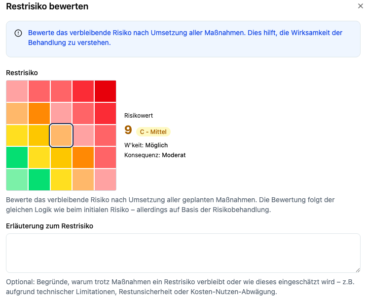

Bei der Bewertung eines Risikos und des Restrisikos sind zwei Dimensionen entscheidend:

- **Eintrittswahrscheinlichkeit (Likelihood)** – Wie wahrscheinlich ist das Ereignis?
- **Auswirkung (Impact)** – Welche Folgen hätte es für dein Unternehmen?

Die Logik für **initiale** und **Restrisiko**-Bewertung ist identisch – beim Restrisiko berücksichtigst du die **Wirksamkeit umgesetzter oder geplanter Maßnahmen**.

## Schnelle Entscheidungshilfe (Rubrik)

**Impact – Leitfragen**

- **5 Kritisch:** Existenzgefährdend, massive rechtliche Folgen (z. B. Millionenbußgeld, mehrtägiger Totalausfall)
- **4 Hoch:** Erheblicher finanzieller/operativer Schaden (z. B. längerer Produktionsausfall)
- **3 Mittel:** Spürbar, aber beherrschbar (z. B. mehrstündige Service-Störung)
- **2 Niedrig:** Begrenzte Wirkung (z. B. kurzer Ausfall, geringe Mehrkosten)
- **1 Sehr niedrig:** Kaum spürbar

**Likelihood – Leitfragen**

- **4 Sehr hoch:** Tritt nahezu sicher ein (Beobachtung/Vorfälle mehrfach pro Jahr)
- **3 Hoch:** Realistisch wahrscheinlich (Branchenlage, wenige Gegenmaßnahmen)
- **2 Mittel:** Möglich (vereinzelte Vorfälle bekannt)
- **1 Niedrig:** Eher selten
- **0.5 Sehr niedrig:** Sehr unwahrscheinlich

> **Score = Impact × Likelihood** → typischer Bereich **1–20**.  
> Schwellen für _Kritisch/Hoch/Mittel/Niedrig_ legst du teamweit fest.

## Skalen & Beispiele

### Auswirkung (Impact)

| Stufe | Leitfragen | Beispiele |
|---|---|---|
| **5 Kritisch** | Existenz-/aufsichtsrechtlich gravierend? | Große Datenpanne mit Meldepflicht & hohen Bußgeldern |
| **4 Hoch** | Erhebliche finanzielle/rechtliche Folgen? | Mehrtägiger Produktionsausfall, Vertragsstrafen |
| **3 Mittel** | Spürbar, beherrschbar? | Kurzzeitige IT-Ausfälle, moderate Bußgelder |
| **2 Niedrig** | Begrenzte Auswirkungen? | Kurzer Service-Hiccup, geringe Kosten |
| **1 Sehr niedrig** | Kaum spürbar? | Geringfügige Prozessabweichung |

### Eintrittswahrscheinlichkeit (Likelihood)

| Stufe | Leitfragen | Beispiele |
|---|---|---|
| **4 Sehr hoch** | Fast sicher? | Häufige Phishing-Wellen ohne MFA |
| **3 Hoch** | Wahrscheinlich? | Ungepatchte, exponierte Systeme |
| **2 Mittel** | Möglich? | Vereinzelte Branchenvorfälle |
| **1 Niedrig** | Eher selten? | Gut gehärtete, interne Systeme |
| **0.5 Sehr niedrig** | Extrem selten? | Nur unter außergewöhnlichen Bedingungen |

## Restrisiko sinnvoll bewerten

Beim Restrisiko startest du **nach Maßnahmen**:

- Welche **Kontrollen** wirken? (z. B. MFA, Patches, Netzsegmentierung, DLP)
- Welche **Belege** liegen vor? (z. B. Change-PR, Scan-Report, Testprotokoll)
- Welche **Restgefahr** bleibt (z. B. Zero-Day, Prozessrisiko, Lieferant)?

**Erläuterung zum Restrisiko:**  
Begründe kurz, **warum** trotz Maßnahmen ein Rest bleibt oder warum du auf **„sehr niedrig“** gehst (nur mit nachvollziehbarer Begründung).

## Praxisbeispiele (real-world)

> Die folgenden Beispiele zeigen **Initial → Maßnahmen → Restrisiko** als Orientierung.

### 1) Ungepatchter VPN-Gateway (schwache TLS-Cipher)
- **Initial:** Impact **3 Mittel**, Likelihood **3 Hoch** → **Score 9 (Mittel)**
- **Maßnahmen:** TLS ≥ 1.2 erzwingen, schwache Cipher deaktivieren, FS aktivieren; Konfig-PR & sslyze-Report als Evidence
- **Restrisiko:** Impact **3**, Likelihood **1 Niedrig** → **Score 3**
- **Erläuterung:** Residual Crypto-Risiken bleiben (Protokoll-Implementierung), aber stark reduziert.

### 2) S3-Bucket public read (Fehlkonfiguration)
- **Initial:** Impact **4 Hoch**, Likelihood **2 Mittel** → **Score 8**
- **Maßnahmen:** Bucket-Policy schließen, Block Public Access, CI-Policy Check; CloudTrail-Nachweis
- **Restrisiko:** Impact **4**, Likelihood **0.5 Sehr niedrig** → **Score 2**
- **Erläuterung:** Restrisiko verbleibt durch menschliche Fehler; Prävention/Detektion verbessert.

### 3) Phishing ohne MFA
- **Initial:** Impact **4 Hoch**, Likelihood **4 Sehr hoch** → **Score 16 (Kritisch)**
- **Maßnahmen:** MFA für alle, Phishing-Simulator, Awareness-Training, Conditional Access
- **Restrisiko:** Impact **4**, Likelihood **1 Niedrig** → **Score 4**
- **Erläuterung:** Zielte Angriffe möglich, aber Eintrittswahrscheinlichkeit stark gesenkt.

### 4) Drittanbieter-Ausfall (kritischer SaaS)
- **Initial:** Impact **4 Hoch**, Likelihood **2 Mittel** → **Score 8**
- **Maßnahmen:** Vertragliche SLA, zweiter Anbieter/Failover, Datenauszug/Backups testen
- **Restrisiko:** Impact **3 Mittel**, Likelihood **1 Niedrig** → **Score 3**
- **Erläuterung:** Operative Folgen reduziert durch Redundanz & Exit-Strategie.

### 5) Verlorener Laptop ohne Festplattenverschlüsselung
- **Initial:** Impact **4 Hoch**, Likelihood **2 Mittel** → **Score 8**
- **Maßnahmen:** Full-Disk-Encryption, Remote-Wipe, Inventar-Kontrollen, Benutzer-Training
- **Restrisiko:** Impact **2 Niedrig**, Likelihood **1 Niedrig** → **Score 2**
- **Erläuterung:** Datenabfluss unwahrscheinlich; verbleibendes Risiko: verspätete Meldung/Fehlbedienung.

## Best Practices

- **Teamwork:** Bewertung mit IT-Ops, Security/DSB und Fachbereich durchführen.
- **Konsistenz:** Skalen & Schwellenwerte teamweit festlegen und dokumentieren.
- **Evidences sammeln:** Bewertung begründen (Kommentare) und **Evidence** anhängen.
- **Regelmäßig prüfen:** Bei Reviews/Rezertifizierungen **Impact/Likelihood** neu bewerten.
- **Kontext beachten:** Asset-Kritikalität, Datenarten (z. B. personenbezogen), externe Abhängigkeiten.
