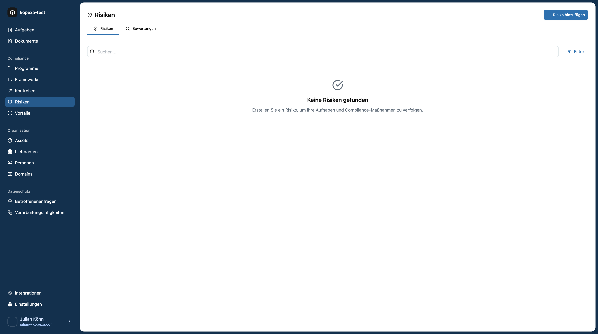
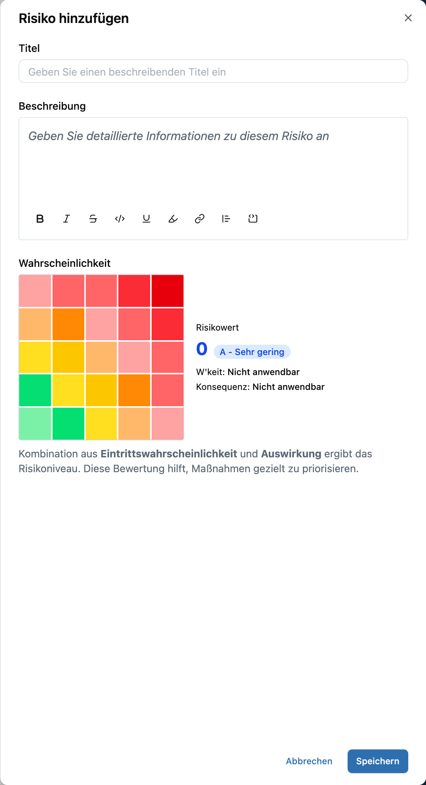
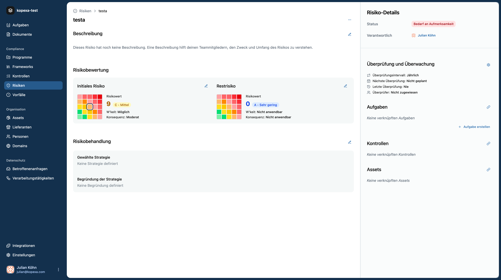

Mit **Risks** identifizierst, bewertest und behandelst du Risiken in deinem Space – verknüpft mit **Assets**, **Controls**, **Evidence** und **Work Items**.  
Diese Seite bündelt **Konzept**, **How-to**, **UI-Referenz** und **FAQ** auf einen Blick.

> **Voraussetzungen**
> - Du befindest dich in einem Space (`/s/{space_id}`).
> - Im Idealfall sind bereits **Assets** im [Inventory](../inventory/index.mdx) erfasst.
> - Rollen & Zugriffe siehe [Security](../../organization/security.mdx).

##  Leere Liste & CTA

Wenn noch keine Risiken vorhanden sind, zeigt Kopexa eine leere Ansicht mit einem klaren **Call-to-Action** oben rechts.

- **Suche & Filter:** oben (Status, Owner, Severity, Asset)
- **Risiko hinzufügen:** eröffnet den Create-Drawer

## Neues Risiko anlegen (Beispiel)

Klicke auf **„Risiko hinzufügen“**. Der **Create-Drawer** öffnet sich:

**Beispieldaten zum Übernehmen**

- **Titel:** Ungepatchter VPN-Gateway erlaubt veraltete TLS-Cipher  
- **Beschreibung:**  
  Unser Edge-VPN (vpn-gw-01) akzeptiert noch veraltete TLS-Cipher.  
  Angreifer könnten schwache Verschlüsselung erzwingen und Datenverkehr kompromittieren.  
  Betroffen ist externer Remote-Zugriff von Mitarbeitenden und Dienstleistern.
- **Wahrscheinlichkeit (Likelihood):** **Möglich**  
- **Konsequenz (Impact):** **Moderat**  
- **Hinweis:** Die **Matrix** berechnet daraus automatisch den initialen **Risikowert**.  
- **Speichern** – das Risiko erscheint nun in der Liste.

> **Tipp:** Verknüpfe das Risiko direkt mit dem betroffenen **Asset** (z. B. „vpn-gw-01“) und relevanten **Controls** (z. B. „Secure Configuration“, „Strong Crypto“), sobald du es gespeichert hast.

## Risiko-Detailseite

Nach dem Speichern gelangst du in die **Detailansicht**. Hier siehst du **Bewertung** und **Behandlung** nebeneinander sowie alle Kontext-Infos rechts.

**Linke Seite (Inhalt)**  
- **Beschreibung:** kurze, präzise Problem- und Kontextdarstellung  
- **Risikobewertung:** Initiale Matrix mit **Likelihood**, **Impact** und abgeleitetem **Score**  
- **Risikobehandlung:** Strategie wählen (avoid/mitigate/transfer/accept) und begründen

**Rechte Seite (Kontext & Aktionen)**  
- **Status & Verantwortlich (Owner)**  
- **Überprüfung & Überwachung:** Intervall (z. B. jährlich/vierteljährlich), nächste/letzte Prüfung, Reviewer  
- **Aufgaben (Work Items):** Maßnahmen planen (z. B. „TLS konfigurieren & schwache Cipher verbieten“)  
- **Kontrollen:** relevante **Controls** verlinken  
- **Assets:** betroffene **Assets** referenzieren

<Callout title="Best Practice">
Lege **sofort eine Aufgabe** an (Owner + Fälligkeitsdatum) und verknüpfe **Evidence** (z. B. „neue TLS-Config“, „Scan-Report“). Aktualisiere danach den **Restrisiko-Wert**.
</Callout>

## Bewertung & Behandlung – kurz erklärt

- **Impact (Konsequenz):** Auswirkung auf Vertraulichkeit, Integrität, Verfügbarkeit oder Compliance  
- **Likelihood (Wahrscheinlichkeit):** Wie wahrscheinlich ist das Ereignis?  
- **Inherent vs. Residual:** Vor / nach Umsetzung von Maßnahmen  
- **Behandlung (Treatment):**
  - **Avoid:** Risikoquelle eliminieren (Service abschalten)
  - **Mitigate:** Kontrolle einführen/verbessern (Patch, Härtung, MFA)
  - **Transfer:** Versicherung/Vertragliche Regelung
  - **Accept:** Bewusst akzeptieren – **mit Begründung & Frist**

**Für das Beispiel „Ungepatchter VPN-Gateway“**  
- **Treatment:** *Mitigate*  
- **Work Item:** „TLS-Konfiguration härten: schwache Cipher deaktivieren, nur TLS ≥1.2, Forward Secrecy erzwingen“  
- **Evidence:** „Konfig-PR #842“, „Nmap/sslyze Report nach Änderung“  
- **Restrisiko:** nach Umsetzung neu bewerten (oft 1–2 Stufen niedriger)

## Workflow, Reviews & Rezertifizierung

- **Status-Flow (empfohlen):** Draft → Assessed → Treatment Planned → In Progress → Closed  
- **Reviews:** regelmäßige Neubewertung (z. B. quartalsweise bei High-Risks)  
- **Rezertifizierung:** Termin im **Überprüfungsintervall** pflegen; Kopexa erinnert über Work Items

## FAQ & Troubleshooting

**„Zu viele Risiken – wo anfangen?“**  
Priorisiere nach **Impact**. Starte bei **High Impact** + **Likely**.

**„Restrisiko bleibt unverändert.“**  
Maßnahmen (Work Items) sind ggf. noch **offen** oder **Evidence** fehlt. Nachpflegen, dann neu bewerten.

**„Unklarer Owner.“**  
Setze **Verantwortliche** pro Risiko fest. Nutze Rollen & ReBAC wie in [Security](../../organization/security.mdx) beschrieben.
