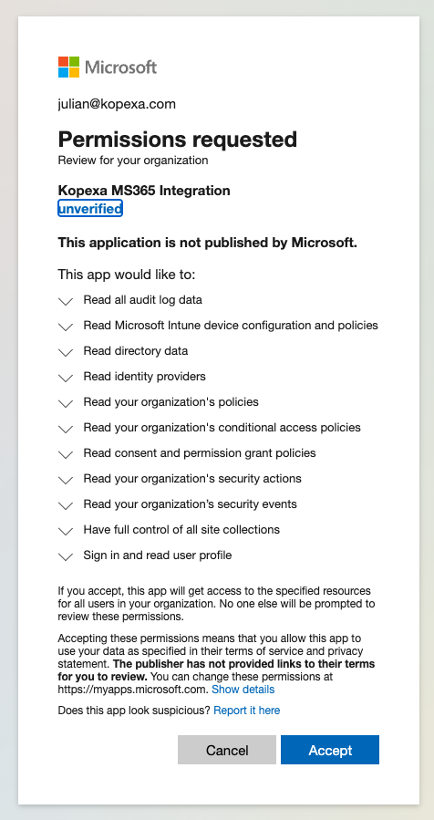

Mit der **Microsoft 365 / Entra ID Integration** holt Kopexa automatisch alle relevanten Compliance-Daten aus deiner Entra-ID-Umgebung.  
Das spart manuelle Arbeit und schafft **auditfeste Evidenzen** für ISO 27001, NIS2, DSGVO, TISAX® und andere Frameworks.

---

## Warum diese Integration?

- **Automatisierte Evidenz:** Keine Screenshots, keine Excel-Listen – Kopexa ruft per API relevante Daten ab.
- **ISMS & DSMS verbinden:** Benutzerverwaltung, MFA, Policies und Subprozessoren als **Controls/TOMs** mappen.
- **Supply-Chain-Risiken managen:** Übersicht über Enterprise Apps, Consent Policies und Drittanbieter-Zugriffe.
- **Audit-Ready:** Zugriff auf Audit Logs & Security Events als Nachweis für Kontrollen.

<Callout title="Gut zu wissen">
Alle Daten werden **read-only** abgerufen und verschlüsselt gespeichert.  
Kopexa schreibt **keine Änderungen** in deine Microsoft-Umgebung und du kannst den Zugriff jederzeit entziehen.
</Callout>

## Welche Daten werden synchronisiert?

Nach Einrichtung zieht Kopexa automatisiert u. a.:

- **Accounts & Personen:** Benutzer, Gruppen, Rollen inkl. MFA-Status
- **Apps & Service Principals:** registrierte Enterprise Apps, Berechtigungen & Consents
- **Security-Policies:** Conditional Access, Identity Provider Einstellungen, Intune Policies
- **Audit-Logs & Security Events:** Anmeldeprotokolle, Sicherheitsvorfälle (als Incident-Evidenz)
- **Consent & Grant Policies:** Welche Apps haben welche Rechte?
- **Optional:** SharePoint/OneDrive Site Collections (Metadaten für Datenlokation/DSGVO)

Diese Informationen fließen in **Inventory (People/Apps)**, **Risiken**, **Kontrollen** und **Incidents** ein.

## Berechtigungen & Scopes

Bei der Einrichtung musst du als Entra-ID-Administrator einmalig Berechtigungen (Admin Consent) erteilen.  
Die Liste der Scopes erscheint in Microsoft wie auf diesem Screenshot:

Eine ausführliche Übersicht, welche Scopes warum benötigt werden, findest du hier:  
[**Berechtigungen (Permissions)**](./permissions.mdx)

## Setup und Einrichtung

1. **Integration starten:** In Kopexa unter *Integrationen → Microsoft 365* auswählen.
2. **Admin Consent:** Mit einem Entra-ID-Admin einloggen, Berechtigungen akzeptieren (siehe Screenshot).
3. **Sync:** Kopexa ruft die Daten read-only ab; keine manuelle Konfiguration erforderlich.
4. **Mapping:** Nutzer, Apps und Policies werden automatisch in Kopexa-Module übernommen.

## Datenschutz & Sicherheit

- **Read-only:** Kein Schreibzugriff in Entra oder M365.
- **Space-Isolation:** Daten pro Kopexa-Space getrennt.
- **Verschlüsselung:** Alle Daten werden verschlüsselt gespeichert.
- **Widerruf:** Zugriff jederzeit in Entra ID entziehbar.

<Callout title="Transparenz">
Kopexa nutzt die [Microsoft Graph API](https://learn.microsoft.com/en-us/graph/permissions-reference).  
Die vollständige Liste der genutzten Endpunkte findest du in [Permissions](./permissions.mdx).
</Callout>

---

## Weiterführende Inhalte

- [Berechtigungen & Scopes](./permissions.mdx) – welche Daten und warum
- [Integrations-Übersicht](../index.mdx) – weitere Integrationen (z. B. GitHub)

