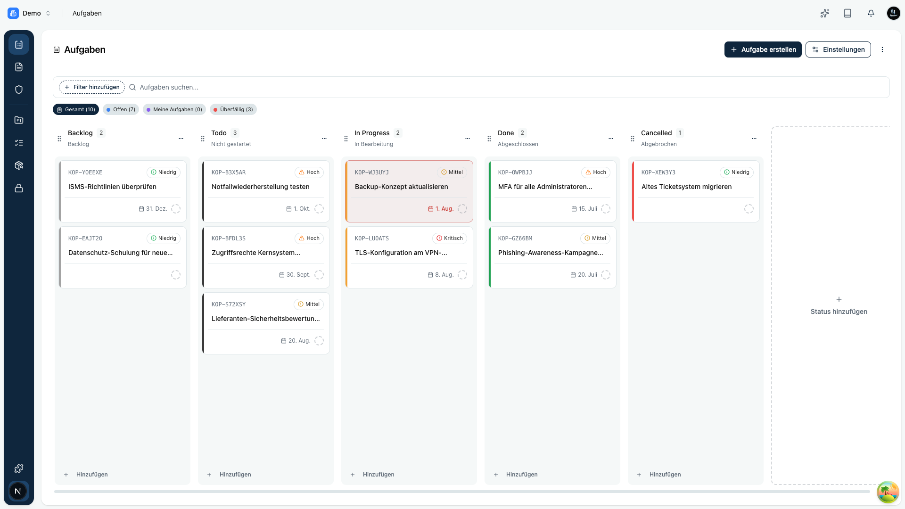
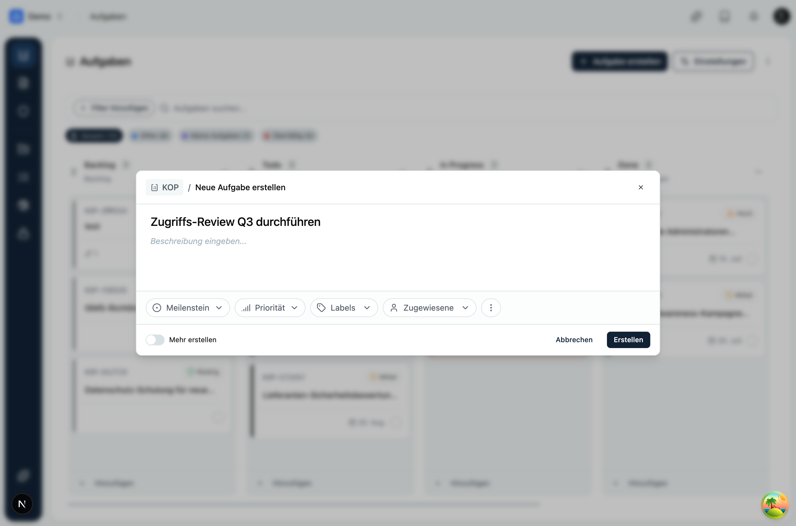
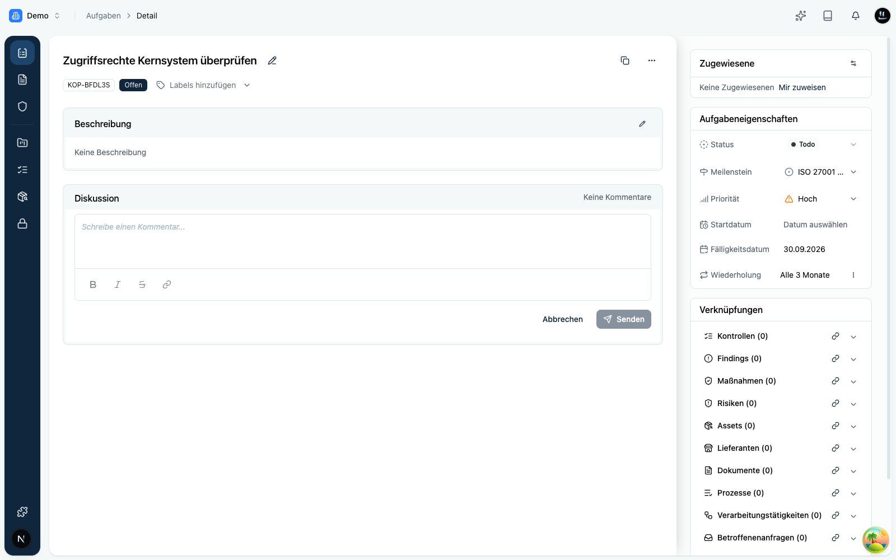

Der Bereich **Aufgaben** ist der zentrale Arbeitsbereich eines Space. Hier landet alles, was jemand konkret tun muss: Maßnahmen aus einem Risiko, offene Punkte aus einem Audit, ein Nachweis, der aktualisiert werden muss, oder eine ganz normale To-do.

<Callout title="Tipp">
Weise jeder Aufgabe eine **zuständige Person** und eine **Fälligkeit** zu. So bleibt sichtbar, wer bis wann was erledigt, und nichts geht verloren.
</Callout>

## Wozu der Aufgaben-Bereich?

In der Navigation findest du den Eintrag **Aufgaben**. Er beantwortet drei Fragen auf einen Blick:

- **Was ist zu tun?** Alle offenen Punkte des Space an einem Ort.
- **Wer macht es bis wann?** Zuständige und Fälligkeit pro Aufgabe.
- **Wie ist der Stand?** Der Status zeigt, ob etwas noch offen, in Arbeit oder erledigt ist.

Weil Aufgaben mit Risiken, Kontrollen, Nachweisen und weiteren Objekten verknüpft sind, entsteht eine lückenlose Spur: Von der erkannten Schwachstelle bis zur belegten Erledigung.

## Kernbegriffe

| Begriff        | Bedeutung                                                                 |
|----------------|---------------------------------------------------------------------------|
| **Status**     | Fortschritt einer Aufgabe, zum Beispiel Offen, In Arbeit oder Erledigt.   |
| **Zuständige** | Personen, die für die Erledigung verantwortlich sind.                     |
| **Fälligkeit** | Datum, bis zu dem die Aufgabe erledigt sein soll.                         |
| **Priorität**  | Wie dringend die Aufgabe ist, damit ihr das Wichtigste zuerst angeht.     |
| **Meilenstein**| Bündelt zusammengehörige Aufgaben zu einem gemeinsamen Ziel oder Termin.  |
| **Verknüpfung**| Verbindung zu einem Risiko, einer Kontrolle, einem Nachweis und mehr.     |

## Das Board

Aufgaben werden als **Board** dargestellt. Jede Spalte steht für einen **Status**, jede Aufgabe ist eine Karte darin.

- **Status per Drag-and-drop ändern:** Ziehe eine Karte in eine andere Spalte.
- **Schnell erfassen:** Direkt in einer Spalte kannst du eine neue Aufgabe anlegen.
- **Filtern und suchen:** Über die Filterleiste grenzt du ein, etwa nach Zuständiger, Priorität, Meilenstein, Fälligkeit oder Vorlage. Die Schnellfilter zeigen mit einem Klick alle, offene, dir zugewiesene oder überfällige Aufgaben. Die Suche findet Aufgaben nach Titel oder Kennung.

Über **Aufgabe erstellen** oben rechts oder **Hinzufügen** in einer Spalte legst du eine neue Aufgabe an, inklusive Zuständigen, Priorität, Fälligkeit und optionaler Wiederholung.

## Eine Aufgabe öffnen

Ein Klick auf eine Karte öffnet zunächst eine **Vorschau**. Von dort gelangst du in die vollständige **Detailansicht**. Dort findest du:

- **Titel, Beschreibung und Kommentare** für den inhaltlichen Austausch.
- **Eigenschaften** in der Seitenleiste: Status, Zuständige, Priorität, Meilenstein, Start- und Fälligkeitsdatum sowie die Wiederholung.
- **Verknüpfungen** zu Kontrollen, Risiken, Nachweisen, Assets, Anbietern, Dokumenten, Prozessen und mehr.

## Verknüpfungen schaffen Nachweis

Der eigentliche Wert entsteht, wenn Aufgaben mit den richtigen Objekten verbunden sind:

- **Risiken:** Eine Aufgabe belegt, dass eine Behandlung tatsächlich umgesetzt wird.
- **Kontrollen und Nachweise:** Aufgaben treiben Umsetzung und Aktualisierung an.
- **Assets, Prozesse, Anbieter und mehr:** Kontext, wo die Arbeit hingehört.

<Callout title="Best Practice">
Formuliere jede Aufgabe so, dass klar ist, **was** erledigt und **woran** die Erledigung erkennbar ist. Verknüpfe sie mit dem Objekt, auf das sie einzahlt, und setze eine realistische Fälligkeit.
</Callout>

## Wiederkehrende Aufgaben

Viele Pflichten kommen regelmäßig wieder: der vierteljährliche Zugriffs-Review, die monatliche Sichtung offener Punkte, die jährliche Awareness-Schulung. Damit du solche Aufgaben nicht jedes Mal von Hand neu anlegen musst, kann Kopexa sie **automatisch im gewählten Rhythmus** erstellen.

👉 Wie das funktioniert und wie du es einrichtest, liest du unter [**Wiederkehrende Aufgaben**](./wiederkehrende-aufgaben.mdx).
