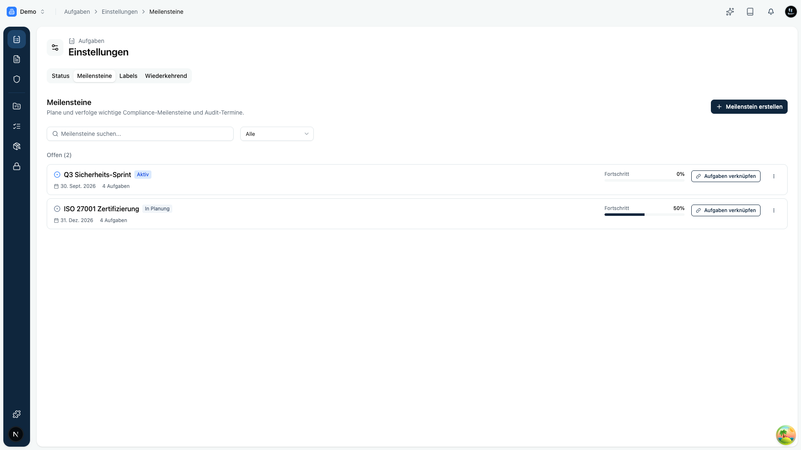

Ein **Meilenstein** bündelt zusammengehörige Aufgaben auf ein gemeinsames Ziel oder einen Termin, zum Beispiel „Zertifizierungsaudit Q3" oder „Einführung neues Tool". Verwalten kannst du sie im Bereich **Aufgaben** unter **Einstellungen › Meilensteine**.

Meilensteine haben einen eigenen Lebenszyklus: **geplant**, **gestartet** und **abgeschlossen**. Bei Bedarf lässt sich ein Meilenstein **abbrechen** oder wieder **öffnen**. Für jeden Meilenstein siehst du den **Fortschritt** und ob er überfällig ist.

Hier kannst du:

- Meilensteine **anlegen** und **bearbeiten**,
- **Aufgaben verknüpfen**, damit sie zum Meilenstein zählen,
- über **Aufs Board** direkt zu den Aufgaben des Meilensteins springen.

<Callout title="Tipp">
Nutze Meilensteine für Vorhaben mit klarem Ziel und Termin. So siehst du auf einen Blick, wie weit ihr auf dem Weg dorthin seid, statt einzelne Aufgaben zu zählen.
</Callout>
