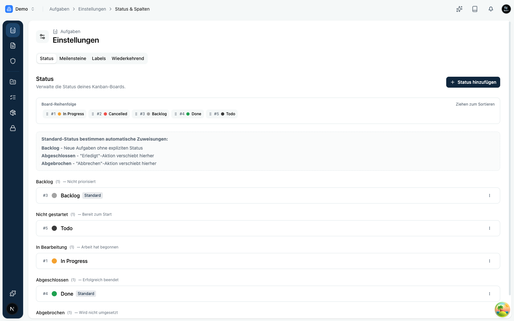

Die **Status** sind die Spalten deines Boards. Jede Aufgabe befindet sich immer in genau einem Status. Verwalten kannst du sie im Bereich **Aufgaben** unter **Einstellungen › Status**.

Ein Status hat einen **Namen**, eine **Farbe** und gehört zu einer **Gruppe**. Die Gruppe bestimmt, was der Status grundsätzlich bedeutet:

| Gruppe             | Bedeutung                                         |
|--------------------|---------------------------------------------------|
| **Backlog**        | Gesammelt, aber noch nicht eingeplant.            |
| **Nicht begonnen** | Eingeplant, aber noch nicht gestartet.            |
| **In Arbeit**      | Wird gerade bearbeitet.                           |
| **Abgeschlossen**  | Erledigt.                                         |
| **Abgebrochen**    | Wird nicht weiterverfolgt.                         |

Du kannst Status **anlegen**, **bearbeiten**, **löschen** und per **Drag-and-drop** sortieren. Die Reihenfolge bestimmt, in welcher Reihenfolge die Spalten auf dem Board erscheinen.

<Callout title="Tipp">
Halte die Zahl der Status überschaubar. Wenige, klar benannte Spalten machen den Fortschritt auf einen Blick erkennbar.
</Callout>
