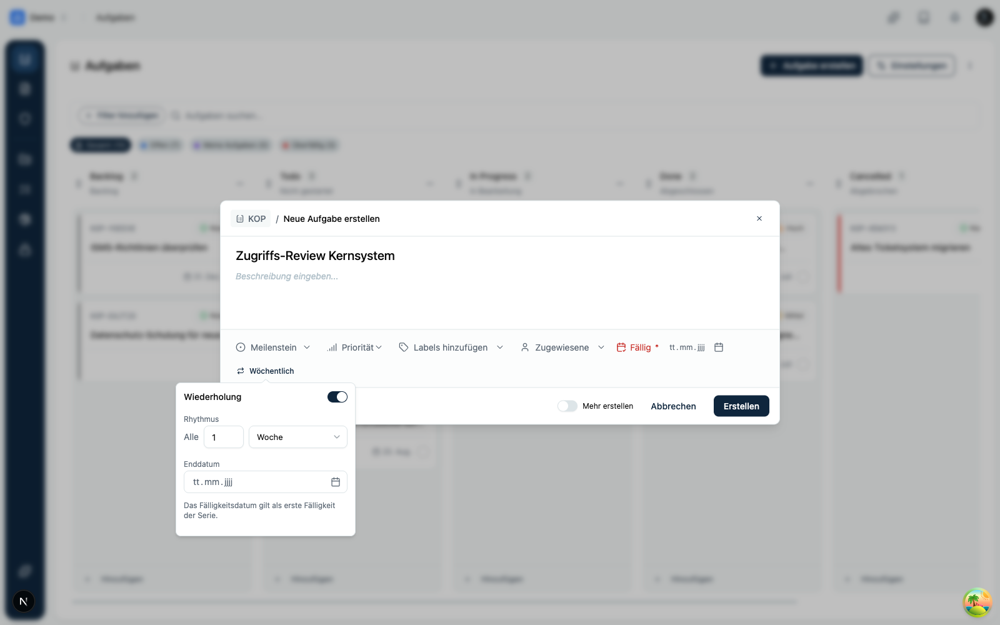
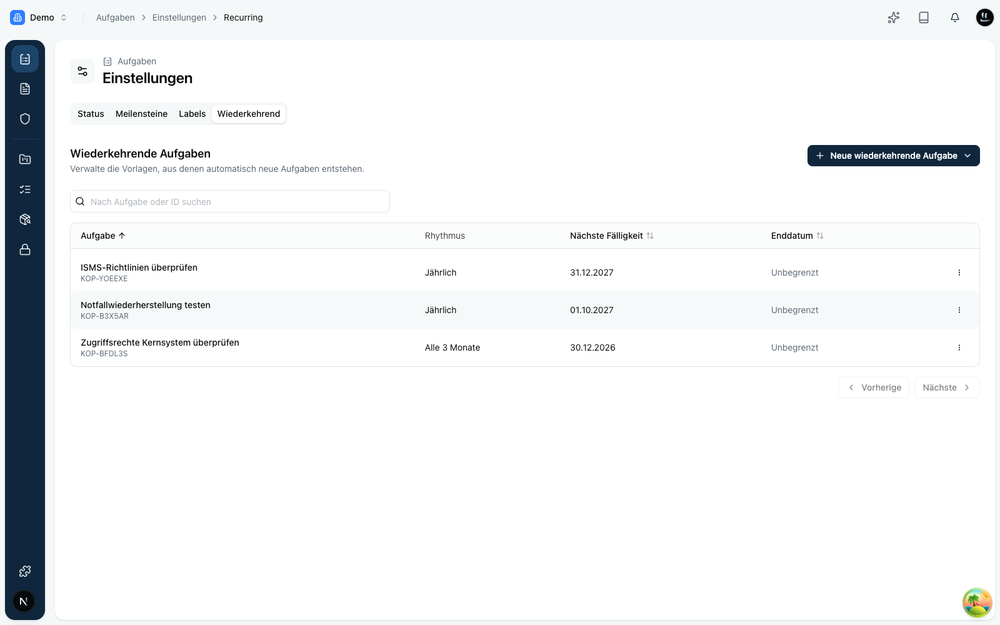

Compliance lebt von **Regelmäßigkeit**. Zugriffsrechte werden vierteljährlich geprüft, Notfallpläne jährlich getestet, offene Punkte monatlich gesichtet. Solche Aufgaben immer wieder von Hand anzulegen, kostet Zeit und wird irgendwann vergessen.

Mit **wiederkehrenden Aufgaben** legst du den Rhythmus einmal fest. Danach erstellt Kopexa die nächste Aufgabe automatisch, pünktlich und vollständig.

<Callout title="Kurzprinzip">
Aus einer normalen Aufgabe wird eine **Vorlage**. Im gewählten Rhythmus entstehen daraus automatisch neue Aufgaben. Jede neue Aufgabe ist eine eigenständige Kopie mit eigenem Verlauf, damit die Historie erhalten bleibt.
</Callout>

## So funktioniert es

Eine wiederkehrende Aufgabe besteht aus zwei Rollen:

- **Vorlage:** Die erste Aufgabe der Serie. Sie legt fest, wie die Folgeaufgaben aussehen und in welchem Rhythmus sie entstehen.
- **Vorkommen:** Jede automatisch erstellte Folgeaufgabe. Sie ist eine vollständige Kopie der Vorlage und verweist auf diese zurück.

<Mermaid
	chart="
graph LR
    V[Vorlage z. B. Zugriffs-Review] -->|alle 3 Monate| A1[Vorkommen Q1]
    V -->|alle 3 Monate| A2[Vorkommen Q2]
    V -->|alle 3 Monate| A3[Vorkommen Q3]
    A1 -.verweist auf.-> V
    A2 -.verweist auf.-> V
    A3 -.verweist auf.-> V
"
/>

Weil jedes Vorkommen eine echte, eigene Aufgabe ist, kannst du sie einzeln bearbeiten, zuweisen und abschließen, ohne die Vorlage oder die anderen Vorkommen zu verändern.

## Rhythmus, Start und Ende

Beim Einrichten legst du drei Dinge fest:

| Einstellung        | Bedeutung                                                                 |
|--------------------|---------------------------------------------------------------------------|
| **Rhythmus**       | Intervall und Einheit, zum Beispiel „alle 3 Monate" oder „jede Woche".     |
| **Erste Fälligkeit**| Der Termin der ersten Aufgabe. Er ist verpflichtend und verankert die Serie. |
| **Enddatum**       | Optional. Ohne Enddatum wiederholt sich die Aufgabe unbegrenzt.           |

Als Einheiten stehen **täglich**, **wöchentlich**, **monatlich** und **jährlich** zur Verfügung, jeweils mit einem frei wählbaren Intervall.

<Callout title="Was wird kopiert?">
Ein Vorkommen übernimmt die Inhalte der Vorlage: Titel, Beschreibung, Zuständige, Priorität, Meilenstein und die Verknüpfungen. So ist jede neue Aufgabe sofort vollständig und einsatzbereit.
</Callout>

## Einrichten

Du hast drei Wege, eine wiederkehrende Aufgabe zu erstellen:

<Accordions>
<Accordion title="Beim Erstellen einer neuen Aufgabe">
Im Erstellen-Dialog aktivierst du **Wiederholung** und wählst den Rhythmus. Sobald die Wiederholung aktiv ist, wird eine **Fälligkeit** zur Pflicht, denn sie legt den ersten Termin der Serie fest.
</Accordion>
<Accordion title="An einer bestehenden Aufgabe">
Öffne eine bestehende Aufgabe und richte in der Seitenleiste unter **Wiederholung** einen Rhythmus ein. Die Aufgabe wird damit zur Vorlage.
</Accordion>
<Accordion title="Über die Einstellungen">
Unter **Einstellungen › Wiederkehrende Aufgaben** kannst du eine neue wiederkehrende Aufgabe anlegen oder eine bestehende Aufgabe als Vorlage auswählen.
</Accordion>
</Accordions>

## Verwalten

Unter **Einstellungen › Wiederkehrende Aufgaben** siehst du alle Vorlagen des Space auf einen Blick, mit Rhythmus, nächster Fälligkeit und Enddatum.

Von dort aus kannst du:

- eine Vorlage **bearbeiten** (Rhythmus oder Enddatum anpassen),
- die Wiederholung **beenden**,
- über **Aufgaben im Board anzeigen** direkt zu allen Aufgaben springen, die aus einer Vorlage entstanden sind.

<Callout title="Beenden ist jederzeit möglich">
Wenn du eine Wiederholung beendest, entstehen keine neuen Vorkommen mehr. Bereits erstellte Aufgaben bleiben unverändert bestehen, damit deine Historie vollständig bleibt.
</Callout>

## Praxisbeispiel

**Ziel:** Zugriffsrechte auf das Kernsystem jedes Quartal überprüfen.

1. Lege eine Aufgabe „Zugriffs-Review Kernsystem" an, weise sie der IT-Leitung zu und verknüpfe die zuständige Kontrolle.
2. Aktiviere die Wiederholung mit Rhythmus **alle 3 Monate** und setze die erste Fälligkeit auf das Ende des laufenden Quartals.
3. Kopexa erstellt danach automatisch jedes Quartal eine neue Aufgabe, fertig zugewiesen und verknüpft.
4. Im Board filterst du bei Bedarf nach der Vorlage und siehst die gesamte Review-Serie über die Zeit.

<Callout title="Tipp">
Nutze wiederkehrende Aufgaben für alles mit festem Takt: Reviews, Tests, Schulungen, Berichte. Der Nachweis, dass eine Pflicht **regelmäßig** erfüllt wurde, ist in vielen Normen genauso wichtig wie die Erfüllung selbst.
</Callout>
