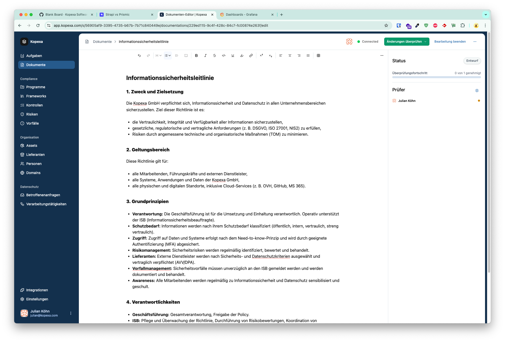
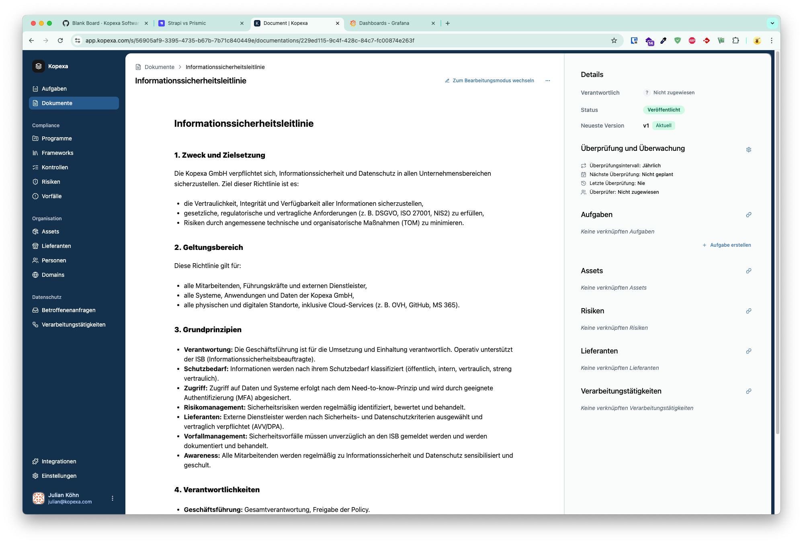

Nachdem du verstanden hast, **warum** Kopexa-Dokumente mehr sind als Policy-Uploads,  
geht es hier um das **„Wie“**: Wie legst du ein Dokument an und startest den Workflow?

## Dokumenttypen auswählen

Beim Anlegen kannst du zwischen zwei Typen wählen:

- **Rich-Text-Dokument (empfohlen):**  
  Direkt im Kopexa-Editor erstellen, mit Formatierungen, Tabellen und Links.  
  Unterstützt **kollaboratives Arbeiten** – mehrere Benutzer können gleichzeitig editieren.

- **Datei-Upload:**  
  Lade externe Dokumente hoch (PDF, Word, Präsentationen), wenn du eine fertige Policy oder einen externen Bericht einbinden möchtest.

Nach Eingabe eines **Titels** gelangst du in den **Document Version Editor**.

## Document Version Editor

Jedes neue Dokument startet als **Entwurf**. Im Editor kannst du:

- Inhalte bearbeiten und formatieren
- Mit anderen Nutzern in Echtzeit zusammenarbeiten (Collaboration)
- Änderungen versioniert speichern
- Einen Review- und Freigabeprozess starten

## Draft vs. Published

- **Draft-Version:**  
  Entwürfe können iterativ bearbeitet und überarbeitet werden.  
  Erst nach erfolgreichem Review werden sie freigegeben.

- **Published-Version:**  
  Nach Freigabe wird die aktuelle Version als **veröffentlichtes Dokument** gespeichert.  
  **Drafts und Published-Versionen sind klar getrennt.**  
  Bei Bedarf kann jederzeit eine neue Version erstellt werden.

## Dokumenten-Mapping & Governance

Nach Veröffentlichung stehen weitere Governance-Funktionen zur Verfügung:

- **Verantwortlichkeiten zuweisen:** z. B. Owner oder Prüfer
- **Business Units zuordnen:** organisatorische Verantwortlichkeiten abbilden
- **Relationen herstellen:** Dokumente mit **Assets**, **Kontrollen**, **Risiken** und **Lieferanten** verknüpfen
- **Aufgaben verlinken:** Dokumentumsetzung oder Awareness-Maßnahmen nachhalten

Diese Verknüpfungen erleichtern die Nachweisführung und machen Abhängigkeiten sichtbar.

## Reviewzyklus & Rezertifizierung

Jedes veröffentlichte Dokument kann mit einem **regelmäßigen Reviewzyklus** versehen werden:

- Intervall festlegen (z. B. jährlich, halbjährlich)
- Verantwortlichen und Prüfer zuweisen
- **Review-Datum** und **Historie** im Dokument sichtbar

So wird regelmäßig überprüft, ob Inhalte **noch korrekt und aktuell** sind.  
Falls nicht, wird eine **neue Draft-Version** erzeugt und erneut durch den Reviewprozess geführt.

## Best Practices

- **Rich-Text bevorzugen:** So profitierst du von Kollaboration und Versionierung.
- **Reviewpflicht:** Jede Policy sollte mindestens eine genehmigte Version haben und einem Zyklus unterliegen.
- **Verknüpfungen nutzen:** Dokumente als Nachweise (Evidence) in Risiken und Kontrollen verwenden.
- **Historie pflegen:** Neue Versionen bei relevanten Änderungen anlegen – so bleibt die Audit-Trail intakt.
