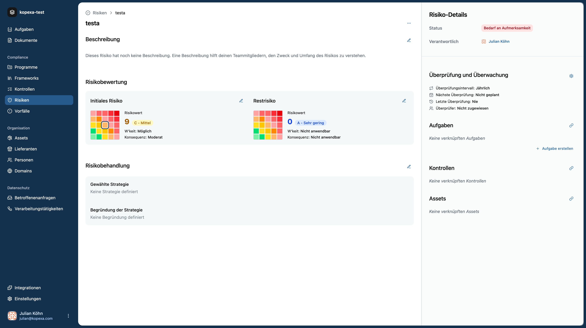

Risikomanagement ist ein **zentraler Bestandteil** jedes ISMS/DSMS und Voraussetzung für Auditfähigkeit in Normen wie ISO 27001, TISAX oder DSGVO.  
Das **Risikomodul** von Kopexa hilft dir, Risiken **zu identifizieren**, **zu bewerten**, **zu priorisieren**, **zu behandeln** und **auditfest nachzuweisen** – verknüpft mit **Assets**, **Kontrollen**, **Nachweisen** und **Aufgaben**.  
Jeder Space in Kopexa führt seine eigenen Risiken, sodass eine klare Mandantentrennung gewährleistet ist.

<Callout title="Kurzprinzip">
_Risikoscore = Eintrittswahrscheinlichkeit × Auswirkung_.  
Du senkst Risiken durch **Kontrollen** und belegst deren Wirksamkeit über **Nachweis** (Nachweise).

</Callout>

## Was ist ein Risiko?

Ein **Risiko** in Kopexa stellt eine potenzielle **Bedrohung**, **Schwachstelle** oder **Unsicherheit** dar, die die Fähigkeit deiner Organisation beeinträchtigen kann, ihre Ziele zu erreichen, Compliance aufrechtzuerhalten oder Assets zu schützen.  
Bewertet wird anhand **Eintrittswahrscheinlichkeit** und **Auswirkung**; gesteuert wird durch geeignete **Kontrollen** und **Maßnahmen**.

## Risikomanagement-Prozess

Das folgende Diagramm zeigt den vereinfachten Risikomanagement-Prozess in Kopexa:

<Mermaid
    chart="
graph TD
    A[Risikoidentifikation] --> B[Risikobewertung]
    B --> C[Risikoscore Auswirkung × Eintrittswahrscheinlichkeit]
    C --> D{Risikostufe}

    D --> E[Kritisch: 16–20 Sofortige Maßnahmen]
    D --> F[Hoch: 12–15 Priorisierte Behandlung]
    D --> G[Mittel: 6–11 Geplante Mitigation]
    D --> H[Niedrig: 1–5 Überwachen/Akzeptieren]

    E --> I[MITIGIEREN]
    F --> I
    F --> J[TRANSFERIEREN]
    G --> I
    G --> K[AKZEPTIEREN]
    H --> K
    H --> L[VERMEIDEN]

    I --> M[Kontrollen]
    I --> N[Maßnahmenpläne]
    J --> O[Versicherung/Verträge]
    K --> P[Risikoregister]
    L --> Q[Prozessänderungen]

    style C fill:#e1f5fe
    style E fill:#ffebee
    style F fill:#fff3e0
    style G fill:#e8f5e8
    style H fill:#f3e5f5
"
/>

### Was ist Risikomanagement?

Risikomanagement ist der Prozess, **alle relevanten Risiken zu identifizieren** und **Wege zu finden**, diese zu kontrollieren, zu mindern oder – wo möglich – strategisch zu nutzen.  
Typischer Ablauf:

1. **Risiken identifizieren:** Vollständiges Bild durch Datenanalysen, Interviews, Trendbeobachtung etc. – Ergebnis ist das **Risikoregister**.
2. **Risiken bewerten:** Potenzielle Auswirkungen und Eintrittswahrscheinlichkeit (qualitativ/quantitativ) ermitteln.
3. **Priorisieren:** Risiken nach geschäftlichem Einfluss sortieren.
4. **Behandeln oder nutzen:** Maßnahmen zur **Risikominderung** planen oder Chancen gezielt nutzen.
5. **Überwachen:** Wirksamkeit laufend messen, Anpassungen vornehmen.
6. **Wiederholen:** Risikomanagement ist ein kontinuierlicher Prozess, kein einmaliges Projekt.

## Warum relevant für Compliance?

| Aspekt                | Zweck                          | Nutzen                                 |
|-----------------------|--------------------------------|----------------------------------------|
| Bedrohungen erkennen  | systematische Risikoerfassung | vollständiges Risikoregister, Auditfähigkeit |
| Priorisieren          | Fokus auf Wesentliches         | effiziente Ressourcennutzung           |
| Kontrollen ableiten   | risikobasierte Maßnahmen       | wirksame Risikominderung               |
| Nachweis führen       | Nachweis & Historie            | Prüfbarkeit, Reifegrad sichtbar        |

## Bewertung & Scoring

- **Impact-Domänen:** Vertraulichkeit, Integrität, Verfügbarkeit, Datenschutz, Reputation, Finanzen  
- **Inherent vs. Residual:** _Inherent_ = Bewertung **vor** Maßnahmen, _Residual_ = Bewertung **nach** Umsetzung von Kontrollen  
- **Lebenszyklus (empfohlen):** _Offen → Geplant → In Arbeit → Mitigiert/Archiviert_

### Impact (Beispielskala 1–5)

| Stufe        | Beschreibung                                | Geschäftliche Folgen              |
|--------------|---------------------------------------------|-----------------------------------|
| 5 Kritisch   | existenzbedrohend, aufsichtsrechtlich gravierend | Betriebsunterbrechung, hohe Bußgelder |
| 4 Hoch       | erheblicher Schaden                         | Umsatz-/Reputationsverlust        |
| 3 Mittel     | merklicher, beherrschbarer Schaden          | temporäre Störung                 |
| 2 Niedrig    | begrenzter Schaden                          | geringe Auswirkung                 |
| 1 Sehr niedrig | kaum spürbar                             | vernachlässigbar                   |

### Likelihood (Beispielskala 0,5–4)

| Stufe        | Wahrscheinlichkeit | Erwartung      |
|--------------|-------------------|----------------|
| 4 Sehr hoch  | > 90 %            | nahezu sicher  |
| 3 Hoch       | 70–90 %           | wahrscheinlich |
| 2 Mittel     | 30–70 %           | möglich        |
| 1 Niedrig    | 10–30 %           | eher selten    |
| 0.5 Sehr niedrig | < 10 %       | unwahrscheinlich |

> **Score = Impact × Likelihood** → typischer Bereich **1–20**.  
> Schwellenwerte für Kritisch/Hoch/Mittel/Niedrig legt ihr teamweit fest.

## Behandlung (Treatment)

- **Mitigate** – Maßnahmen einführen/verbessern (Patch, Härtung, MFA, Prozess)  
- **Transfer** – Risiko auslagern (Vertrag/Versicherung)  
- **Avoid** – Risikoquelle eliminieren (Service abschalten)  
- **Accept** – bewusst akzeptieren (mit Begründung & Frist)  

Mehrere Treatments lassen sich kombinieren.  
**Best Practice:** Jede Behandlung erzeugt mindestens ein **Aufgabe** (Owner, Fälligkeit) und verlinkt **Nachweis** (z. B. Config-PR, Scan-Report). Danach **Restrisiko** neu bewerten.

## Praxisbeispiel

**Titel:** Ungepatchter VPN-Gateway erlaubt veraltete TLS-Cipher  
**Kontext:** Edge-VPN `vpn-gw-01` akzeptiert schwache Cipher → Gefahr für Datenabfluss.  
**Initial:** Likelihood _möglich_, Impact _moderat_ → Score ca. 9 (Mittel)  
**Treatment:** Mitigate – TLS ≥ 1.2 erzwingen, schwache Cipher deaktivieren, Forward Secrecy  
**Aufgaben:** „TLS-Konfiguration härten“, Owner NetSec, Due +14 Tage  
**Nachweis:** PR #842 (Config), sslyze/Nmap-Report nach Änderung  
**Residual:** nach Umsetzung neu bewerten (i. d. R. 1–2 Stufen niedriger)

## Integration in Kopexa

- **Assets:** betroffene Systeme/Daten referenzieren (Inventar)  
- **Kontrollen:** passende Kontrollen zuordnen, Wirksamkeit prüfen  
- **Dokumente & Nachweis:** Policies, Reports, Freigaben versioniert ablegen  
- **Aufgaben:** Maßnahmen planen & Fortschritt im Board verfolgen  
- **Reviews:** Überprüfungsintervall (z. B. quartalsweise bei High-Risiken) setzen

## Risiko anlegen (How-to)

Eine Schritt-für-Schritt-Anleitung mit Screenshots (leere Liste, Create-Drawer, Detailseite) findest du hier:  
👉 [**Risiko anlegen**](./create-guide.mdx)

> **Tipp:** Starte mit 3–5 Top-Risiken und etabliere früh regelmäßige Reviews.
