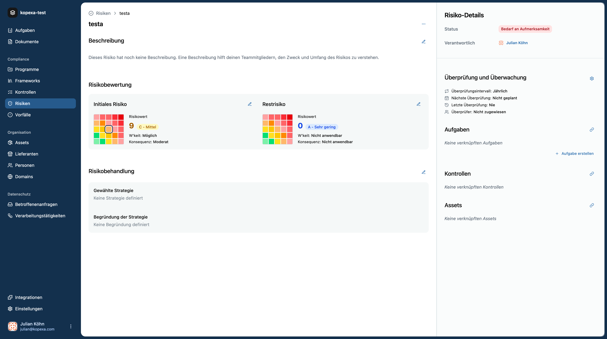

Risikomanagement ist ein kontinuierlicher Prozess – Risiken müssen **regelmäßig überprüft** werden, damit Bewertungen und Maßnahmen aktuell bleiben. Kopexa unterstützt dich dabei mit klaren Workflows für **Reviews** und **Rezertifizierungen**.

## Warum sind regelmäßige Reviews wichtig?

- **Veränderte Bedrohungslage:** Technologien, Angriffe oder Vorschriften ändern sich laufend.
- **Maßnahmen-Wirksamkeit prüfen:** Haben die eingeführten Kontrollen das Risiko tatsächlich reduziert?
- **Audit-Anforderungen:** Frameworks wie ISO 27001 oder TISAX verlangen dokumentierte Neubewertungen.

## Review-Zyklen in Kopexa

Jedes Risiko kann mit einem **Überprüfungsintervall** versehen werden, z. B.:

- **Quartalsweise** für kritische/high Risks
- **Jährlich** für mittlere Risks
- **Alle zwei Jahre** für akzeptierte/niedrige Risks

Diese Intervalle kannst du beim Anlegen oder Aktualisieren des Risikos festlegen. Kopexa zeigt dir das **nächste Review-Datum** in der Detailansicht an.

> **Tipp:** Lege teamweit verbindliche Intervalle fest und halte dich daran – das erleichtert Audits erheblich.

## Rezertifizierung

Eine **Rezertifizierung** ist eine vertiefte Neubewertung und wird vor allem für **High/Critical Risks** gefordert.

In Kopexa bedeutet das:
- **Alle Bewertungen und Nachweise erneut prüfen**
- **Restrisiko (Residual) neu berechnen** basierend auf aktuellen Daten
- **Maßnahmen anpassen oder ergänzen**

Für Rezertifizierungen kannst du in Kopexa **Work Items** mit Fälligkeiten und Verantwortlichen anlegen. So stellst du sicher, dass niemand die Rezertifizierung verpasst.

## Workflow für Reviews und Rezertifizierung

1. **Risiken filtern:** Zeige alle Risiken mit fälligen Reviews im Risikomodul an.
2. **Aktualität prüfen:** Sind Beschreibung, Kontext und Assets noch korrekt?
3. **Wirksamkeit der Maßnahmen bewerten:** Sind alle Work Items abgeschlossen? Nachweise aktuell?
4. **Score anpassen:** Impact und Likelihood ggf. neu bewerten.
5. **Ergebnisse dokumentieren:** Kommentare und Änderungen werden in Kopexa automatisch versioniert.
6. **Rezertifizierung durchführen:** Bei High/Critical Risks vollständige Neubewertung inkl. Maßnahmenplanung.

## Automatisierte Unterstützung

Kopexa erinnert dich an fällige Reviews und Rezertifizierungen:

- **Dashboard-Hinweise:** Fällige Reviews erscheinen im Risiko-Dashboard.
- **Work Item-Integration:** Erstelle Aufgaben für Reviewer direkt aus dem Risiko heraus.
- **Benachrichtigungen:** Optional über Integrationen (z. B. E-Mail oder Teams/Slack).

## Best Practices

- **Verantwortlichkeiten klar zuweisen:** Jeder Risiko-Owner sollte für Reviews und Rezertifizierung zuständig sein.
- **Review-Workflows mit Controls/Evidence verknüpfen:** Hilft, die Wirksamkeit objektiv zu prüfen.
- **Dokumentiere Begründungen:** Warum hat sich Impact oder Likelihood verändert? Diese Nachweise sind auditrelevant.
