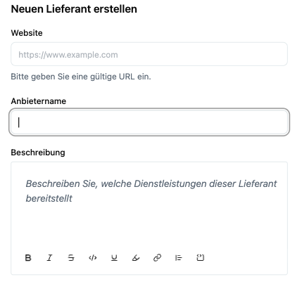

Neue Lieferanten werden im **Vendor-Modul** zentral erfasst. Dies schafft die Grundlage für Risikoanalysen, Sicherheitsbewertungen und Audits.

## Schritt-für-Schritt-Anleitung

1. **In der Liste auf „+ Lieferant hinzufügen“ klicken**  
   → Rechts oben im Lieferantenverzeichnis.

2. **Basisinformationen erfassen:**
   - **Website:** URL der offiziellen Anbieter-Seite.
   - **Name:** Klarer Name des Anbieters (z. B. „OVH Cloud“).
   - **Beschreibung:** Kurzbeschreibung der bereitgestellten Leistungen (z. B. „Cloud-Hosting für unsere Produktionssysteme“).

   

3. **Weitere Angaben (optional, aber empfohlen):**
   - **Kategorie/Kritikalität:** Kritisch/nicht-kritisch – dient der späteren Priorisierung.
   - **Primärer Ansprechpartner:** Verantwortliche Person im Unternehmen für diesen Vendor.
   - **Vertragsstatus:** z. B. „AVV vorhanden“ oder „in Verhandlung“.

4. **Speichern:** Der Lieferant wird mit dem Status **„Ausstehende Überprüfung“** angelegt.

## Best Practices beim Anlegen

- **Kritikalität definieren:** Je höher die Kritikalität, desto enger die Prüfintervalle.  
- **Alle relevanten Daten gleich mit erfassen:** erleichtert das spätere Mapping und die Audit-Vorbereitung.  
- **DSGVO-relevant?** Bei Datenverarbeitung unbedingt AV-Vertrag und Datenschutz-Links hinzufügen.

Nach dem Anlegen gelangst du auf die **Detailansicht**, wo SLA, Authentifizierung, Dokumente und Risiken gepflegt werden.
