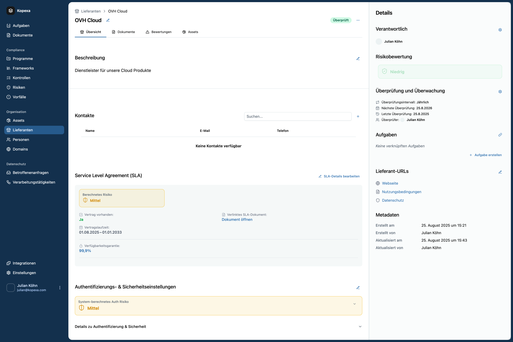

Die Detailansicht eines Vendors bildet **alle sicherheits- und compliance-relevanten Informationen** ab. Hier werden SLAs, Sicherheitsanforderungen und Nachweise verwaltet.

## Übersicht & Felder

- **Beschreibung:** Zweck und Art der Dienstleistung.
- **Kontakte:** Ansprechpartner mit E-Mail & Telefonnummer.  
  <Callout>Tipp: Füge immer einen **technischen** und einen **Vertrags-Ansprechpartner** hinzu.</Callout>
- **SLA-Daten:** Vertragsstatus, Laufzeit, Verfügbarkeitsgarantie.  
  SLA-Dokumente lassen sich direkt hochladen und verlinken.
- **Authentifizierungs- & Sicherheitseinstellungen:**  
  Dokumentiere MFA, Zugriffsbeschränkungen und bewertetes Auth-Risiko.
- **Risikobewertung:**
  - Systemberechnetes Risiko (auf Basis SLA + Auth-Einstellungen).
  - Verantwortlicher und Reviewzyklus.
- **Verknüpfte Dokumente:** AV-Verträge, Zertifikate, Sicherheitsrichtlinien.
- **Assets:** Falls der Vendor spezifische Systeme oder Daten hostet, können Assets zugeordnet werden.
- **Review & Audit-Trail:** Letzte und nächste Überprüfung, inklusive Reviewer.

## Verknüpfungen

- **Risiken:** Erstelle direkt ein Risiko für diesen Vendor oder verknüpfe bestehende.
- **Kontrollen:** Ordne Controls aus Katalogen wie ISO/NIS2 zu (z. B. „Alle Lieferanten müssen AVV haben“).
- **Dokumente:** Lade Datenschutzrichtlinien oder Verträge hoch und mappe sie.
- **Incident Reports:** Verknüpfe Sicherheitsvorfälle mit dem betroffenen Vendor.

## Vorteile der Detailansicht

- **Single Source of Truth** für alle lieferantenrelevanten Infos.  
- **Auditbereit:** Alle Nachweise und Bewertungen zentral verfügbar.  
- **Automatisiertes Risiko-Scoring:** Hilft bei Priorisierung und Prüfintervallen.
