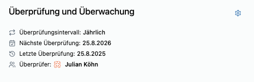

Normen wie **ISO 27001 (A.5.20–A.5.23)** und **NIS2** verlangen, dass **kritische Lieferanten regelmäßig überprüft** werden. Kopexa automatisiert diesen Prozess.

## Review-Mechanismus in Kopexa

<Mermaid
  chart={`
graph TD
    A[Ausstehende Überprüfung] -->|Review durchführen| B[Überprüft]
    B -->|Review-Zyklus fällig| A
    B -->|Status ändern bei SLA-/Risikoänderung| A
    A -->|Auditor fordert Nachweis| B
    style A fill:#fff7ed,stroke:#fb923c
    style B fill:#ecfdf5,stroke:#34d399
`}
 />

## Was wird überprüft?

- **Vertragliche Sicherheit:** AVV, SLA, TOMs aktuell und gültig?  
- **Technische Sicherheit:** MFA, Zugriffsbeschränkungen, Security-Zertifikate.  
- **Risikobewertung:** Änderungen bei Kritikalität oder Bedrohungslage?  
- **Evidenzen:** Nachweise hochladen (z. B. ISO-Zertifikate, Auditberichte).

## Workflow

1. **Review-Zyklus festlegen:** z. B. jährlich für kritische Vendoren, alle 2 Jahre für Low-Risk.  
2. **Automatische Erinnerung:** Kopexa benachrichtigt Reviewer vor Fälligkeit.  
3. **Review durchführen:** SLA, Auth, Risiko prüfen, Status aktualisieren.  
4. **Änderungen dokumentieren:** Alle Anpassungen versioniert und nachvollziehbar.

## Best Practices

- **Risikoorientierte Intervalle:** Kritische Lieferanten öfter prüfen.  
- **Review mit Nachweisen kombinieren:** Alle Dokumente und Checklisten hochladen.  
- **Kontinuierliches Monitoring:** Bei Vorfällen (Incidents) sofortige Neubewertung.

Kopexa stellt sicher, dass **Lieferantenüberprüfungen** nicht nur ein Häkchen sind, sondern Teil eines **lebendigen Sicherheitsprozesses** – inklusive Audit-Trail.
