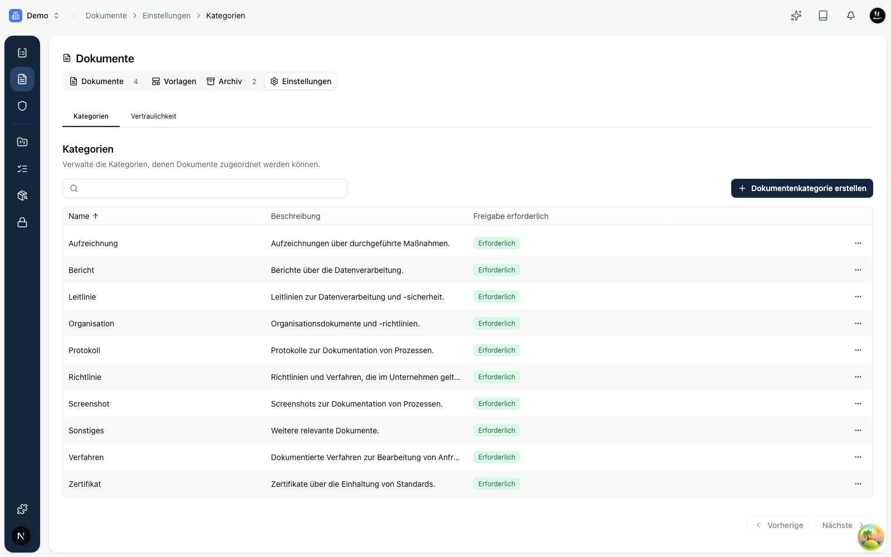
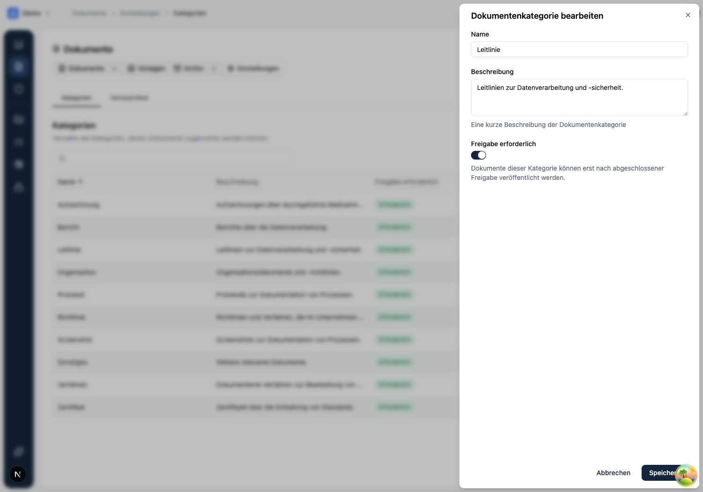
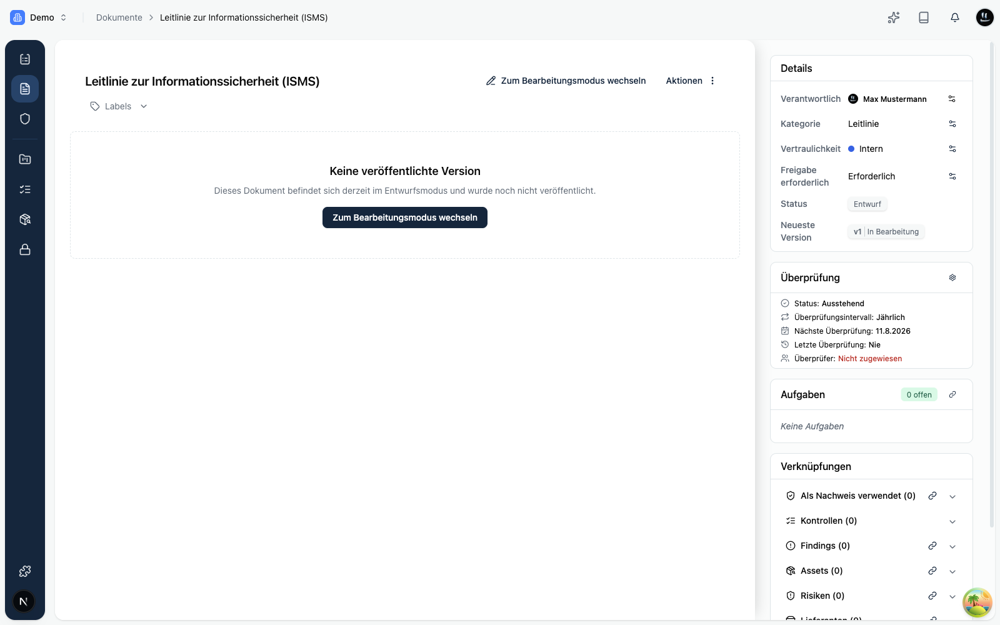
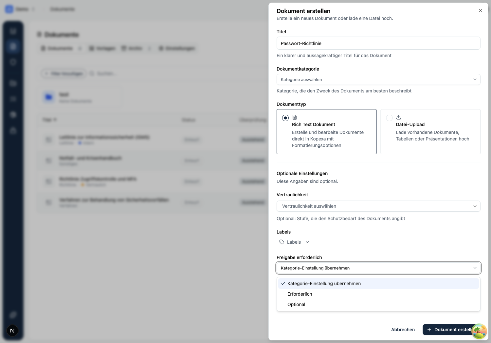

Ein zentrales Ziel von Kopexa ist es, **Governance und Auditfähigkeit** zu gewährleisten.  
Dafür gibt es einen klaren **Review- und Freigabeprozess** für alle Dokumente.

## Warum ein Reviewprozess?

- **Auditnachweis:** Prüfer wollen sehen, dass Policies **formell freigegeben** und regelmäßig überprüft werden.
- **Governance:** Klare Trennung zwischen **Entwurf (Draft)** und **veröffentlichten (Published)** Versionen.
- **Transparenz:** Jede Änderung wird versioniert und mit einem **Genehmigungs-Trail** versehen.
- **Qualität:** Policies werden durch mehrere Augenpaare geprüft, bevor sie verbindlich sind.

## Status-Lifecycle

Jedes Dokument durchläuft folgende Stati:

1. **Entwurf (Draft):**  
   - Inhalt wird erstellt/bearbeitet.
   - Kollaborative Bearbeitung möglich (Rich Text Editor).
   - Noch **nicht** verbindlich.

2. **Zur Überprüfung eingereicht:**  
   - Draft wird für Review markiert.
   - **Prüfer** (Reviewer) werden zugewiesen.
   - Reviewer erhalten eine Benachrichtigung.

3. **Genehmigt / Veröffentlicht:**  
   - Reviewer haben das Dokument geprüft und freigegeben.
   - Der Draft wird zur **Published-Version**.
   - Audit-Trail vermerkt **wer, wann und was** genehmigt hat.

4. **Änderungen angefordert:**  
   - Reviewer können Änderungen fordern.
   - Draft bleibt im Bearbeitungsstatus und wird nach Anpassung erneut eingereicht.

<Mermaid
  chart={`
graph TD
    D[Entwurf] -->|Einreichen| R[Zur Überprüfung eingereicht]
    R -->|Genehmigen| P[Veröffentlicht]
    R -->|Änderungen anfordern| D
    P -->|Neue Version starten| ND[Neuer Draft]
    P -->|Reviewzyklus fällig| RC[Review fällig]
    RC --> ND
    P -->|Deprecate / Archivieren| A[Archiviert]
    P --> M[Mapping: Owner, BU, Assets, Kontrollen, Risiken, Lieferanten]

    %% Styling
    style D fill:#eef2ff,stroke:#6366f1,stroke-width:1px
    style R fill:#fff7ed,stroke:#fb923c,stroke-width:1px
    style P fill:#ecfdf5,stroke:#34d399,stroke-width:1px
    style ND fill:#eef2ff,stroke:#6366f1,stroke-width:1px
    style RC fill:#e0f2fe,stroke:#38bdf8,stroke-width:1px
    style A fill:#f5f3ff,stroke:#a78bfa,stroke-width:1px
    style M fill:#f1f5f9,stroke:#94a3b8,stroke-width:1px
`}
/>

## Freigabe erforderlich: Pflicht oder optional

Nicht jedes Dokument braucht denselben Freigabegrad. In Kopexa steuerst du das über die Einstellung **„Freigabe erforderlich"**.

- Ist sie **aktiv**, kann ein Dokument erst nach abgeschlossener Freigabe veröffentlicht werden. Du weist Prüfer zu, und diese müssen freigeben.
- Ist sie **inaktiv**, ist die Freigabe optional. Ohne zugewiesene Prüfer kannst du direkt veröffentlichen. Sobald du Prüfer zuweist, gilt wieder der normale Ablauf.

Standardmäßig ist **Freigabe erforderlich** für alle Dokumente aktiv. So bleibt die bisherige, sichere Praxis erhalten.

### Standard je Kategorie

Den Standard legst du pro **Dokumentkategorie** fest. In den Kategorie-Einstellungen siehst du für jede Kategorie auf einen Blick, ob eine Freigabe erforderlich ist.

Beim Bearbeiten einer Kategorie schaltest du „Freigabe erforderlich" ein oder aus.

### Ausnahme je Dokument

Einzelne Dokumente dürfen vom Kategorie-Standard abweichen. In der Detailansicht eines Dokuments findest du dazu die Zeile **„Freigabe erforderlich"**.

Du hast drei Möglichkeiten:

- **Kategorie-Einstellung übernehmen:** Das Dokument folgt dem Standard seiner Kategorie.
- **Erforderlich:** Für dieses Dokument ist eine Freigabe Pflicht, unabhängig von der Kategorie.
- **Optional:** Für dieses Dokument ist die Freigabe optional.

Diese Ausnahme kannst du auch direkt beim Anlegen setzen, unter **„Optionale Einstellungen"**.

<Callout title="Gut zu wissen">
In der Detailansicht zeigt dir Kopexa per Mouseover, warum der Wert so ist: geerbt von der Kategorie, oder als Ausnahme gesetzt und von wem.
</Callout>

## Rollen & Verantwortlichkeiten

- **Author:** Erstellt und bearbeitet Drafts.
- **Reviewer:** Prüft Inhalt, kann freigeben oder Änderungen anfordern.
- **Owner:** Fachlich verantwortliche Person für das Dokument (z. B. ISB).

<Callout title="Best Practice">
Jeder freigegebene Entwurf sollte mindestens einen Prüfer und einen Owner haben.
</Callout>

## Audit-Trail & Versionierung

- **Jede Version** (Draft & Published) wird revisionssicher gespeichert.
- Alte Versionen bleiben für Audits sichtbar.
- Alle Genehmigungen und Kommentare werden protokolliert.

## Published-Dokumente

Nach Freigabe wird ein Dokument als **„Published“** geführt:

- Kann **gemappt** werden (Nachweise, Kontrollen, Findings, Assets, Risiken, Lieferanten, Prozesse und mehr).
- Kann in Audits als **Nachweis** genutzt werden.
- Unterliegt einem **Reviewzyklus** (siehe [Mapping & Zyklen](./mapping.mdx)).

## Beispiel: Review in der Praxis

1. Draft: „Informationssicherheitsleitlinie“ erstellt.
2. Reviewer (ISB) weist Feedback zu Wortlaut aus.
3. Änderungen übernommen, erneut eingereicht.
4. ISB genehmigt, Status auf **Veröffentlicht**.
5. Mapping zu Assets, Kontrollen und jährlicher Reviewzyklus gesetzt.

## Verwandte Themen

- [Dokument anlegen](./create.mdx)
- [Mapping & Reviewzyklen](./mapping.mdx)
- [Warum Dokumente mehr sind als Uploads](./index.mdx)
