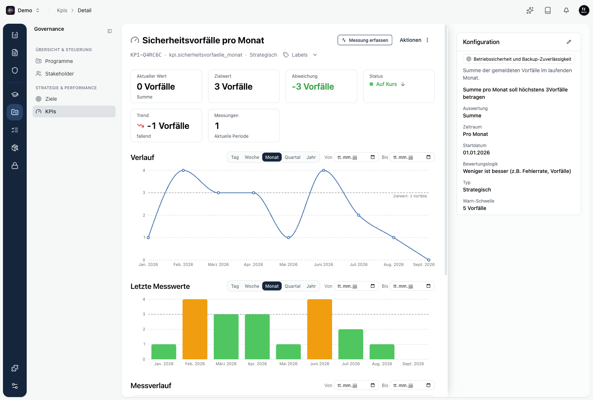

Die Detailseite eines KPI zeigt den aktuellen Stand, den Verlauf über die Zeit und alle einzelnen Messwerte. Du öffnest sie mit einem Klick auf einen KPI in der Liste.

## Kennzahlen auf einen Blick

Oben fassen mehrere Karten den Stand zusammen:

- **Aktueller Wert**: der ausgewertete Wert der laufenden Periode.
- **Zielwert**: der angestrebte Wert.
- **Abweichung**: der Abstand zwischen aktuellem Wert und Zielwert.
- **Status**: Auf Kurs, Gefährdet oder Verfehlt.
- **Trend**: ob sich der Wert gegenüber der Vorperiode verbessert oder verschlechtert.
- **Messungen**: wie viele Messwerte in die laufende Periode einfließen.

## Verlauf und Messwerte

Zwei Diagramme zeigen die Entwicklung:

- **Verlauf** stellt den ausgewerteten Wert je Periode als Linie dar, mit einer gestrichelten Linie für den Zielwert.
- **Letzte Messwerte** zeigt die jüngsten Perioden als Balken, eingefärbt nach ihrem Status.

Über die Umschaltung **Tag / Woche / Monat / Quartal / Jahr** änderst du die Granularität der Diagramme. Mit dem Filter **Von / Bis** grenzt du den betrachteten Zeitraum ein.

Darunter listet der **Messverlauf** jeden einzelnen Messwert mit Zeitpunkt, Wert, Datenquelle und Notiz. Diese Tabelle reagiert auf denselben Von/Bis-Filter.

## Konfiguration

Rechts fasst die **Konfiguration** die Einstellungen des KPI zusammen: das verknüpfte Ziel oder der Prozess, die Beschreibung, Auswertung, Zeitraum, Startdatum, Bewertungslogik, Typ, Warn-Schwelle und die Plausibilitätsgrenzen. Über das Stift-Symbol passt du diese Werte an.

## Export als CSV

Du exportierst die KPIs eines Space als CSV. Öffne dazu in der KPI-Liste das Menü **…** und wähle **Exportieren**. Du gibst einen Zeitraum über **Von** und **Bis** an, wahlweise über die Schnellauswahl (letzter Monat, aktuelles Quartal, aktuelles Jahr, letzte 12 Monate).

Die Datei enthält eine Zeile je KPI und Periode. So bekommst du eine Zeitreihe für Auswertungen außerhalb von Kopexa, etwa für ein Management-Review.

<Callout title="Umfang des Exports">
Der Export umfasst immer alle KPIs des Space, unabhängig von einer gesetzten Suche oder einem Filter in der Liste.
</Callout>
