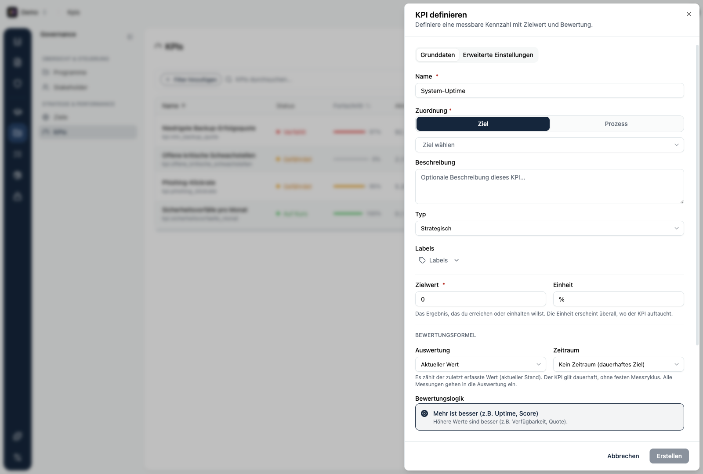
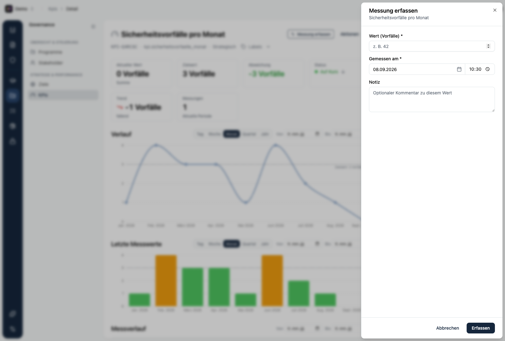

Du legst einen KPI über **KPI hinzufügen** in der KPI-Liste an. Das Formular hat zwei Reiter: **Grunddaten** und **Erweiterte Einstellungen**.

## Grunddaten

| Feld | Bedeutung |
|------|-----------|
| **Name** | Kurze, sprechende Bezeichnung, zum Beispiel „Phishing-Klickrate". |
| **Zuordnung** | Ob der KPI zu einem **Ziel** oder einem **Prozess** gehört, plus die Auswahl des konkreten Eintrags. Du kannst hier auch direkt ein neues Ziel oder einen neuen Prozess anlegen. |
| **Beschreibung** | Optionaler Kontext: was wird gemessen, woher kommt der Wert. |
| **Typ** | **Strategisch** oder **Operativ**. |
| **Zielwert** | Der Wert, den du erreichen oder einhalten willst. |
| **Einheit** | Frei wählbar, zum Beispiel %, Tage, Anzahl, EUR. |
| **Auswertung** | Wie mehrere Messwerte je Periode zusammengefasst werden: Aktueller Wert, Summe, Durchschnitt, Minimum oder Maximum. |
| **Zeitraum** | Die Periode: kein Zeitraum, pro Tag, Woche, Monat, Quartal oder Jahr. |
| **Startdatum** | Ab wann gemessen wird. Nur nötig, wenn du einen Zeitraum gewählt hast. |
| **Bewertungslogik** | Mehr ist besser, weniger ist besser oder exakte Übereinstimmung. |

Eine Vorschau fasst deine Auswahl in einem Satz zusammen, damit du die Wirkung direkt siehst.

## Erweiterte Einstellungen

| Feld | Bedeutung |
|------|-----------|
| **Topic** | Eine eindeutige Kurzkennung des KPI. Sie wird aus dem Namen vorgeschlagen und lässt sich später nicht mehr ändern. |
| **Warn-Schwelle** | Ab welchem Wert der KPI auf **Gefährdet** springt, bevor der Zielwert reißt. |
| **Min. Wert / Max. Wert** | Plausibilitätsgrenzen. Messwerte außerhalb dieser Grenzen werden beim Erfassen abgelehnt. |

## Was einen guten KPI ausmacht

Ein KPI ist nur so viel wert wie die Daten dahinter. Diese vier Merkmale trennen einen brauchbaren KPI von einem, der schnell verwaist:

| Merkmal | Schlechter KPI | Guter KPI |
|---|---|---|
| **Spezifität** | „Sicherheitsvorfälle reduzieren" | „Anzahl Phishing-Vorfälle mit Datenabfluss pro Quartal ≤ 1" |
| **Datenquelle** | Geschätzt, ohne Quelle | Automatisch aus dem SIEM, wöchentlich aktualisiert |
| **Pflegeverantwortung** | Unklar | SOC-Lead, wöchentlich |
| **Handlungsrelevanz** | „Nice to know" | Bei Überschreitung ist klar, wer was tut |

<Callout title="Ohne Datenbasis kein KPI">
Lege keinen KPI an, dessen Datenquelle du nicht geklärt hast. Ein KPI, den niemand pflegt, ist nicht nur wertlos, er untergräbt das Vertrauen in die gesamte Zielverfolgung. Lieber ein KPI weniger als ein KPI ohne Datenbasis.
</Callout>

## Messwerte erfassen

Ein KPI lebt von seinen Messwerten. Über **Messung erfassen** trägst du einen neuen Wert ein, entweder auf der Detailseite des KPI oder direkt aus der Liste.

Ein Messwert besteht aus:

- **Wert** in der Einheit des KPI.
- **Gemessen am**: Zeitpunkt der Messung. Er darf nicht in der Zukunft liegen.
- **Notiz**: optionaler Kommentar zu diesem Wert.

Jeder Messwert hat eine **Datenquelle**. Neben der manuellen Eingabe kennt Kopexa auch die Quellen **Interne Metrik**, **Externe API** und **Webhook**. So lassen sich Werte auch automatisch aus einem eigenen Ablauf einspielen, statt sie von Hand zu pflegen.

<Callout title="Werte automatisch einspielen">
Statt Messwerte von Hand einzutragen, kannst du sie über die Kopexa API automatisch schreiben lassen. Erstelle dazu einen [API Token](/platform/quickstart/api-tokens) mit Schreibrechten und lass ein eigenes Skript oder ein Automatisierungs-Tool (zum Beispiel Windmill oder n8n) die Werte regelmäßig an Kopexa senden. So pflegt sich der KPI selbst, und du reagierst nur noch auf Abweichungen.
</Callout>

<Callout title="Plausibilität">
Hast du Min- oder Max-Werte gesetzt, prüft Kopexa jeden Messwert dagegen. Ein Tippfehler wie eine Quote von 995 % wird so direkt beim Erfassen abgefangen.
</Callout>
