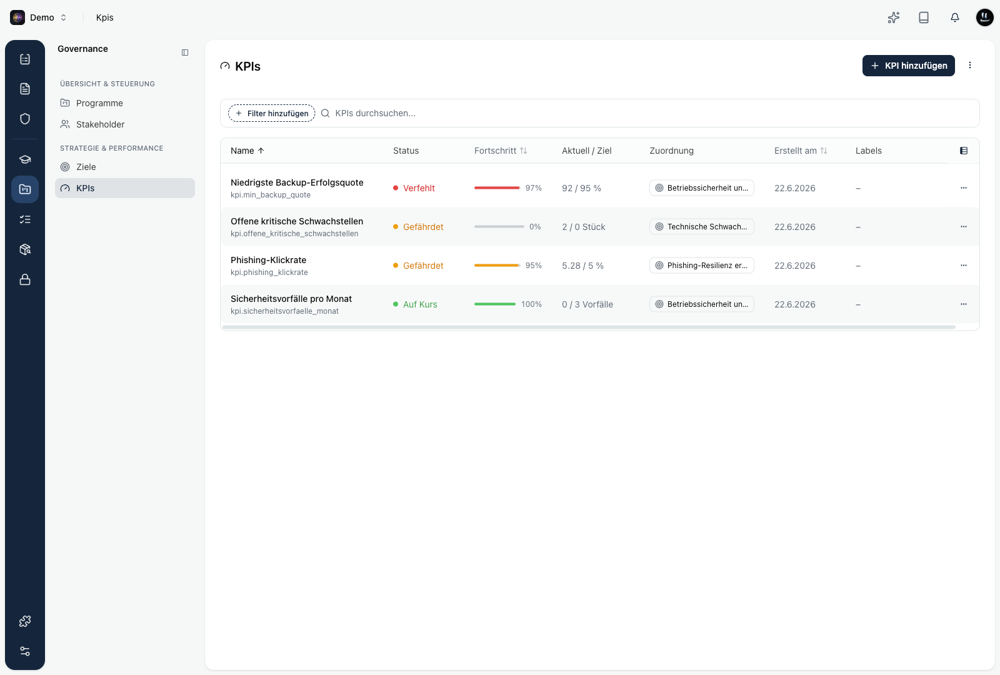

Ein KPI ist eine messbare Kennzahl mit einem Zielwert. Kopexa erfasst die Messwerte über die Zeit, berechnet den Fortschritt und zeigt dir mit einem klaren Status, ob du auf Kurs bist. Jeder KPI gehört zu genau einem [Ziel](/platform/governance/goals) oder einem Prozess und zahlt dort auf die Zielerreichung ein.

Du findest KPIs unter **Governance → KPIs**.

## Die Liste

Jede Zeile zeigt einen KPI auf einen Blick:

| Spalte | Bedeutung |
|--------|-----------|
| **Name** | Bezeichnung des KPI, darunter das Topic als Kurzkennung. |
| **Status** | Farbige Ampel: Auf Kurs, Gefährdet oder Verfehlt. |
| **Fortschritt** | Wie nah der aktuelle Wert am Zielwert liegt, als Balken und Prozent. |
| **Aktuell / Ziel** | Der zuletzt ausgewertete Wert im Vergleich zum Zielwert. |
| **Zuordnung** | Das Ziel oder der Prozess, zu dem der KPI gehört. |
| **Erstellt am** | Anlagedatum. |
| **Labels** | Freie Schlagworte zur Gruppierung. |

Über die Suche findest du KPIs nach Name oder Topic. Mit **Filter hinzufügen** grenzt du nach Status, Bewertungslogik, Zuordnung oder Labels ein.

## Status eines KPI

Kopexa bewertet den Status automatisch aus dem aktuellen Wert, dem Zielwert und der Bewertungslogik:

| Status | Bedeutung |
|--------|-----------|
| **Auf Kurs** | Der Zielwert ist erfüllt. |
| **Gefährdet** | Der Wert liegt im Warnbereich, das Ziel ist in Gefahr. |
| **Verfehlt** | Der Zielwert ist nicht erfüllt. |

Der Warnbereich entsteht aus der optionalen **Warn-Schwelle**. So siehst du eine Verschlechterung, bevor der Zielwert reißt.

## Bewertungslogik

Die Bewertungslogik legt fest, wann ein Wert gut ist:

| Logik | Wofür |
|-------|-------|
| **Mehr ist besser** | Höhere Werte sind besser, zum Beispiel Verfügbarkeit oder Abdeckung. |
| **Weniger ist besser** | Niedrigere Werte sind besser, zum Beispiel Fehlerrate oder Anzahl Vorfälle. |
| **Exakte Übereinstimmung** | Der Wert soll genau dem Zielwert entsprechen, zum Beispiel ein Zertifizierungsstatus. |

## Auswertung und Zeitraum

Ein KPI kann viele Messwerte je Periode haben. Die **Auswertung** bestimmt, wie diese zu einem Wert je Periode zusammengefasst werden:

- **Aktueller Wert** verwendet den zuletzt erfassten Wert.
- **Summe** addiert alle Werte einer Periode.
- **Durchschnitt** mittelt die Werte einer Periode.
- **Minimum** und **Maximum** nehmen den kleinsten oder größten Wert.

Der **Zeitraum** legt die Periode fest: kein Zeitraum (ein dauerhaftes Ziel), pro Tag, Woche, Monat, Quartal oder Jahr.

## Zuordnung zu Ziel oder Prozess

Jeder KPI gehört zu genau einem **Ziel** oder einem **Prozess**, nie zu beidem. Über diese Zuordnung fließt der KPI in die [Zielerreichung](/platform/governance/goals) ein: Kopexa berechnet den Fortschritt eines Ziels aus seinen verknüpften KPIs.

## So geht es weiter

<Cards>
  <Card title="KPI anlegen und Werte erfassen" href="/platform/governance/kpis/erstellen" />
  <Card title="KPI auswerten" href="/platform/governance/kpis/auswerten" />
  <Card title="KPIs automatisch tracken" href="/platform/governance/kpis/automatisieren" />
</Cards>

<Callout title="KPIs und Ziele gehören zusammen">
KPIs sind die Messgrößen, an denen sich ein Ziel bewegt. Warum Ziele wichtig sind und wie du gute Kennzahlen wählst, liest du unter [Ziele](/platform/governance/goals).
</Callout>
