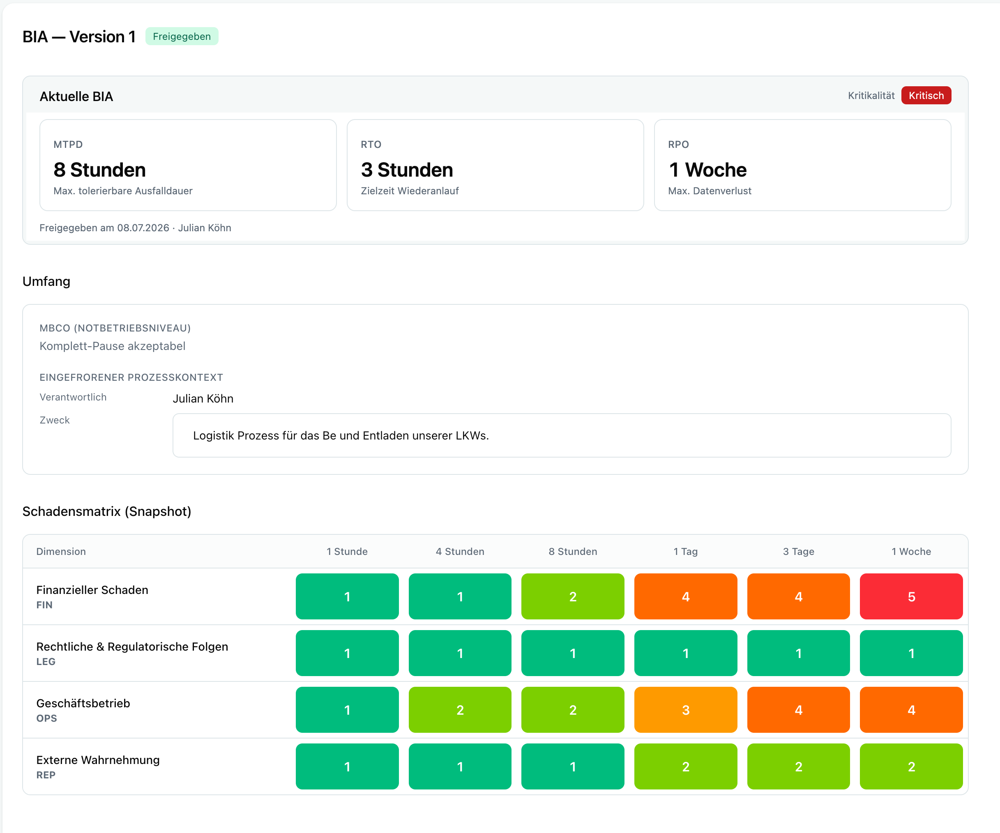
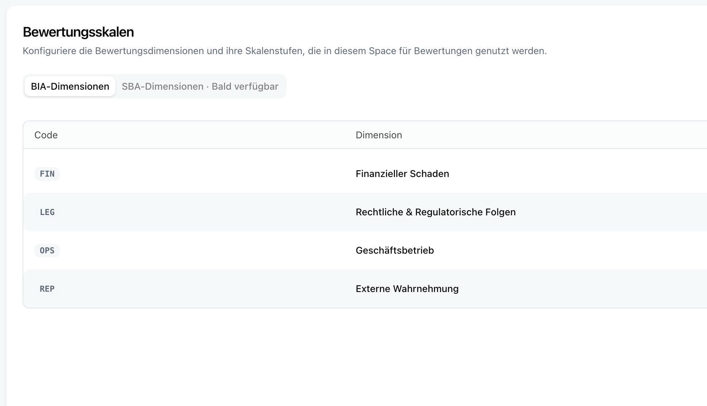
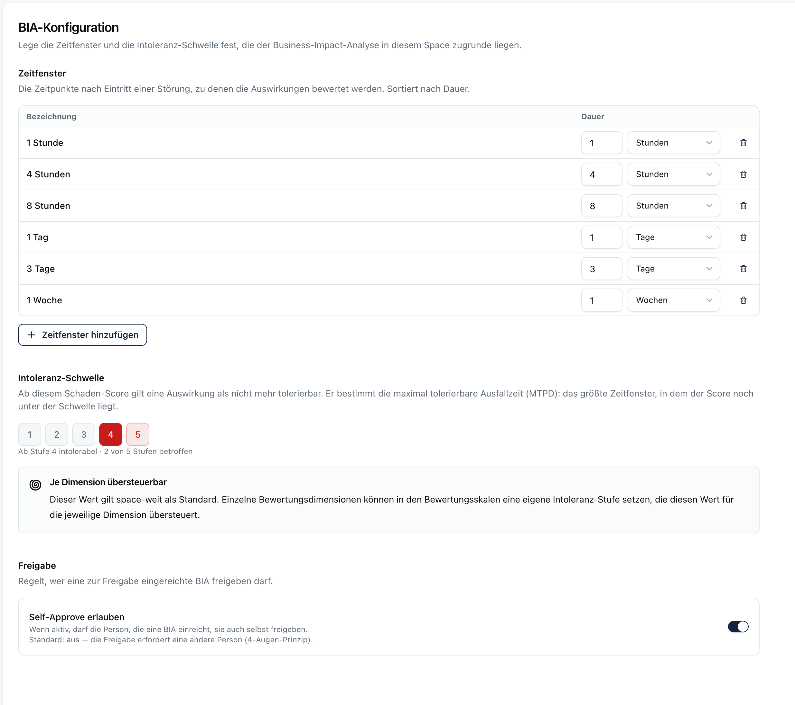
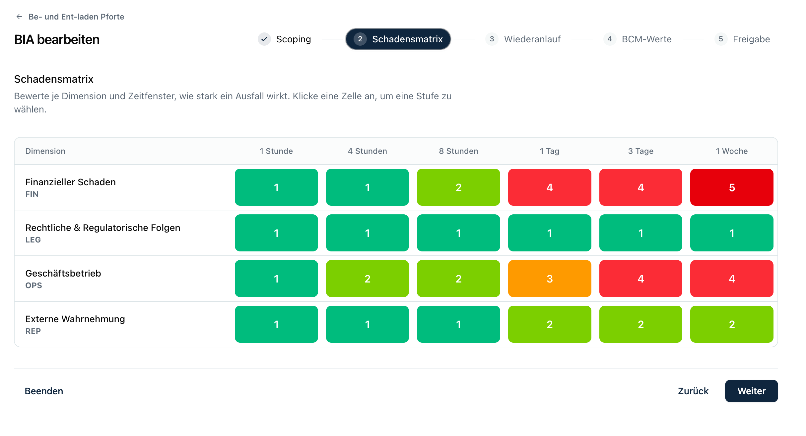

Eine **Business Impact Analyse (BIA)** beantwortet für einen **Prozess** eine einfache, aber zentrale Frage:

<Callout title="Die Kernfrage">
„Wenn dieser Prozess ausfällt: wie schlimm wird es, und wie schnell?"
</Callout>

Aus dieser Bewertung leitet Kopexa die zentralen Notfallkennzahlen ab, die dein **Business-Continuity-Management (BCM)** braucht:

- **MTPD** *(Maximum Tolerable Period of Disruption)*: Wie lange darf der Prozess maximal ausfallen, bevor der Schaden untragbar wird?
- **RTO** *(Recovery Time Objective)*: Bis wann muss der Prozess wieder laufen?
- **RPO** *(Recovery Point Objective)*: Wie viel Datenverlust ist tolerierbar?
- **Kritikalität:** wie geschäftskritisch der Prozess insgesamt ist (*Unkritisch*, *Wesentlich* oder *Kritisch*).

Das Vorgehen orientiert sich an **ISO 22301** und **BSI-Standard 200-4**. Die BIA ist versioniert und **auditfest**: eine freigegebene BIA lässt sich nicht mehr verändern und dient als Nachweis (SOC 2, ISO 27001, NIS2, BSI).

## Wo finde ich das?

Am Prozess selbst, im Bereich **Geschäftskontinuitätsmanagement (BCM)** („Notfallmanagement und Wiederanlaufzeiten"). Über die Schaltfläche **Business Impact Analyse** öffnest du die aktuelle BIA oder legst die erste an. Der Bereich zeigt außerdem die **BCM-Klasse** des Prozesses sowie die abgeleiteten Kennzahlen und die komplette Versionshistorie.

<Path items={[
  { label: "Organisation", icon: "PackageSearch" },
  { label: "Prozesse", icon: "ListTodo" },
  { label: "Prozess auswählen", entity: true },
  { label: "Geschäftskontinuitätsmanagement (BCM)" },
  { label: "Business Impact Analyse", icon: "Gauge", action: true },
]} />

Ein Klick öffnet die BIA-Übersicht mit Status, den abgeleiteten Kennzahlen und der Versions-Historie:

## Einmalige Vorbereitung (Space-Einstellungen)

Bevor du BIAs erstellst, richtet ein **Admin** einmal die Bewertungsgrundlagen im Space ein:

<Path items={[
  { label: "Einstellungen", icon: "Settings" },
  { label: "Bewertung", icon: "Gauge" },
]} />

1. **Bewertungsskalen:** die Schadens-*Dimensionen* (z. B. Finanzen, Reputation, rechtliche Folgen, Betrieb) und ihre *Stufen* mit Score (z. B. 1 = gering bis 5 = existenzbedrohend). Diese Skala gilt für alle BIAs im Space. Optional kannst du je Dimension eine eigene **Intoleranzstufe** setzen (siehe unten).

   

2. **BIA-Konfiguration**
   - **Zeitfenster:** die Zeitpunkte nach einem Ausfall, an denen der Schaden bewertet wird (z. B. 1 Std, 4 Std, 24 Std, 3 Tage, 1 Woche).
   - **Intoleranzschwelle:** ab welchem Schaden-Score ein Ausfall als *nicht mehr tolerierbar* gilt. Dieser Wert steuert die MTPD-Ableitung (BSI-Standardwert: 5). Er gilt space-weit als Standard.
   - **Freigabe:** ob die Freigabe im **4-Augen-Prinzip** erfolgt (Standard) oder ob **Self-Approve** erlaubt ist (siehe „Freigabe-Ablauf").

   

<Callout type="info" title="Intoleranz je Dimension (optional)">
Nicht jede Dimension „kippt" beim selben Score: ein finanzieller Schaden kann schon ab Stufe 4 („Kritisch") untragbar sein, während Reputationsschaden erst ab Stufe 5 zählt. Deshalb kannst du in den **Bewertungsskalen** pro Dimension eine eigene **Intoleranzstufe** hinterlegen. Ist sie gesetzt, gilt sie für diese Dimension; ist sie leer, greift die space-weite Standardschwelle als Fallback.

Effektive Schwelle einer Dimension = *ihre eigene Stufe, sonst der Space-Standard*. Ein Zeitfenster gilt als intolerabel, sobald **irgendeine** Dimension darin ihre eigene Schwelle erreicht.
</Callout>

> Diese Grundlagen sind pro Space konfigurierbar und werden für neue Spaces automatisch mit sinnvollen Standardwerten vorbelegt.

## Der Ablauf (BIA-Assistent)

Eine neue BIA legst du am Prozess an. Kopexa übernimmt dabei Stammdaten aus dem Prozess (Verantwortlicher, Beschreibung, Zweck), damit du nicht doppelt tippst. Ein **Assistent** führt dich Schritt für Schritt durch die Bearbeitung:

1. **Scoping (Was bewerten wir?):** Verantwortlicher, Hauptaktivitäten, Empfänger der Leistung, Saisonalität und Spitzenzeiten.
2. **Schadensmatrix** *(der Kern)*: für jede Dimension × jedes Zeitfenster wählst du die passende Skalenstufe. So entsteht ein Bild davon, **wie ein Ausfall über die Zeit eskaliert** (z. B. nach 1 Std noch gering, nach 24 Std existenzbedrohend).
3. **RPO & MBCO:** tolerierbarer Datenverlust (RPO) und das *Minimum Business Continuity Objective*, also das Mindest-Niveau, auf dem der Prozess im Krisenmodus weiterlaufen muss.
4. **BCM-Werte:** Kopexa **schlägt ein MTPD aus der Matrix vor**; du legst das RTO fest. Der Assistent prüft die Plausibilität (RTO darf nie größer als das MTPD sein).
5. **Ressourcen** *(folgt später)*: was der Prozess zum Wiederanlauf braucht (IT-Systeme, Schlüsselpersonen, Standorte, Dienstleister, Daten).
6. **Abschluss & Freigabe:** Zusammenfassung, dann Freigeben.

Solange die BIA im **Entwurf** ist, kannst du alles frei ändern. Sie zeigt immer die aktuellen Skalen- und Zeitfenster-Texte.

## Wie wird das MTPD abgeleitet?

Kopexa prüft je Zeitfenster, ob **irgendeine** Dimension ihre **effektive Intoleranzschwelle** erreicht (die eigene Dimensionsschwelle, sonst der Space-Standard). Das MTPD ist das **größte Zeitfenster, das noch für alle Dimensionen tolerierbar** ist.

- Ist schon das kleinste Zeitfenster für eine Dimension intolerabel, dann ist das MTPD = 0.
- Erreicht keine Dimension in keinem Zeitfenster ihre Schwelle, gibt es kein hartes MTPD.

<Callout type="warn" title="Vorschlag, nicht Vorschrift">
Der abgeleitete MTPD-Wert ist **nicht bindend**: bei Saisonalität oder nicht-linearer Eskalation kannst du das MTPD manuell übersteuern (mit Begründung). In der BIA ist ein solcher Wert als **manuell übersteuert** gekennzeichnet, ein automatischer als **aus Matrix abgeleitet**.
</Callout>

Die **Kritikalität** ergibt sich daraus, ob eine Dimension ihre effektive Schwelle erreicht (dann *Kritisch*) oder eine Stufe darunter liegt (dann *Wesentlich*), unabhängig vom zeitlichen Timing. Ein Prozess kann also geschäftskritisch sein, ohne besonders zeitkritisch zu sein.

## Freigabe-Ablauf (4-Augen oder Self-Approve)

Wie eine BIA final freigegeben wird, steuert ein Space-Setting:

<Path items={[
  { label: "Einstellungen", icon: "Settings" },
  { label: "Bewertung", icon: "Gauge" },
  { label: "BIA-Konfiguration", icon: "Timer" },
  { label: "Freigabe" },
]} />

- **4-Augen-Prinzip (Standard):** Am Ende des Assistenten **reichst du die BIA zur Freigabe ein** (Status **In Prüfung**). Danach gibt eine **andere Person** sie frei (**Freigeben**) oder **lehnt sie mit Kommentar ab** (**Ablehnen**, zurück zum Entwurf). Der Einreicher kann seine Einreichung auch **zurückziehen**. Freigeben und Einreichen durch dieselbe Person wird verhindert.
- **Self-Approve (optional):** Ist „Self-Approve erlauben" aktiv, endet der Assistent direkt mit **Freigeben**. Du gibst deine eigene BIA in einem Schritt frei, ohne separaten Prüfer. Sinnvoll für kleine Teams oder Einzel-Admins.

<Mermaid
    chart="
graph LR
    A[Entwurf] -->|einreichen| B[In Prüfung]
    B -->|freigeben| C[Freigegeben]
    B -->|ablehnen| A
    A -.->|Self-Approve| C
    C -->|neue Version| A
    C -->|abgelöst| D[Abgelöst]
"/>

## Was passiert bei der Freigabe?

Mit der Freigabe wird die BIA verbindlich. Kopexa führt automatisch aus:

1. **Plausibilitätsprüfung:** RTO ≤ MTPD; bei kritischen Prozessen sind Begründungen für RTO und RPO Pflicht. Schlägt eine Prüfung fehl, wird die Freigabe blockiert.
2. **Snapshot einfrieren:** die verwendeten Skalen- und Zeitfenster-Werte werden **hart in die BIA kopiert**. So bleibt der Nachweis korrekt, selbst wenn die Skala später geändert wird.
3. **Kennzahlen ableiten:** MTPD und Kritikalität werden aus der Matrix bestimmt.
4. **Auf den Prozess übertragen:** MTPD/RTO/RPO und die BCM-Klasse des Prozesses werden aus der BIA gesetzt. Ab jetzt ist die **BIA die Quelle** dieser Werte.
5. **Vorherige Version archivieren:** die bisher freigegebene BIA wird zur *abgelösten* (read-only) Historie.

<Callout type="info" title="Änderungen an einer freigegebenen BIA">
Eine freigegebene BIA ist **unveränderlich**. Willst du etwas ändern, erstellst du eine **neue Version** (sie übernimmt die Werte der aktuellen als Entwurf).
</Callout>

## Rückwärtskompatibilität (bestehende Prozesse)

Prozesse, deren MTPD/RTO/RPO **manuell** gepflegt sind, bleiben unverändert und weiter manuell editierbar, solange **keine BIA freigegeben** ist. Erst mit der ersten Freigabe übernimmt die BIA diese Felder; danach sind sie „aus der BIA abgeleitet" und werden nicht mehr von Hand geändert (dafür gibt es die neue Version). Es gibt **keine erzwungene Migration** bestehender Daten.

## Versionen & Historie

| Status | Bedeutung |
|---|---|
| **Entwurf** | In Arbeit, frei editierbar. |
| **In Prüfung** | Zur Freigabe eingereicht, inhaltlich gesperrt; wartet auf Freigabe oder Ablehnung durch eine andere Person (nur im 4-Augen-Modus). |
| **Freigegeben** | Die aktuell gültige BIA, unveränderlich. |
| **Abgelöst** | Frühere freigegebene Versionen, read-only als Audithistorie (zeigen die eingefrorenen Snapshot-Werte von damals). |

## Begriffe kurz erklärt

| Begriff | Bedeutung |
|---|---|
| **MTPD** | Maximal tolerierbare Ausfalldauer, bevor der Schaden untragbar wird |
| **RTO** | Zielzeit für den Wiederanlauf des Prozesses |
| **RPO** | Maximal tolerierbarer Datenverlust (Zeit) |
| **MBCO** | Mindest-Betriebsniveau im Krisenmodus |
| **Zeitfenster** | Zeitpunkt nach dem Ausfall, an dem der Schaden bewertet wird |
| **Schaden-Score** | Zahlenwert einer Skalenstufe (z. B. 1 bis 5) |
| **Intoleranzschwelle** | Score, ab dem ein Ausfall als untragbar gilt (space-weit als Standard, optional je Dimension übersteuerbar) |
| **Kritikalität** | Geschäftskritikalität des Prozesses (aus dem Max-Schaden) |

## Wer darf was?

BIAs erstellen, bearbeiten, einreichen und freigeben dürfen **Space-Admins**. Mitglieder sehen die BIA und ihre Historie lesend.

Im **4-Augen-Modus** (Standard) muss der Freigebende ein **anderer Admin** sein als der Einreicher; ein Ein-Personen-Space kommt so nicht durch. Für solche Fälle aktiviere **Self-Approve** (siehe „Freigabe-Ablauf"), dann darf dieselbe Person einreichen und freigeben.
