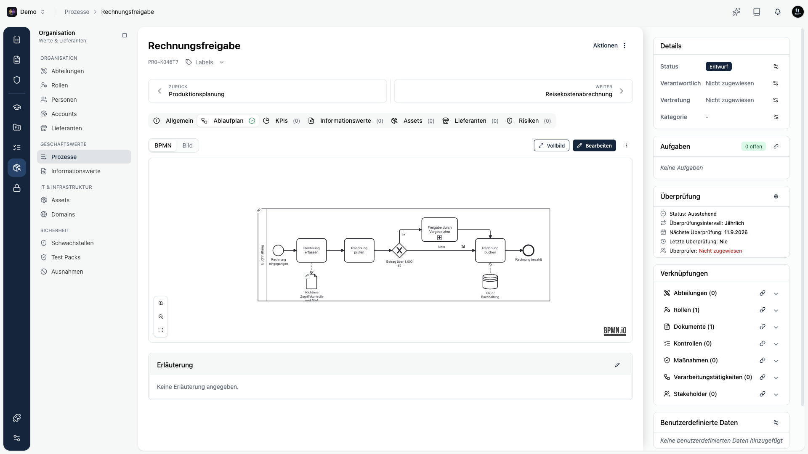
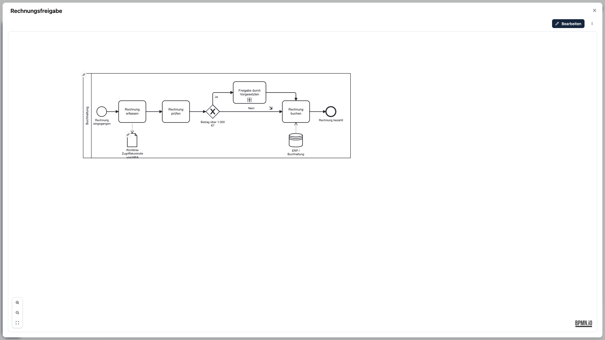
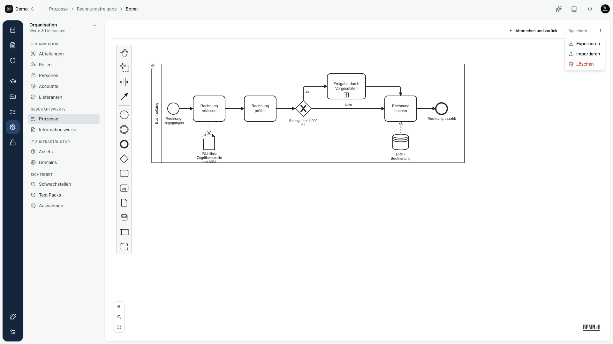

Zu jedem Prozess kannst du einen **Ablaufplan** im Standard **BPMN 2.0** hinterlegen. Das Besondere in Kopexa: du verknüpfst einzelne Elemente des Diagramms direkt mit deinen **Dokumenten**, **Assets**, **Informationswerten**, **Unterprozessen** und **Rollen**. So wird aus dem Ablaufplan mehr als ein Bild. Es entsteht ein echtes Beziehungsnetz, das im Prozess sichtbar wird.

## Wo du den Ablaufplan findest

Öffne einen Prozess und wechsle auf den Reiter **Ablaufplan**. Dort gibt es einen Umschalter:

- **BPMN**: das interaktive Ablaufdiagramm.
- **Bild**: ein hochgeladenes Ablaufbild als einfache Alternative.

## Ansehen

Ist ein Diagramm hinterlegt, siehst du es als Ansicht. Klickst du auf ein verknüpftes Element, öffnet sich eine kleine Vorschau des verknüpften Objekts mit Namen, Beschreibung und einem Link zur Detailseite. Über **Vollbild** öffnest du das Diagramm bildschirmfüllend. Mit den Zoom-Schaltflächen vergrößerst, verkleinerst oder passt du das Diagramm ein.

## Bearbeiten

Über **Bearbeiten** (oder **BPMN erstellen**, wenn noch kein Diagramm vorhanden ist) öffnest du den Editor. Dort modellierst du den Ablauf und speicherst ihn über **Speichern**.

## Elemente mit Kopexa verknüpfen

Wählst du im Editor ein passendes Element aus, erscheint rechts das Panel **Verknüpfung**. Dort wählst du das Kopexa-Objekt, mit dem das Element verbunden werden soll. Der Name des Elements übernimmt dabei den Namen des Objekts.

| Diagramm-Element | Verknüpfbar mit |
|------------------|-----------------|
| Datenobjekt | **Dokument** |
| Datenspeicher | **Asset** oder **Informationswert** |
| Unterprozess | **Unterprozess** |
| Pool | **Rolle** |

Findest du das gewünschte Objekt nicht, legst du es direkt aus dem Auswahlfeld heraus neu an. Beim Speichern stellt Kopexa aus den Verknüpfungen die echten Beziehungen des Prozesses her.

## Importieren, exportieren, löschen

Über das Menü **Weitere Aktionen** (die drei Punkte neben **Bearbeiten** beziehungsweise **Speichern**) stehen dir drei Aktionen zur Verfügung:

- **Exportieren**: lädt das Diagramm als `.bpmn`-Datei herunter. Die Verknüpfungen zu deinen Kopexa-Objekten sind in der Datei enthalten.
- **Importieren**: lädt eine `.bpmn`- oder `.xml`-Datei hoch. Der aktuelle Ablauf wird ersetzt. Erkannte Verknüpfungen stellt Kopexa automatisch wieder her. Diese Aktion steht im Ablaufplan-Reiter und im Editor zur Verfügung, nicht in der Vollbild-Ansicht.
- **Löschen**: entfernt den Ablaufplan. Die Verknüpfungen zu Dokumenten, Assets und Rollen gehen dabei verloren.

<Callout title="Tipp">
Beim Import prüft Kopexa, ob die Datei ein gültiges BPMN-2.0-Diagramm ist. Ungültige Dateien werden abgelehnt. So bleibt dein Ablaufplan sauber, auch wenn er aus einem anderen Werkzeug stammt.
</Callout>
