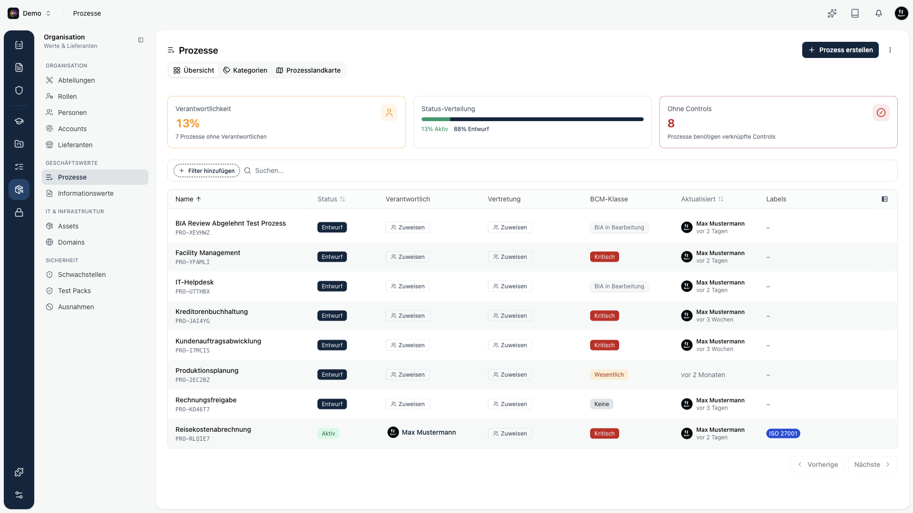
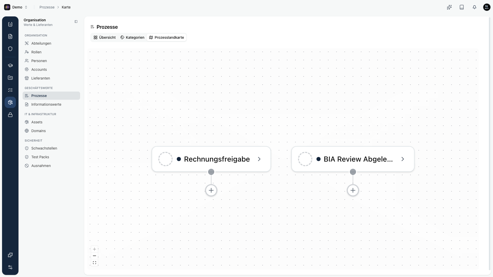
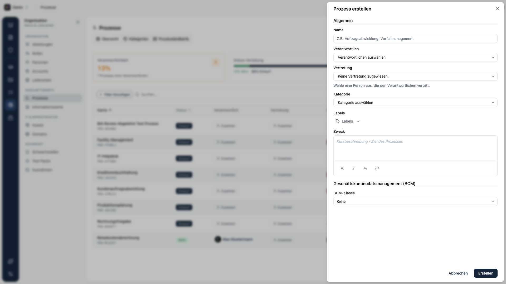
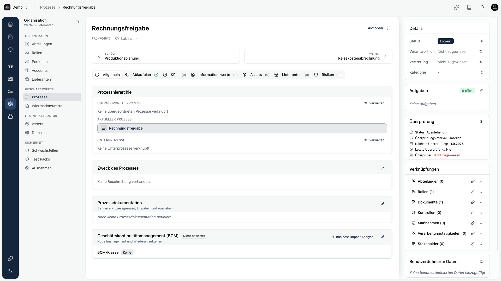

**Prozesse** bilden die Geschäftsprozesse deiner Organisation im **Space** ab, von der Kernwertschöpfung bis zu unterstützenden Abläufen. Sie sind die Grundlage für **Business-Continuity-Management (BCM)**: Erst wenn ein Prozess erfasst und dokumentiert ist, kannst du seine Kritikalität und seine Notfallkennzahlen über eine [Business Impact Analyse](./bia) bestimmen.

<Callout title="Kurzprinzip">
Ein Prozess bündelt **Verantwortlichkeit**, **Dokumentation**, **Kennzahlen** und **Verknüpfungen** an einer Stelle und dient als Anker für **Kontrollen**, **Risiken** und die **BIA**.
</Callout>

## Was ist ein Prozess?

Ein Prozess in Kopexa beschreibt einen wiederkehrenden Ablauf mit klarem Zweck, einem Verantwortlichen und definierten Ein- und Ausgaben. Jeder Space führt seine eigenen Prozesse.

**Navigation:** im Space unter `Organisation → Prozesse`.

## Die drei Ansichten

Über die Reiter am Kopf der Prozessliste wechselst du zwischen drei Ansichten:

| Ansicht | Was du dort siehst |
|---------|--------------------|
| **Übersicht** | Kennzahlen-Kacheln und eine Tabelle aller Prozesse. |
| **Kategorien** | Deine Prozesskategorien zum Ordnen und Gruppieren. |
| **Prozesslandkarte** | Eine visuelle Karte, die zeigt, wie deine Prozesse zusammenhängen. |

In der **Übersicht** enthält die Tabelle die Spalten **Name**, **Status**, **Verantwortlich**, **Vertretung**, **BCM-Klasse**, **Aktualisiert** und **Labels**. Über die Suchleiste filterst du zusätzlich nach Status, BCM-Klasse, BIA, Kategorie, Verantwortlich, Vertretung und Labels.

## Prozess erstellen

Über **Prozess erstellen** öffnest du das Formular. Es ist in zwei Abschnitte gegliedert.

**Allgemein**: **Name** (Pflicht), **Verantwortlich**, **Vertretung**, **Kategorie**, **Labels** und **Zweck** (eine kurze Beschreibung von Ziel und Zweck des Prozesses).

**Geschäftskontinuitätsmanagement (BCM)**: die **BCM-Klasse** (**Keine**, **Wesentlich** oder **Kritisch**). Bei **Wesentlich** oder **Kritisch** erscheinen die Kennzahlen **MTPD**, **RTO** und **RPO** (jeweils in Minuten) mit Begründung. Für kritische Prozesse sind MTPD und RTO Pflicht, und die RTO darf die MTPD nicht überschreiten.

## Die Detailseite

Öffnest du einen Prozess, siehst du links den Inhalt in Reitern und rechts eine Seitenleiste.

**Reiter:** **Allgemein** (Prozesshierarchie, Zweck, Prozessdokumentation, BCM), **Ablaufplan** (das BPMN-Diagramm, siehe unten), **KPIs**, **Informationswerte**, **Assets**, **Lieferanten** und **Risiken**.

**Seitenleiste:** **Details** (Status, Verantwortlich, Vertretung, Kategorie), **Aufgaben**, **Überprüfung** sowie **Verknüpfungen** zu Organisationseinheiten, Rollen, Dokumentation, Kontrollen, Verarbeitungstätigkeiten und Stakeholdern.

### Prozessdokumentation

Jeder Prozess trägt eine strukturierte **Prozessdokumentation**:

- **Geltungsbereich:** was der Prozess umfasst (und was nicht).
- **Eingaben:** was der Prozess benötigt (Daten, Vorleistungen, Auslöser).
- **Ausgaben:** welche Ergebnisse und Leistungen er liefert und an wen.

Diese Angaben sind zugleich die Stammdaten, die eine **BIA** automatisch übernimmt, damit du sie nicht doppelt pflegst.

### Prozesshierarchie

Prozesse lassen sich in einer **Hierarchie** anordnen: **übergeordnete Prozesse** als fachlicher Rahmen und **Unterprozesse** als feinere Abläufe. So bildest du eine Wertschöpfungskette bis auf Teilprozess-Ebene ab.

### Kennzahlen und Kontrollen

- **Kennzahlen (KPIs):** messbare Zielwerte je Prozess (zum Beispiel *Durchlaufzeit unter 24 h*), mit Einheit und Messfrequenz.
- **Kontrollen:** jeder Prozess sollte mit **Kontrollen** verknüpft sein, die seine ordnungsgemäße und sichere Ausführung belegen. Prozesse ohne verknüpfte Kontrollen weist Kopexa gesondert aus.

### Verknüpfungen

Prozesse verbinden sich mit den übrigen Modulen und werden so zum roten Faden durch dein Managementsystem: **Assets**, **Risiken**, **Kontrollen und Nachweise** sowie **Personen und Lieferanten**.

## Ablaufplan (BPMN)

Zu jedem Prozess kannst du einen **Ablaufplan** als BPMN-Diagramm hinterlegen und einzelne Schritte direkt mit Dokumenten, Assets, Informationswerten, Unterprozessen und Rollen verknüpfen. Wie das funktioniert, liest du auf der Seite [Ablaufplan (BPMN)](./bpmn).

## Business Impact Analyse (BIA)

Die zentrale Fähigkeit am Prozess ist die **Business Impact Analyse**. Sie beantwortet, *wie schlimm* und *wie schnell* der Ausfall eines Prozesses wird, und leitet daraus die BCM-Kennzahlen **MTPD**, **RTO**, **RPO** und die **Kritikalität** ab, versioniert und auditfest.

<Callout title="Weiter zur BIA">
Alles zum Ablauf, zur Schadensmatrix und zur Freigabe findest du unter **[Business Impact Analyse](./bia)**.
</Callout>
