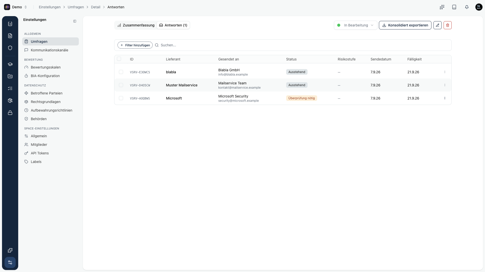
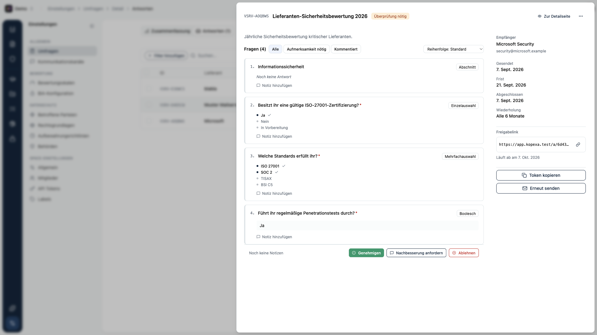

Eine **Bewertung** ist eine [Umfrage](/platform/settings/surveys) vom Typ Lieferanten-Risikobewertung, die du an einen Lieferanten verschickst. Der Lieferant füllt den Fragebogen über einen Link aus, du überprüfst die Antworten und schließt die Bewertung mit einer Entscheidung ab.

<Callout title="Fragebogen zuerst">
Wie du den Fragebogen aufbaust, Vorlagen pflegst, Ergebnisse auswertest und archivierst, liest du unter [Umfragen](/platform/settings/surveys). Diese Seite beschreibt nur die lieferantenspezifischen Schritte.
</Callout>

## Bewertung senden

Du verschickst eine Bewertung aus dem Lieferanten-Modul. Dabei gibst du an:

- **Empfänger** - Name und E-Mail-Adresse der Kontaktperson beim Lieferanten.
- **Frist** - bis wann die Bewertung ausgefüllt sein soll.
- **Wiederholung** - optional, damit die Bewertung regelmäßig neu ausgeht.

Kopexa erzeugt einen persönlichen **Freigabelink** und verschickt ihn an den Empfänger. Über diesen Link füllt der Lieferant den Fragebogen aus, ohne ein eigenes Konto zu brauchen.

## Versendete Bewertungen

Die versendeten Bewertungen findest du im **Bewertungen**-Tab des Lieferanten sowie in der Antworten-Ansicht der zugehörigen Umfrage.

Jede Zeile zeigt den Lieferanten, die Kontaktperson, den Status, das Sendedatum und die Frist.

### Status einer Bewertung

| Status | Bedeutung |
|--------|-----------|
| **Ausstehend** | Verschickt, aber noch nicht bearbeitet. |
| **In Bearbeitung** | Der Lieferant füllt den Fragebogen gerade aus. |
| **Überfällig** | Die Frist ist verstrichen, ohne dass abgeschlossen wurde. |
| **Überprüfung nötig** | Der Lieferant hat geantwortet, du bist am Zug. |
| **Nachbesserung** | Du hast Nachbesserung angefordert, der Lieferant bessert nach. |
| **Genehmigt** | Bewertung geprüft und freigegeben. |
| **Abgelehnt** | Bewertung geprüft und abgelehnt. |
| **Archiviert** | Aus dem Alltag genommen, siehe [Archiv](/platform/settings/surveys/archiv). |

## Überprüfen

Öffne eine Bewertung mit dem Status **Überprüfung nötig**. Du siehst die Antworten Frage für Frage und kannst zu einzelnen Punkten Notizen hinterlassen.

Zum Abschluss hast du drei Möglichkeiten:

- **Genehmigen** - die Bewertung ist in Ordnung.
- **Nachbesserung anfordern** - der Lieferant soll einzelne Punkte überarbeiten.
- **Ablehnen** - die Bewertung erfüllt die Anforderungen nicht.

Rechts findest du außerdem den **Freigabelink** und den **Token**, kannst die Bewertung **erneut senden** und siehst Frist, Sendedatum und Wiederholung.

<Callout title="Archivierte Bewertungen">
Bei einer archivierten Umfrage sind diese Aktionen eingeschränkt: Erneut senden, Freigabelink, Token und Nachbesserung entfallen, es bleiben nur Genehmigen und Ablehnen. Neue Antworten nimmt der Fragebogen dann nicht mehr an.
</Callout>
