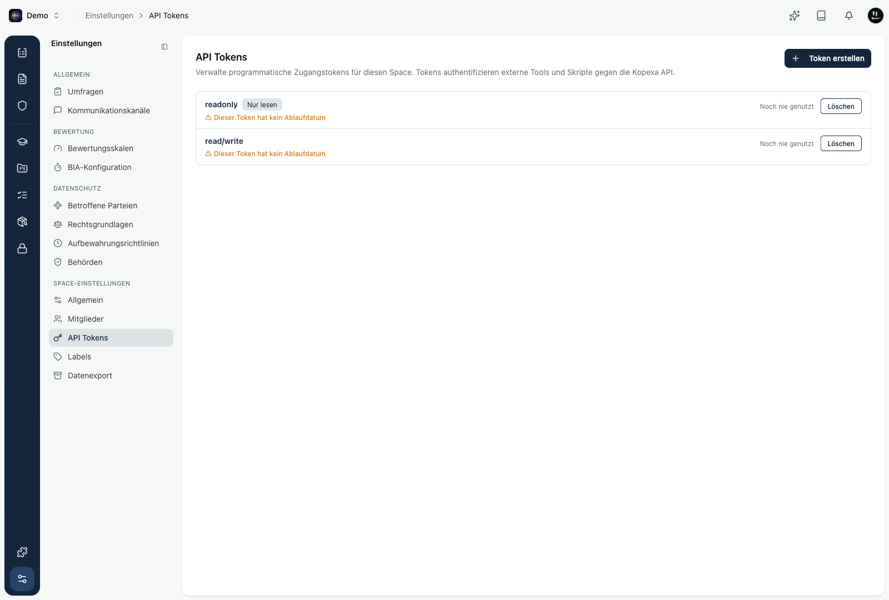
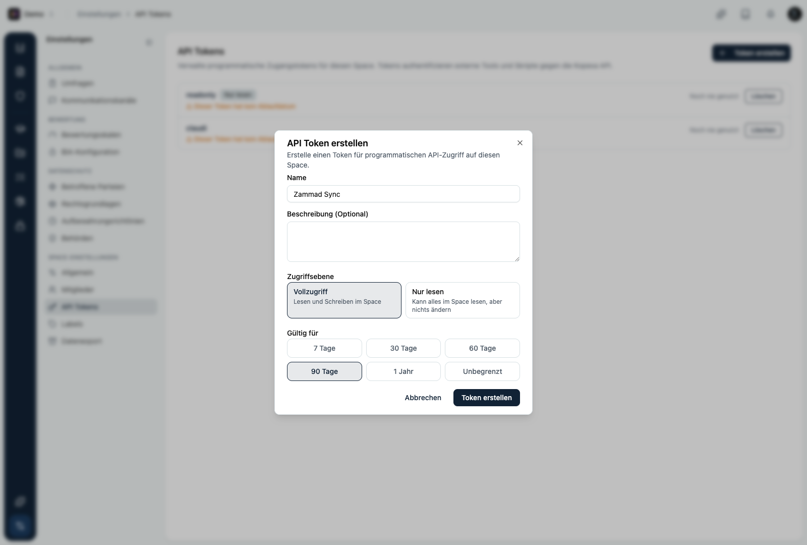

Ein API Token ist ein Schlüssel für den programmatischen Zugriff auf einen Space. Damit authentifizieren sich externe Tools, Skripte und Automatisierungen gegen die Kopexa API, ohne dass sich eine Person anmelden muss. Ein typischer Fall ist das automatische Einspielen von [KPI-Messwerten](/platform/governance/kpis/erstellen) aus einem eigenen Ablauf.

Du findest API Tokens unter **Einstellungen → API Tokens**.

Jeder Token gehört zu genau einem Space und hat nur dort Zugriff. Die Liste zeigt Name, Zugriffsebene, Ablauf und wann der Token zuletzt genutzt wurde.

## Token erstellen

Über **Token erstellen** legst du einen neuen Token an.

| Feld | Bedeutung |
|------|-----------|
| **Name** | Sprechende Bezeichnung, damit du den Token später wiedererkennst, zum Beispiel „Zammad Sync". |
| **Beschreibung** | Optionaler Zweck des Tokens. |
| **Zugriffsebene** | **Vollzugriff** (lesen und schreiben) oder **Nur lesen** (kann alles im Space lesen, aber nichts ändern). |
| **Gültig für** | Ablauf des Tokens: 7, 30, 60 oder 90 Tage, 1 Jahr oder unbegrenzt. |

<Callout title="Token nur einmal sichtbar">
Nach dem Erstellen wird der Token **einmalig** angezeigt. Kopiere ihn sofort und hinterlege ihn sicher, zum Beispiel im Secret-Speicher deines Tools. Danach lässt er sich nicht mehr anzeigen. Geht er verloren, erstellst du einfach einen neuen.
</Callout>

## Token verwalten und widerrufen

In der Liste siehst du zu jedem Token den Status (aktiv, abgelaufen oder widerrufen) und die letzte Nutzung. Über **Löschen** widerrufst du einen Token. Der Zugriff endet dann sofort. Widerrufe einen Token, sobald er nicht mehr gebraucht wird oder ein Verdacht besteht, dass er offengelegt wurde.

## Empfehlungen

- **So wenig Rechte wie nötig:** Nutze **Nur lesen**, wenn dein Tool keine Daten schreiben muss.
- **Ablaufdatum setzen:** Ein befristeter Token begrenzt den Schaden, falls er doch abhandenkommt.
- **Pro Zweck ein Token:** Ein eigener Token je Tool oder Skript macht sichtbar, wer worauf zugreift, und lässt sich gezielt widerrufen.
- **Sicher aufbewahren:** Lege den Token nie im Klartext in Code oder Chats ab.

<Callout title="Die API erkunden">
Welche Daten und Aktionen die Kopexa API bietet, siehst du im interaktiven [API Playground](https://api.kopexa.com/playground). Dort kannst du die API mit deinem Token direkt ausprobieren.
</Callout>
