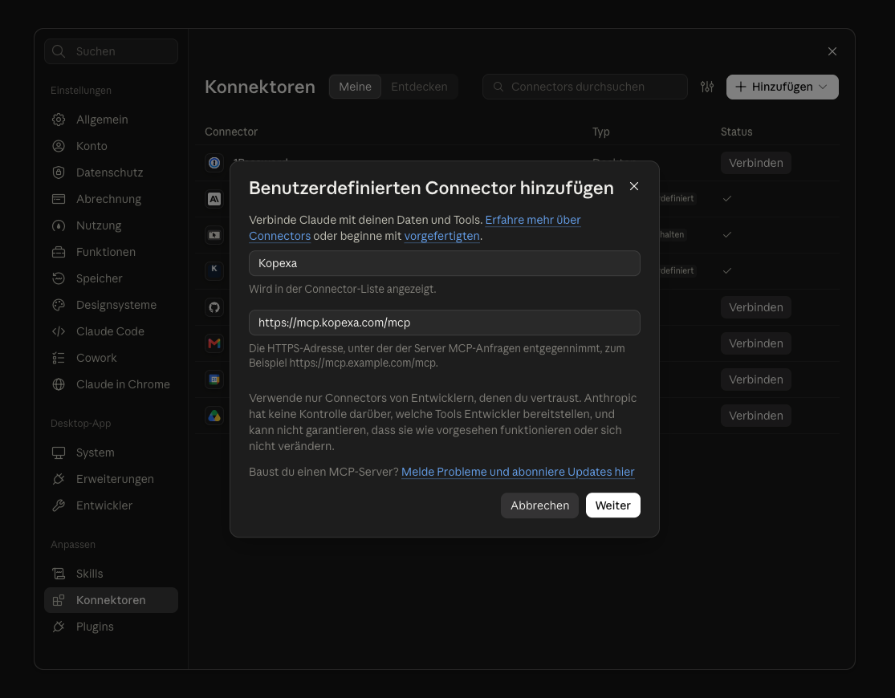

<Callout title="Enterprise-Plan">
Die KI-Anbindung ist ein Feature des **Enterprise-Plans** und muss von Kopexa für deine Organisation freigeschaltet werden.
</Callout>

Mit der KI-Anbindung verbindest du einen KI-Assistenten wie **ChatGPT** oder **Claude** direkt mit deinen Kopexa-Daten. Der Assistent kann deine Daten dann lesen und bearbeiten, immer im Rahmen deiner Berechtigungen im gewählten Space. Die Anbindung nutzt den offenen Standard **MCP (Model Context Protocol)**.

## Voraussetzungen

- **Enterprise-Plan.**
- Die KI-Anbindung ist **für deine Organisation freigeschaltet** (durch Kopexa).
- Ein Kopexa-Konto mit Zugriff auf den gewünschten Space.

## Verbinden mit ChatGPT

1. Öffne in ChatGPT die **Einstellungen** und suche nach **„MCP"**.
2. Unter **Plugins** wechselst du zum Tab **MCPs** und wählst **Hinzufügen**, dann **MCP-Server hinzufügen**.
3. Trage die Verbindung ein:
   - **Name:** Kopexa
   - **Typ:** Streamable HTTP
   - **URL:** `https://mcp.kopexa.com/mcp`

   Die Felder für Token und Header bleiben leer. Die Anmeldung läuft über den Login.
4. **Speichern.** ChatGPT leitet dich zum **Kopexa-Login** weiter. Melde dich an und bestätige den Zugriff. Fertig.


## Verbinden mit Claude

In Claude heißt die Anbindung **Connector**. Sie funktioniert im Browser auf claude.ai und in der Claude-App für Desktop.

1. Öffne in Claude die **Einstellungen** und wähle **Konnektoren**.
2. Wähle **Hinzufügen** und dann **Benutzerdefinierten Connector hinzufügen**.
3. Trage die Verbindung ein:
   - **Name:** Kopexa
   - **URL:** `https://mcp.kopexa.com/mcp`
4. Wähle **Weiter**. Claude erkennt die Anmeldung selbst: Lass **Jetzt anmelden** und **Automatisch registrieren** ausgewählt. Request-Header brauchst du nicht.
5. Wähle **Hinzufügen**. Claude zeigt dir den neuen Connector mit dem Hinweis, dass du noch nicht verbunden bist.
6. Wähle **Verbinden**. Claude leitet dich zum **Kopexa-Login** weiter. Melde dich an und bestätige den Zugriff. Fertig.



<Callout title="Claude im Team">
In einem Team- oder Enterprise-Konto von Claude richtet in der Regel ein Admin den Connector einmal für die ganze Organisation ein. Danach verbindet sich jede Person in ihren eigenen Einstellungen unter **Konnektoren** mit ihrem Kopexa-Konto.
</Callout>

<Accordions>
<Accordion title="Für Entwickler: Claude Code">
Hast du Kopexa schon in Claude verbunden und bist in Claude Code mit demselben Konto angemeldet, ist Kopexa dort bereits verfügbar. Du musst nichts weiter tun.

Ohne diesen Connector fügst du Kopexa im Terminal hinzu:

```bash
claude mcp add --transport http kopexa https://mcp.kopexa.com/mcp
```

Starte danach in Claude Code `/mcp`, wähle **kopexa** und melde dich an.
</Accordion>
</Accordions>

## Space auswählen

Eine Sitzung ist immer an **einen** Space gebunden. Bitte den Assistenten zuerst, deine Spaces aufzulisten, und dann den gewünschten Space auszuwählen. Ab dann beziehen sich alle Aktionen auf diesen Space.

<Callout title="Sicherheit">
Der Assistent sieht und ändert nur Daten des gewählten Space, und nur das, wozu dein Konto berechtigt ist. Eine Sitzung kann keine Daten zwischen verschiedenen Spaces vermischen.
</Callout>
