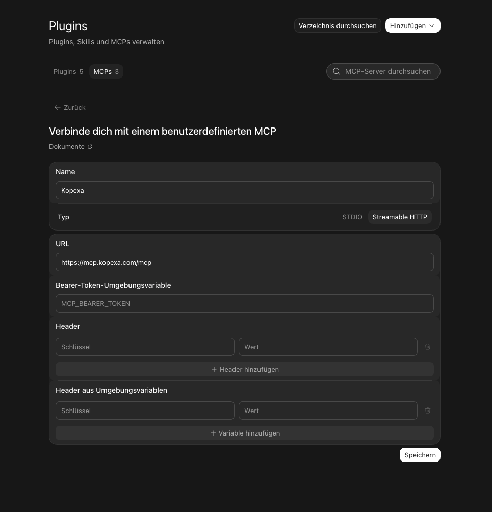

<Callout title="Enterprise-Plan">
Die KI-Anbindung ist ein Feature des **Enterprise-Plans** und muss von Kopexa für deine Organisation freigeschaltet werden.
</Callout>

Mit der KI-Anbindung verbindest du einen KI-Assistenten wie **ChatGPT** direkt mit deinen Kopexa-Daten. Der Assistent kann deine Daten dann lesen und bearbeiten, immer im Rahmen deiner Berechtigungen im gewählten Space. Die Anbindung nutzt den offenen Standard **MCP (Model Context Protocol)**.

## Voraussetzungen

- **Enterprise-Plan.**
- Die KI-Anbindung ist **für deine Organisation freigeschaltet** (durch Kopexa).
- Ein Kopexa-Konto mit Zugriff auf den gewünschten Space.

## Verbinden mit ChatGPT

1. Öffne in ChatGPT die **Einstellungen** und suche nach **„MCP"**.
2. Unter **Plugins** wechselst du zum Tab **MCPs** und wählst **Hinzufügen**, dann **MCP-Server hinzufügen**.
3. Trage die Verbindung ein:
   - **Name:** Kopexa
   - **Typ:** Streamable HTTP
   - **URL:** `https://mcp.kopexa.com/mcp`

   Die Felder für Token und Header bleiben leer. Die Anmeldung läuft über den Login.
4. **Speichern.** ChatGPT leitet dich zum **Kopexa-Login** weiter. Melde dich an und bestätige den Zugriff. Fertig.

## Space auswählen

Eine Sitzung ist immer an **einen** Space gebunden. Bitte den Assistenten zuerst, deine Spaces aufzulisten, und dann den gewünschten Space auszuwählen. Ab dann beziehen sich alle Aktionen auf diesen Space.

<Callout title="Sicherheit">
Der Assistent sieht und ändert nur Daten des gewählten Space, und nur das, wozu dein Konto berechtigt ist. Eine Sitzung kann keine Daten zwischen verschiedenen Spaces vermischen.
</Callout>
