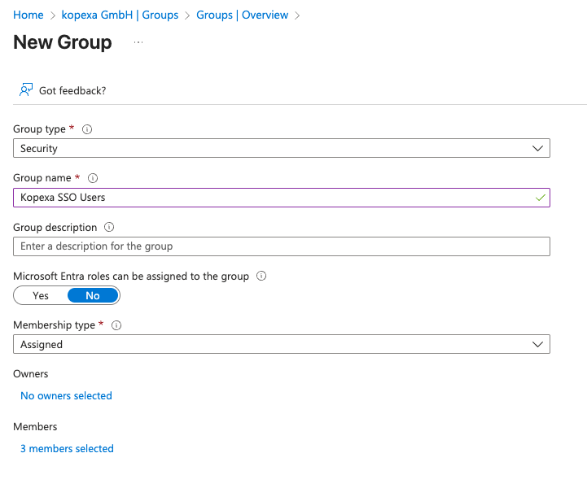
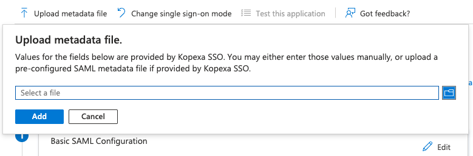
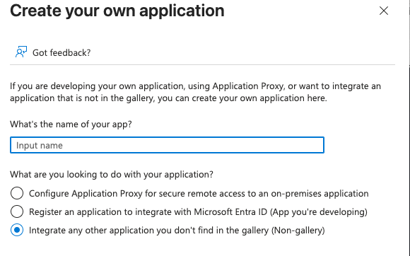
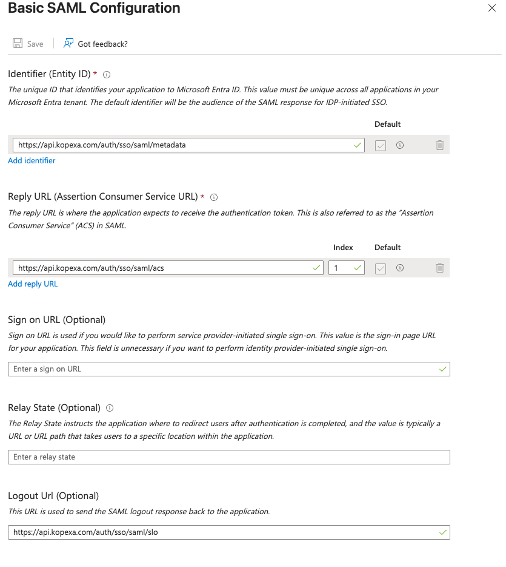
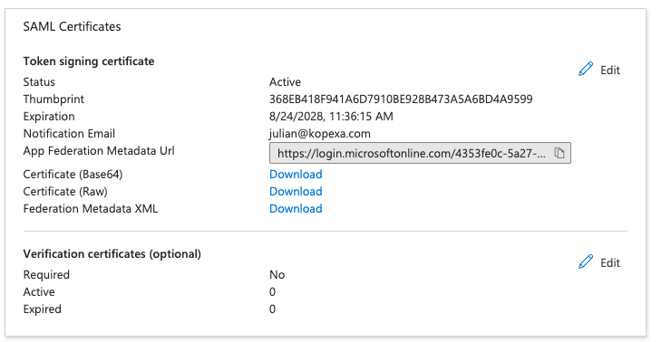
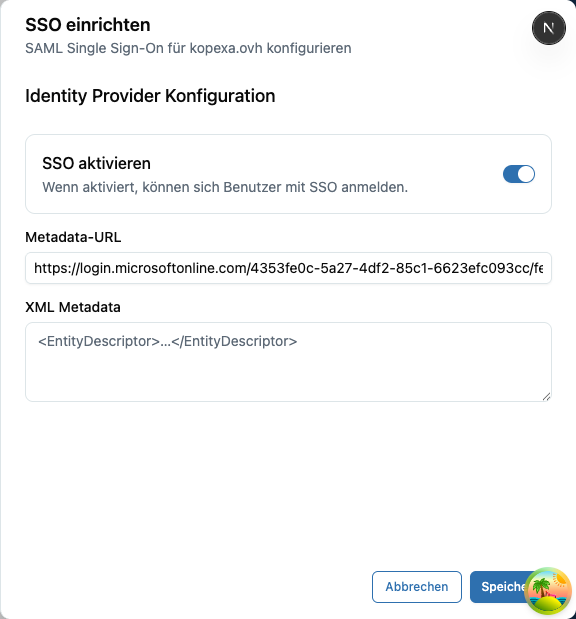

Diese Anleitung zeigt dir, wie du SAML-SSO zwischen Kopexa und **Microsoft Entra ID** (ehemals Azure AD) einrichtest. Voraussetzung ist eine [verifizierte Domain](./setup.mdx).

<Callout type="info">
SAML und Single Sign-On stehen in allen Tarifen zur Verfügung.
</Callout>

## Gruppe in Entra ID erstellen (empfohlen)

Um Benutzer sauber zuordnen zu können, empfiehlt es sich, vorab eine **Gruppe in Entra ID** für Kopexa anzulegen:

1. Melde dich im [Microsoft Entra Admin Center](https://entra.microsoft.com) an.
2. Navigiere zu **Identität → Gruppen → Neue Gruppe**.
3. Wähle **Sicherheitsgruppe** als Typ aus.
4. Gib einen eindeutigen Namen an, z. B. *Kopexa SSO Users*.
5. Füge die Benutzer hinzu, die Zugriff auf Kopexa erhalten sollen.

Diese Gruppe weist du später deiner erstellten Kopexa-App zu.

## Kopexa-Metadata (SP) beziehen

Zur schnelleren und fehlerfreien Konfiguration nutze die Service-Provider-Metadaten von Kopexa:

- **Metadata-Datei/URL (SP):**  
  `https://id.kopexa.com/sso/saml/metadata`
- **ACS / Reply URL (SP):**  
  `https://id.kopexa.com/sso/saml/acs`

> Tipp: Entra kann die Metadata **per URL einlesen** (empfohlen) oder als **XML-Datei** hochgeladen bekommen.  
> Dadurch werden **Entity ID/Issuer**, **ACS/Reply URL** und weitere Felder automatisch gesetzt.

## Neue App-Registrierung in Entra ID

1. Navigiere zu **Identitätsverwaltung → Unternehmensanwendungen → Neue Anwendung**.
2. Wähle **Eigene Anwendung erstellen** und gib einen Namen an (z. B. *Kopexa SSO*).
3. Wähle **SAML/SSO** als Integrationsmethode.

## Basis-SAML-Konfiguration

In der App wähle **Einmaliges Anmelden → SAML** und konfiguriere:

- Nutze **„Metadaten von Datei/URL hochladen“** und gib die Kopexa-URL an:  
  `https://id.kopexa.com/sso/saml/metadata`
- Alternativ: Werte manuell aus der Metadata übernehmen:
  - **Bezeichner (Entity ID / Issuer)** – aus Metadata
  - **Antwort-URL (ACS / Reply URL)** – `https://id.kopexa.com/sso/saml/acs`
  - **Anmelde-URL (optional)** – deine Kopexa-URL

{/* 
## Benutzerattribute & Claims

Stelle sicher, dass folgende Claims gesetzt sind:

- **NameID:** E-Mail-Adresse (Format: `user.userprincipalname` oder `user.mail`)
- Optional: **Vorname** (`user.givenname`), **Nachname** (`user.surname`)

Diese Attribute werden in Kopexa für Benutzerzuordnung und Auto-Provisioning genutzt. */}

{/*  */}

---

## SAML-Zertifikat exportieren

1. Lade das **SAML-Signaturzertifikat (Base64)** aus Entra herunter.
2. Kopiere die **SAML-Metadaten-URL** oder lade das XML herunter.

Diese Informationen trägst du später in Kopexa ein.

---

## Werte in Kopexa eintragen

In Kopexa:

1. Öffne **Einstellungen → Organisation → Domains**, wähle die verifizierte Domain und gehe auf **SSO einrichten**.
2. Aktiviere den Schalter **SSO aktivieren**.
3. Trage entweder die **Metadata-URL** deines Identity-Providers oder das komplette **XML-Metadaten-Dokument** ein:

   - **Option 1, Metadata-URL**: Beispiel für Entra: `https://login.microsoftonline.com/<tenant-id>/federationmetadata/2007-06/federationmetadata.xml`
   - **Option 2, XML-Metadata**: Kopiere den Inhalt der von Entra exportierten XML-Datei in das Feld "XML Metadata".

<Callout title="Hinweis">
Du füllst nur eine der beiden Varianten aus. Kopexa verwendet entweder die URL oder das XML, nicht beides.
</Callout>

4. Speichere und führe den SSO-Test aus, um die Konfiguration zu prüfen.

## Benutzerzuordnung und Test

- Weise der Entra-App die Gruppe **Kopexa SSO Users** zu (oder eine eigene Gruppe).
- Führe den Test-Login in Kopexa aus.
- Bei Erfolg können berechtigte Benutzer der verifizierten Domain sich per SSO anmelden.

## Automatische Benutzeranlage

In Kopexa kannst du die automatische Benutzeranlage aktivieren. Benutzer werden dann beim ersten SSO-Login automatisch in Kopexa angelegt. Stelle sicher, dass Entra die Felder E-Mail (und optional Vorname und Nachname) übermittelt.

## Sicherheitstipps

- **Least Privilege**: Weise nur die benötigten Gruppen oder Benutzer zu.
- **Zertifikatsrotation**: Tausche das Zertifikat rechtzeitig vor Ablauf und aktualisiere es in Kopexa.
- **Protokolle prüfen**: Sichte fehlgeschlagene Anmeldungen sowohl in Entra als auch in Kopexa.
