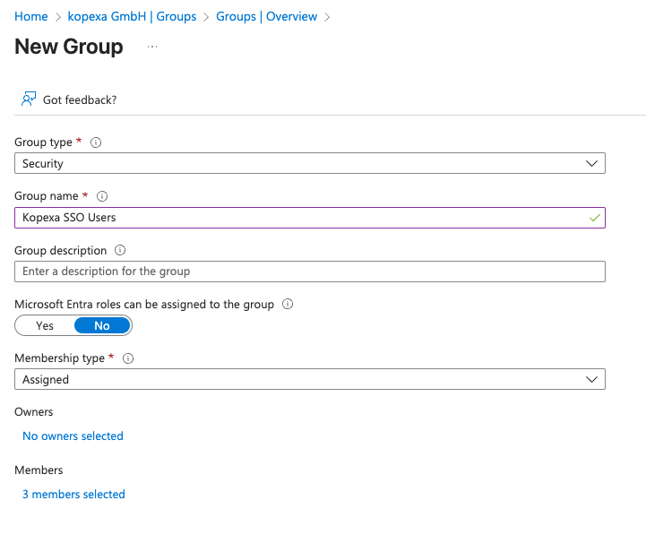
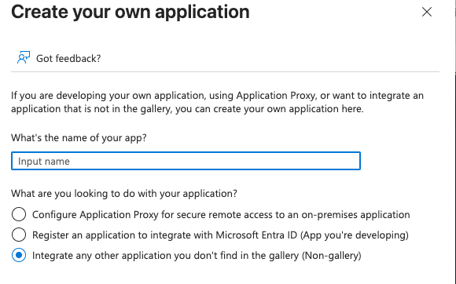
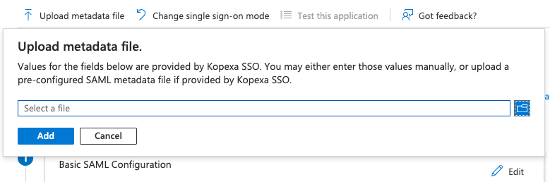
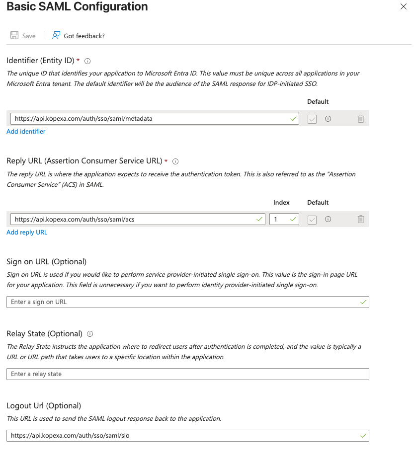
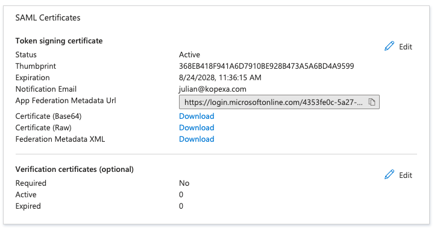
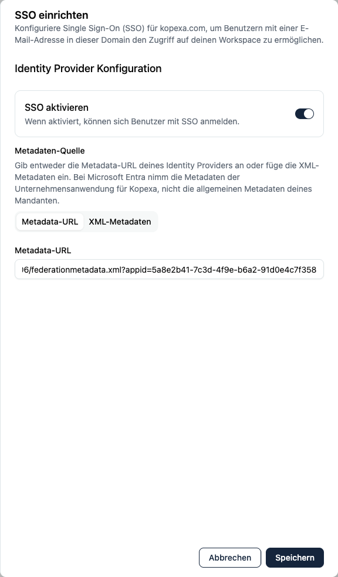

Diese Anleitung zeigt dir, wie du **SAML-SSO** zwischen Kopexa und **Microsoft Entra ID** (früher Azure AD) einrichtest.
Voraussetzung ist eine **verifizierte Domain** (siehe [Setup](./setup.mdx)).

> **Hinweis:** SSO gibt es in jedem Kopexa-Tarif ohne Aufpreis.

## 1. Gruppe in Entra ID anlegen (empfohlen)

Mit einer eigenen Gruppe steuerst du übersichtlich, wer Kopexa nutzen darf:

1. Melde dich im [Microsoft Entra Admin Center](https://entra.microsoft.com) an.
2. Gehe zu **Gruppen → Alle Gruppen → Neue Gruppe**.
3. Wähle als Typ **Sicherheit**.
4. Gib einen eindeutigen Namen an, zum Beispiel *Kopexa SSO Users*.
5. Füge die Personen hinzu, die Kopexa nutzen sollen.

Die Gruppe weist du später der Kopexa-App zu. Gruppen zuweisen kannst du ab Entra ID P1. Ohne P1 weist du die Personen einzeln zu.

## 2. Kopexa-App in Entra ID anlegen

1. Gehe zu **Unternehmensanwendungen → Neue Anwendung**.
2. Klicke auf **Eigene Anwendung erstellen**.
3. Gib einen Namen an, zum Beispiel *Kopexa*, und wähle **Nicht-Katalog-Anwendung integrieren**.

## 3. SAML in Entra einrichten

Öffne in der neuen App **Einmaliges Anmelden** und wähle **SAML**.

Am einfachsten übernimmst du die Daten von Kopexa aus der Metadaten-Datei:

1. Lade die Metadaten von Kopexa herunter: `https://id.kopexa.com/sso/saml/metadata`
2. Klicke in Entra oben auf **Metadatendatei hochladen** und wähle die Datei aus.
3. Entra füllt Bezeichner und Antwort-URL aus. Speichere.

Du kannst die Werte unter **Grundlegende SAML-Konfiguration** auch von Hand eintragen:

- **Bezeichner (Entitäts-ID):** `https://id.kopexa.com/sso/saml/metadata`
- **Antwort-URL (Assertionverbraucherdienst-URL):** `https://id.kopexa.com/sso/saml/acs`

### Attribute und Ansprüche

Kopexa braucht die **E-Mail-Adresse** des Nutzers. Entra schickt sie standardmäßig mit (`user.mail`). Vorname (`user.givenname`) und Nachname (`user.surname`) sind optional und werden beim ersten Login übernommen.

> **Tipp:** Haben deine Nutzer in Entra kein E-Mail-Feld gepflegt, stelle den Anspruch für die E-Mail-Adresse auf `user.userprincipalname` um. Der Benutzerprinzipalname muss dann der E-Mail-Adresse entsprechen.

## 4. Metadaten von Entra holen

Scrolle in derselben Ansicht zu **SAML-Zertifikate**. Dort findest du:

- die **App-Verbundmetadaten-URL** (empfohlen), oder
- die **Verbundmetadaten-XML** zum Herunterladen.

<Callout title="Die richtigen Metadaten">
Nimm die Metadaten **dieser App**. Die App-Verbundmetadaten-URL endet auf `?appid=…`. Die allgemeinen Metadaten deines Mandanten passen nicht, weil die App ihr eigenes Signaturzertifikat hat.
</Callout>

Das Zertifikat musst du nicht extra herunterladen. Kopexa liest es aus den Metadaten.

## 5. Entra in Kopexa eintragen

1. Öffne in Kopexa **Einstellungen → Domains**.
2. Wähle im Menü deiner verifizierten Domain **SSO-Einstellungen**.
3. Wähle die Quelle der Metadaten:
   - **Metadata-URL:** Füge die App-Verbundmetadaten-URL aus Entra ein.
   - **XML-Metadaten:** Füge den Inhalt der heruntergeladenen XML-Datei ein.
4. Schalte **SSO aktivieren** ein und klicke auf **Speichern**.

Du brauchst nur eine der beiden Quellen. Stimmt etwas an den Metadaten nicht, zeigt Kopexa dir direkt am Feld, was fehlt.

<Callout title="Wichtig">
Ab jetzt melden sich alle Nutzer mit einer E-Mail-Adresse dieser Domain nur noch über Entra an, auch bestehende Konten mit Passwort.
</Callout>

## 6. Nutzer zuweisen und anmelden

1. Öffne in Entra in der Kopexa-App **Benutzer und Gruppen**.
2. Klicke auf **Benutzer/Gruppe hinzufügen** und wähle die Gruppe *Kopexa SSO Users* oder einzelne Personen.
3. Melde dich bei Kopexa mit deiner E-Mail-Adresse an. Kopexa leitet dich zu Microsoft weiter und nach der Anmeldung zurück.

Wer sich zum ersten Mal anmeldet, bekommt automatisch ein Kopexa-Konto. Ist an der Domain **Auto-Join** aktiv, kommt die Person beim SSO-Login direkt als Mitglied in deine Organisation. Sonst lädst du sie ein. Mehr dazu unter [Auto-Join](./setup.mdx#4-auto-join).

## Sicherheitstipps

- **MFA in Entra erzwingen:** Ein Login über SSO ersetzt die Zwei-Faktor-Abfrage von Kopexa. Richte MFA deshalb in Entra ein, zum Beispiel über bedingten Zugriff.
- **Zugriff klein halten:** Weise nur die Gruppen und Personen zu, die Kopexa brauchen.
- **Zertifikat rechtzeitig erneuern:** Läuft das Signaturzertifikat in Entra ab, erstellst du dort ein neues. Danach öffnest du in Kopexa die SSO-Einstellungen. Mit Metadata-URL reicht es, erneut zu speichern. Mit XML-Metadaten fügst du vorher die neue XML ein.
- **Anmeldungen prüfen:** Fehlgeschlagene Anmeldungen siehst du in den Anmeldeprotokollen von Entra.
