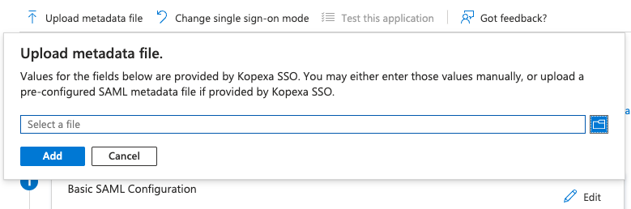
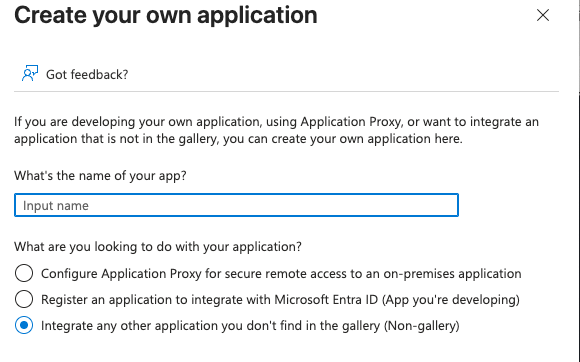
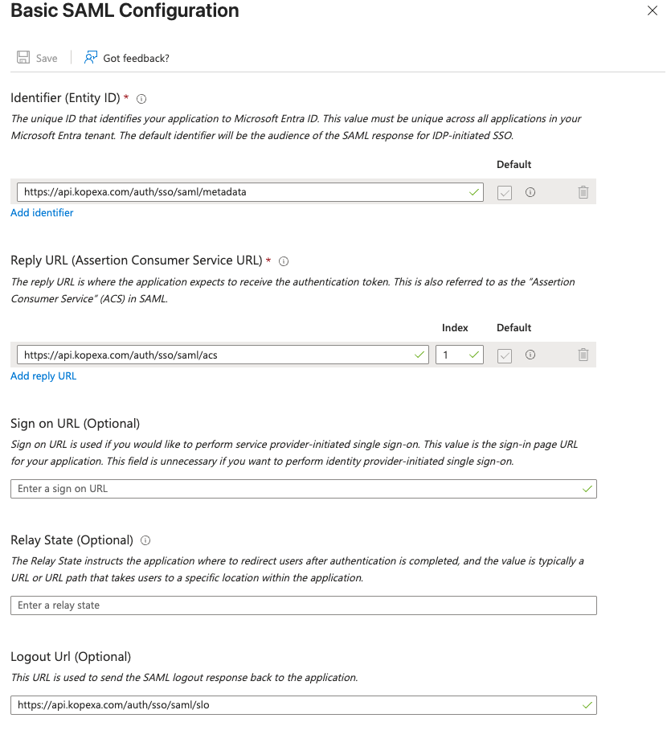
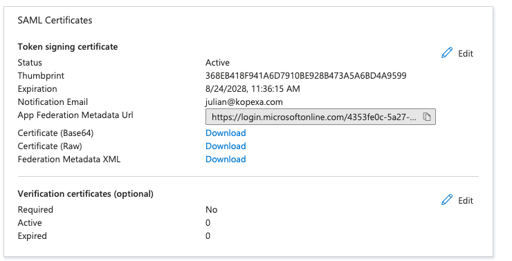

Diese Anleitung zeigt dir, wie du **SAML-SSO** zwischen Kopexa und **Microsoft Entra ID (ehemals Azure AD)** einrichtest.  
Voraussetzung ist eine **verifizierte Domain** (siehe [Setup & Verifizierung](./setup.mdx)).

> **Hinweis:** Jeder Tarif (Free, Lite, Pro, Enterprise) unterstützt SAML/SSO – Sicherheit ist kein Premium-Feature.

## Gruppe in Entra ID erstellen (empfohlen)

Um Benutzer sauber zuordnen zu können, empfiehlt es sich, vorab eine **Gruppe in Entra ID** für Kopexa anzulegen:

1. Melde dich im [Microsoft Entra Admin Center](https://entra.microsoft.com) an.
2. Navigiere zu **Identität → Gruppen → Neue Gruppe**.
3. Wähle **Sicherheitsgruppe** als Typ aus.
4. Gib einen eindeutigen Namen an, z. B. *Kopexa SSO Users*.
5. Füge die Benutzer hinzu, die Zugriff auf Kopexa erhalten sollen.

Diese Gruppe weist du später deiner erstellten Kopexa-App zu.

## Kopexa-Metadata (SP) beziehen

Zur schnelleren und fehlerfreien Konfiguration nutze die Service-Provider-Metadaten von Kopexa:

- **Metadata-Datei/URL (SP):**  
  `https://api.kopexa.com/auth/sso/saml/sp/metadata.xml`

> Tipp: Entra kann die Metadata **per URL einlesen** (empfohlen) oder als **XML-Datei** hochgeladen bekommen.  
> Dadurch werden **Entity ID/Issuer**, **ACS/Reply URL** und weitere Felder automatisch gesetzt.

## Neue App-Registrierung in Entra ID

1. Navigiere zu **Identitätsverwaltung → Unternehmensanwendungen → Neue Anwendung**.
2. Wähle **Eigene Anwendung erstellen** und gib einen Namen an (z. B. *Kopexa SSO*).
3. Wähle **SAML/SSO** als Integrationsmethode.

## Basis-SAML-Konfiguration

In der App wähle **Einmaliges Anmelden → SAML** und konfiguriere:

- Nutze **„Metadaten von Datei/URL hochladen“** und gib die Kopexa-URL an:  
  `http://api.kopexa.com/auth/sso/saml/sp/metadata.xml`
- Alternativ: Werte manuell aus der Metadata übernehmen:
  - **Bezeichner (Entity ID / Issuer)** – aus Metadata
  - **Antwort-URL (ACS / Reply URL)** – aus Metadata
  - **Anmelde-URL (optional)** – deine Kopexa-URL

{/* 
## Benutzerattribute & Claims

Stelle sicher, dass folgende Claims gesetzt sind:

- **NameID:** E-Mail-Adresse (Format: `user.userprincipalname` oder `user.mail`)
- Optional: **Vorname** (`user.givenname`), **Nachname** (`user.surname`)

Diese Attribute werden in Kopexa für Benutzerzuordnung und Auto-Provisioning genutzt. */}

{/*  */}

---

## SAML-Zertifikat exportieren

1. Lade das **SAML-Signaturzertifikat (Base64)** aus Entra herunter.
2. Kopiere die **SAML-Metadaten-URL** oder lade das XML herunter.

Diese Informationen trägst du später in Kopexa ein.

---

## Werte in Kopexa eintragen

In Kopexa:

1. **Settings → Organization → Domains → [Verifizierte Domain] → SSO einrichten**
2. Aktiviere den Schalter **SSO aktivieren**.
3. Trage **entweder** die **Metadata-URL** deines IdP **oder** das komplette **XML-Metadaten-Dokument** ein:

   - **Option 1 – Metadata-URL:**  
     Beispiel für Entra: `https://login.microsoftonline.com/<tenant-id>/federationmetadata/2007-06/federationmetadata.xml`
   - **Option 2 – XML-Metadata:**  
     Kopiere den Inhalt der von Entra exportierten XML-Datei in das Feld „XML Metadata“.

<Callout title="Hinweis">
Du musst **nur eine der beiden Varianten** ausfüllen – Kopexa verwendet entweder die URL oder das XML, nicht beides.
</Callout>

4. **Speichern** und **SSO-Test** ausführen, um die Konfiguration zu prüfen.

## Benutzerzuordnung & Test

- Weise der Entra-App die **Gruppe _Kopexa SSO Users_** zu (oder eine eigene Gruppe).  
- Führe den **Test-Login** in Kopexa aus.  
- Bei Erfolg können berechtigte Nutzer der verifizierten Domain via SSO anmelden.

## Auto-Provisioning

Aktivierbar in Kopexa: Benutzer werden beim ersten SSO-Login automatisch erstellt.  
Stelle sicher, dass Claims für **E-Mail**, optional **Vorname/Nachname** übermittelt werden.

## 9. Sicherheitstipps

- **Least Privilege:** Nur benötigte Gruppen/Benutzer zuweisen  
- **Zertifikatsrotation:** Vor Ablauf tauschen und in Kopexa aktualisieren  
- **Audits/Logs:** Fehlversuche in Entra & Kopexa prüfen
