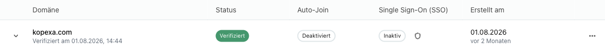

**Domains** sind die E-Mail-Domains deiner Organisation, zum Beispiel `example.com`. Du legst sie auf Organisationsebene an und verifizierst sie. Danach kannst du für jede Domain **Single Sign-On (SSO)** per **SAML** einrichten und neue Nutzer automatisch in deine Organisation aufnehmen.

## Zweck und Nutzen

- **Nachweis der Kontrolle:** Über einen DNS-Eintrag zeigst du, dass dir die Domain gehört. Erst dann lassen sich SSO und Auto-Join aktivieren.
- **Zentrale Anmeldung:** Mit SSO melden sich alle Nutzer dieser Domain über euren Identity Provider (IdP) an, zum Beispiel Microsoft Entra ID, Okta oder Keycloak. Jeder IdP, der SAML 2.0 unterstützt, funktioniert.
- **Weniger Aufwand:** Mit **Auto-Join** landen Kolleginnen und Kollegen beim SSO-Login direkt in deiner Organisation.
- **Mehrere Domains:** Hast du Tochtergesellschaften oder mehrere Marken, legst du einfach mehrere Domains an. Jede bekommt ihre eigene SSO-Konfiguration.

## SSO in jedem Tarif

Bei Kopexa ist SSO **kein Enterprise-Extra**. Jede Organisation kann SAML-SSO nutzen, unabhängig vom Tarif und ohne Aufpreis. Wir finden: Eine sichere Anmeldung sollte keine Frage des Budgets sein.

## So läuft die Einrichtung

Du findest alles unter **Einstellungen → Domains** deiner Organisation.

1. **Domain hinzufügen:** Trage deine Domain ein, zum Beispiel `example.com`.
2. **Verifizieren:** Hinterlege den angezeigten DNS-TXT-Eintrag bei deinem DNS-Anbieter.
3. **SSO einrichten:** Verbinde die Domain mit deinem Identity Provider.
4. **Auto-Join aktivieren (optional):** Neue Nutzer kommen beim ersten SSO-Login automatisch in die Organisation.

Die Schritte im Detail: [Setup](./setup.mdx). Eine Anleitung für Microsoft: [SSO mit Entra ID](./entra.mdx).

## Beziehung zu Spaces

Domains gelten **für die ganze Organisation** und damit für alle Spaces darin. Anmeldung und Aufnahme in die Organisation regelst du hier an einer Stelle. Welche Spaces jemand sieht, legst du weiterhin in den Spaces selbst fest.

Weitere Informationen:
- [Organisation](../index.mdx): zentrale Verwaltung deiner Organisation und Nutzer
- [Spaces](../../spaces.mdx): eigenständige Arbeitsbereiche in Kopexa
- [Security](../security.mdx): unsere Sicherheitsprinzipien
