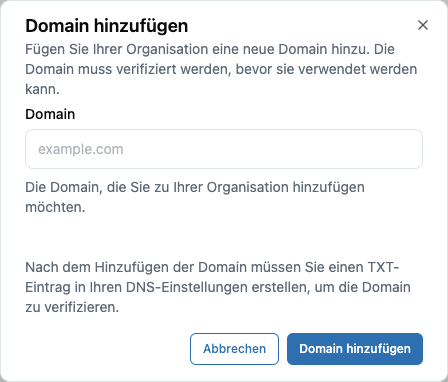
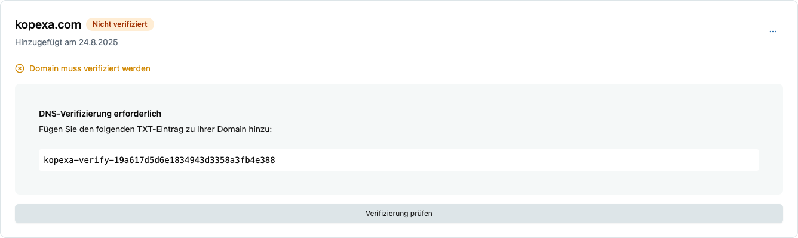

Über **Domains** verwaltest du auf Organisationsebene die E-Mail-Domains deiner Nutzer und bereitest **Single Sign-On (SSO)** vor.

> **Hinweis:** Operative Internet-Domains (z. B. für Subdomain-Scanning) gehören zum [Inventory eines Space](../../../compliance/inventory/index.mdx).  
> SSO-Domains werden hier auf **Organization-Level** gepflegt.

---

## 1. Neue Domain hinzufügen

1. Gehe zu: **Settings → Organization → Domains**  
2. Klicke auf **Domain hinzufügen**  
   
3. Gib die gewünschte Domain ein (z. B. `example.com`) und speichere.

---

## 2. Domain verifizieren

Um zu bestätigen, dass du die Domain besitzt:

1. Kopexa zeigt dir einen **DNS TXT-Eintrag** an, der hinterlegt werden muss.  
   
2. Trage diesen TXT-Eintrag bei deinem DNS-Provider ein.
3. Warte, bis die DNS-Änderung propagiert ist (kann bis zu 24 h dauern).
4. Klicke auf **Verifizieren** in Kopexa – bei Erfolg wechselt der Status auf **Verifiziert**.

> **Tipp:** Kopexa prüft automatisch in Intervallen. Du kannst auch manuell auf „Jetzt prüfen“ klicken.

---

## 3. SAML-SSO vorbereiten

<Callout title="Vertrauen aufbauen">
Damit dein Kopexa-Account als Service Provider eine SSO-Verbindung zu einem Identity Provider (IdP) herstellen kann, muss ein gegenseitiges Vertrauensverhältnis (Party Trust) konfiguriert werden.
</Callout>

Nach erfolgreicher Verifizierung kannst du die **grundlegende SAML-SSO-Konfiguration** in Kopexa öffnen:

- **Entity ID / Issuer**, **SSO URL / ACS Endpoint**, **X.509-Zertifikat** werden benötigt.
- Diese Werte müssen zwischen Kopexa und deinem IdP (z. B. Entra ID, Okta, Keycloak) ausgetauscht werden.

> **Hinweis:** Die konkrete Einrichtung hängt vom genutzten IdP ab.  
> Für eine Anleitung mit Beispielen siehe [SSO mit Entra ID einrichten](./entra.mdx).

---

## 4. Benutzerzuordnung

- Alle Benutzer mit einer E-Mail-Adresse unter dieser Domain können nach Abschluss der SSO-Konfiguration über SSO anmelden.
- Optional kannst du **Auto-Provisioning** aktivieren, sodass Benutzer beim ersten Login automatisch angelegt werden.

---

## 5. Sicherheitshinweise

- Jeder Tarif (Free, Lite, Pro, Enterprise) hat Zugriff auf SAML/SSO – **Security ist kein Premium-Feature**.
- Domain-Verifizierung schützt vor Missbrauch (Account Takeover).
- Mehr zu unseren Sicherheitsprinzipien: [Security](../security.mdx)
