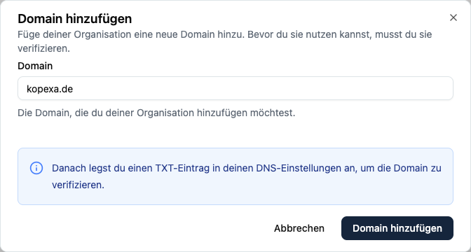
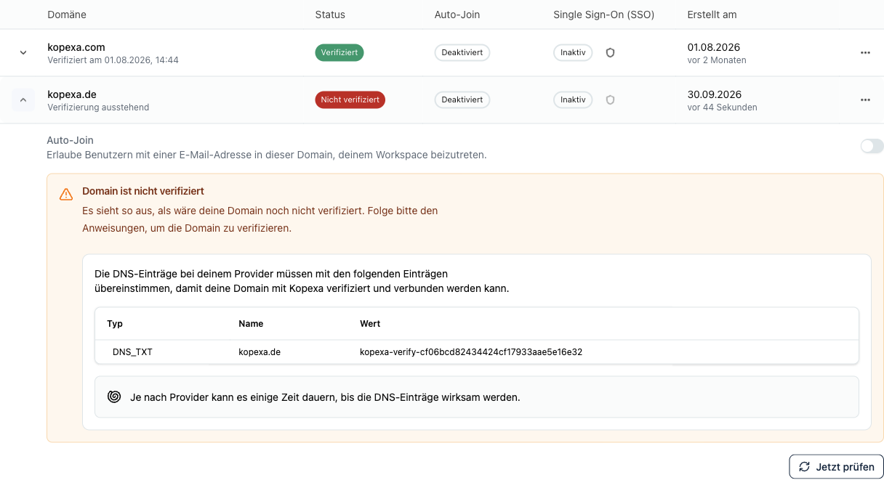

Unter **Einstellungen → Domains** verwaltest du auf Organisationsebene die E-Mail-Domains deiner Nutzer und richtest **Single Sign-On (SSO)** ein.

> **Hinweis:** Internet-Domains, die Kopexa auf Sicherheit prüfen soll (zum Beispiel DNS und Zertifikate), gehören in die [Domains eines Space](../../../organization/domains/index.mdx).
> Hier geht es nur um die Domains für die Anmeldung.

---

## 1. Domain hinzufügen

1. Öffne die Einstellungen deiner Organisation und gehe zu **Domains**.
2. Klicke auf **Domain hinzufügen**.
   
3. Gib deine Domain ein, zum Beispiel `example.com`, und bestätige.

Die Domain erscheint in der Liste mit dem Status **Nicht verifiziert**.

---

## 2. Domain verifizieren

So zeigst du, dass dir die Domain gehört:

1. Klappe die Domain in der Liste auf. Kopexa zeigt dir einen **DNS-TXT-Eintrag**.
   
2. Trage diesen TXT-Eintrag bei deinem DNS-Anbieter ein.
3. Warte, bis die Änderung sichtbar ist. Das dauert meist Minuten, im Einzelfall bis zu 24 Stunden.
4. Kopexa prüft automatisch alle 15 Minuten. Du musst also nichts weiter tun. Wenn du nicht warten willst, klicke auf **Jetzt prüfen**.

Sobald der Eintrag gefunden ist, wechselt der Status auf **Verifiziert**.

---

## 3. SSO einrichten

Nach der Verifizierung öffnest du über das Menü der Domain die **SSO-Einstellungen**. Solange die Domain nicht verifiziert ist, ist der Eintrag ausgegraut.

### Kopexa in deinem Identity Provider eintragen

Dein Identity Provider (IdP) braucht die Daten von Kopexa. Am einfachsten gibst du ihm die Metadaten-URL, dann übernimmt er alles automatisch:

- **Metadaten-URL:** `https://id.kopexa.com/sso/saml/metadata`
- **Antwort-URL (ACS):** `https://id.kopexa.com/sso/saml/acs`

Kopexa braucht vom IdP die **E-Mail-Adresse** des Nutzers. Vorname und Nachname sind optional und werden beim ersten Login übernommen.

### Deinen Identity Provider in Kopexa eintragen

In den SSO-Einstellungen wählst du, woher Kopexa die Daten deines IdP bekommt:

- **Metadata-URL:** Kopexa lädt die Metadaten einmal von dieser Adresse.
- **XML-Metadaten:** Du fügst den Inhalt der Metadaten-Datei direkt ein.

Du brauchst nur eins von beiden. Das Signaturzertifikat liest Kopexa selbst aus den Metadaten, du musst es nicht extra hochladen.

Schalte **SSO aktivieren** ein und speichere. Passt etwas an den Metadaten nicht, zeigt dir Kopexa direkt am Feld, was fehlt.

<Callout title="Wichtig">
Sobald SSO aktiv ist, melden sich **alle** Nutzer mit einer E-Mail-Adresse dieser Domain nur noch über deinen Identity Provider an. Die Anmeldung mit Passwort ist für sie dann nicht mehr möglich, auch nicht für bestehende Konten. Stelle vorher sicher, dass alle, die Kopexa nutzen, im Identity Provider für die Kopexa-App freigeschaltet sind.
</Callout>

Die Anleitung für Microsoft mit allen Klicks: [SSO mit Entra ID](./entra.mdx).

### SSO ausschalten

Du kannst SSO jederzeit über den Schalter **SSO aktivieren** wieder ausschalten. Deine Konfiguration bleibt erhalten. Wenn du SSO wieder einschaltest, musst du nichts neu eintragen.

---

## 4. Auto-Join

Mit **Auto-Join** kommen Nutzer deiner Domain automatisch in deine Organisation:

- Du aktivierst Auto-Join, indem du die Domain in der Liste aufklappst und den Schalter umlegst. Das geht erst nach der Verifizierung.
- Auto-Join greift nur beim Login über SSO. Wer sich per SSO anmeldet und noch nicht in der Organisation ist, wird als **Mitglied** aufgenommen. Beim ersten Login legt Kopexa dafür automatisch ein Konto an.
- Ohne aktives SSO bewirkt Auto-Join nichts. Wer sich per Passwort registriert, wird nicht automatisch aufgenommen.
- Ohne Auto-Join legt Kopexa beim ersten SSO-Login zwar ein Konto an. In die Organisation kommt der Nutzer aber erst, wenn du ihn einlädst.

Welche Spaces ein Mitglied sieht, legst du weiterhin in den Spaces fest.

---

## 5. Sicherheitshinweise

- **MFA im IdP erzwingen:** Ein Login über SSO gilt in Kopexa als vollständige Anmeldung. Die Zwei-Faktor-Abfrage von Kopexa entfällt dann. Aktiviere MFA deshalb in deinem Identity Provider.
- **Zugriff klein halten:** Weise die Kopexa-App im IdP nur den Personen oder Gruppen zu, die Kopexa wirklich brauchen.
- **Verifizierung schützt:** Weil nur verifizierte Domains SSO nutzen können, kann niemand fremde Domains für sich beanspruchen.
- SSO gibt es in jedem Tarif. Mehr zu unseren Sicherheitsprinzipien: [Security](../security.mdx)
