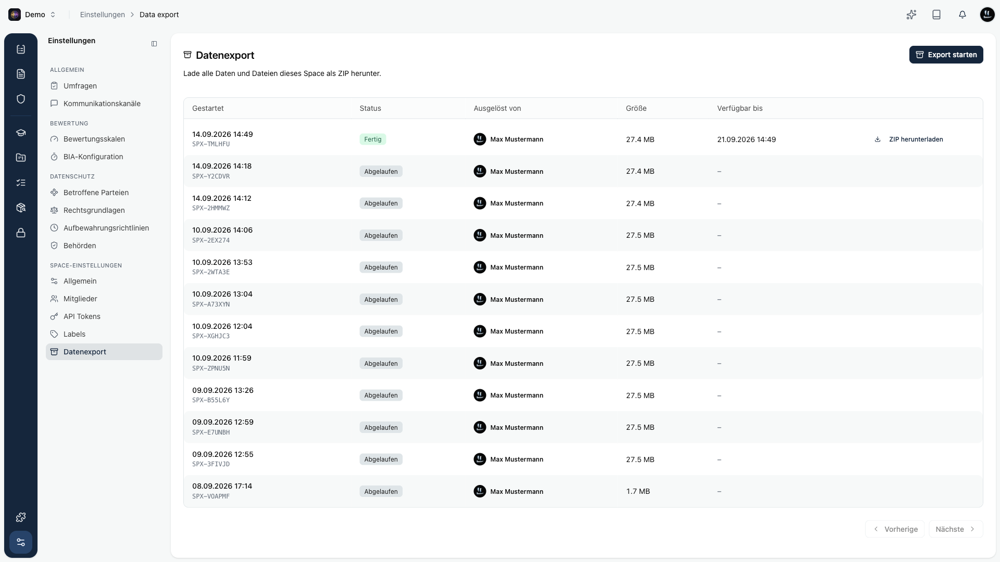

Mit dem **Datenexport** lädst du alle Daten und Dateien eines Space gebündelt als **ZIP-Archiv** herunter. Das ist nützlich für Audits, Datenmitnahme oder eine eigene Sicherung. Der Export läuft im Hintergrund, damit du weiterarbeiten kannst, während das Archiv erstellt wird.

## Wo du ihn findest

Öffne den Space und folge in der Seitenleiste dem Weg **Einstellungen** und dort dem Abschnitt **Space-Einstellungen** zu **Datenexport**.

## Export starten

Über **Export starten** stößt du einen neuen Export an. Du bekommst eine kurze Bestätigung, dass der Export gestartet wurde. Je nach Datenmenge dauert die Erstellung eine Weile.

<Callout title="Gut zu wissen">
Pro Space kann immer nur **ein** Export gleichzeitig laufen. Solange ein Export in Arbeit ist, ist die Schaltfläche gesperrt und weist dich darauf hin.
</Callout>

## Status

Jeder Export durchläuft mehrere Zustände, die du in der Liste als Kennzeichnung siehst:

| Status | Bedeutung |
|--------|-----------|
| **Wartet** | Der Export ist eingereiht und startet gleich. |
| **Wird erstellt** | Das Archiv wird gerade zusammengestellt. |
| **Fertig** | Das Archiv steht zum Download bereit. |
| **Fehlgeschlagen** | Beim Erstellen ist ein Fehler aufgetreten. |
| **Abgelaufen** | Die Verfügbarkeit ist abgelaufen, das Archiv steht nicht mehr bereit. |

Die Liste aktualisiert sich von selbst, solange ein Export läuft.

## Herunterladen und Verfügbarkeit

Sobald ein Export **Fertig** ist, lädst du das Archiv über **ZIP herunterladen** herunter. Die Spalte **Verfügbar bis** zeigt dir, bis wann es abrufbar ist.

Ein fertiges Archiv steht **7 Tage** zum Download bereit. Startest du einen neuen Export, wird das vorherige Archiv entfernt. Nach Ablauf wechselt der Status auf **Abgelaufen** und der Download ist nicht mehr möglich. Du startest dann einfach einen neuen Export.

In der Liste siehst du pro Export außerdem, wann er **gestartet** wurde, wer ihn **ausgelöst** hat und wie **groß** das Archiv ist.
