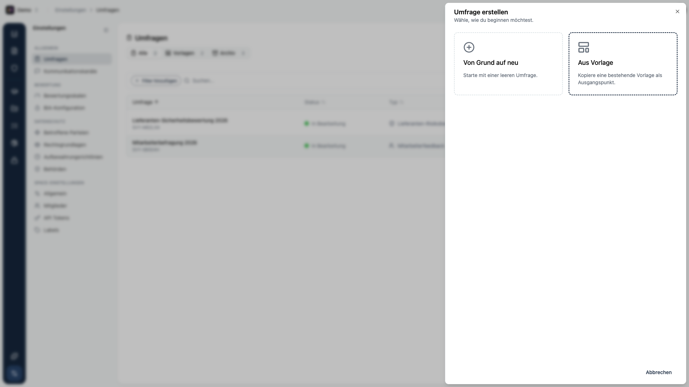
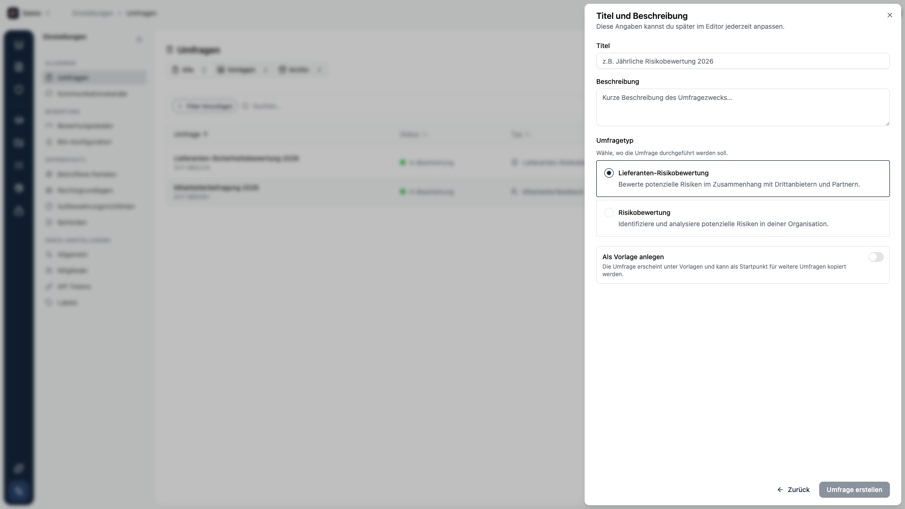
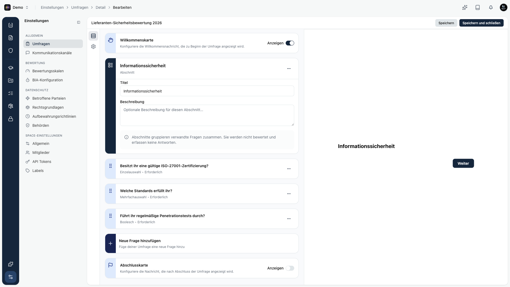

## Umfrage anlegen

Klicke oben rechts auf **Umfrage erstellen**. Du wählst zuerst, wie du starten möchtest:

- **Von Grund auf neu** - startet mit einer leeren Umfrage.
- **Aus Vorlage** - kopiert eine bestehende [Vorlage](/platform/settings/surveys/vorlagen) als Ausgangspunkt.

Danach legst du Titel, Beschreibung und Typ fest:

Mit **Als Vorlage anlegen** wird die Umfrage stattdessen unter Vorlagen abgelegt. Alle Angaben lassen sich später im Editor jederzeit anpassen.

## Fragen bearbeiten

Nach dem Anlegen landest du im Editor. Hier baust du den Fragebogen auf.

Der Aufbau von oben nach unten:

- **Willkommenskarte** - eine optionale Begrüßung zu Beginn der Umfrage. Über einen Schalter ein- oder ausblendbar.
- **Abschnitte** - gruppieren verwandte Fragen. Ein Abschnitt wird nicht bewertet und erfasst keine Antworten.
- **Fragen** - der Kern des Fragebogens. Jede Frage lässt sich als **Erforderlich** oder **Optional** kennzeichnen.
- **Abschlusskarte** - eine optionale Nachricht am Ende.

Rechts siehst du jederzeit eine **Live-Vorschau**, so wie die befragte Person die Umfrage erlebt.

### Fragetypen

| Typ | Wofür |
|-----|-------|
| **Einzelauswahl** | Eine Option aus einer Liste. |
| **Mehrfachauswahl** | Mehrere Optionen aus einer Liste. |
| **Boolesch** | Einfache Ja/Nein-Frage. |
| **Bewertung** | Einschätzung auf einer Skala. |
| **NPS** | Weiterempfehlung messen (Net Promoter Score). |
| **Freitext** | Freie Textantwort. |
| **Zustimmung** | Zustimmung zu Bedingungen einholen. |
| **Abschnitt** | Überschrift zum Gruppieren, keine Antwort. |

<Callout title="Tipp">
Speichere zwischendurch über **Speichern**. Mit **Speichern und schließen** kehrst du zur Übersicht zurück.
</Callout>
