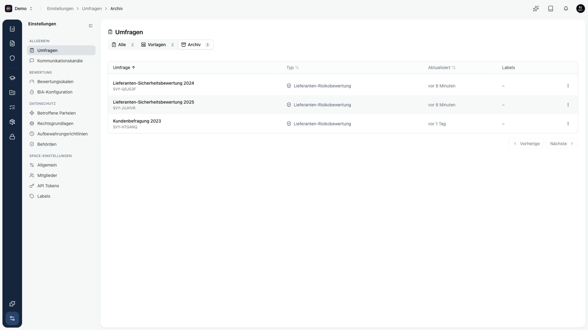

Eine Umfrage, die schon beantwortet wurde, löschst du nicht einfach. Die Antworten sind ein Nachweis. Deshalb wird eine Umfrage mit Antworten **archiviert** statt gelöscht. So bleibt der Nachweis erhalten und deine aktiven Listen bleiben aufgeräumt.

## Löschen oder archivieren

Kopexa entscheidet das automatisch, je nachdem ob es schon Antworten gibt:

| Situation | Was passiert |
|-----------|--------------|
| Umfrage **ohne** Antworten | Wird gelöscht. |
| Umfrage **mit** Antworten | Wird beim Löschen **archiviert**, nicht gelöscht. |

Versuchst du eine beantwortete Umfrage zu löschen, weist Kopexa dich darauf hin: *„Diese Umfrage hat bereits Antworten und kann daher nicht gelöscht werden. Sie wird archiviert und aus den aktiven Listen ausgeblendet."*

## Das Archiv

Öffne **Einstellungen → Umfragen** und wechsle in den Tab **Archiv**. Dort liegen alle archivierten Umfragen.

Pro Eintrag gibt es zwei Aktionen: **Wiederherstellen** und **Endgültig löschen**.

## Was mit einer archivierten Umfrage geht

Eine archivierte Umfrage ist nicht weg, nur ausgeblendet. Du kannst sie weiterhin öffnen und mit ihr arbeiten:

- **Ansehen:** Zusammenfassung und einzelne Antworten bleiben vollständig sichtbar.
- **Exportieren:** Antworten lassen sich weiterhin als CSV, Excel oder PDF herunterladen.
- **Wiederherstellen:** Holt die Umfrage zurück in die aktiven Listen.

## Was gesperrt ist

Damit archivierte Umfragen ihren Nachweischarakter behalten, sind einige Aktionen bewusst nicht mehr möglich:

- **Keine neuen Antworten:** Der Fragebogen nimmt nichts mehr an. Ein noch offener Link führt ins Leere.
- **Kein Bearbeiten und kein Statuswechsel** der Umfrage selbst.

<Callout title="Tipp">
Archivieren ist der saubere Weg, um eine abgeschlossene oder veraltete Umfrage aus dem Alltag zu nehmen, ohne den Nachweis zu verlieren. Für Normen wie ISO 27001 und NIS2 zählt die Nachvollziehbarkeit, nicht ein leerer Papierkorb.
</Callout>

## Endgültig löschen

Über **Endgültig löschen** entfernst du eine archivierte Umfrage dauerhaft. Kopexa fragt vorher nach:

*„Die Umfrage und alle zugehörigen Antworten werden dauerhaft gelöscht. Das kann nicht rückgängig gemacht werden."*

Danach erscheint die Umfrage nirgends mehr und lässt sich nicht wiederherstellen. Nutze das nur, wenn die Umfrage wirklich nicht mehr gebraucht wird.
