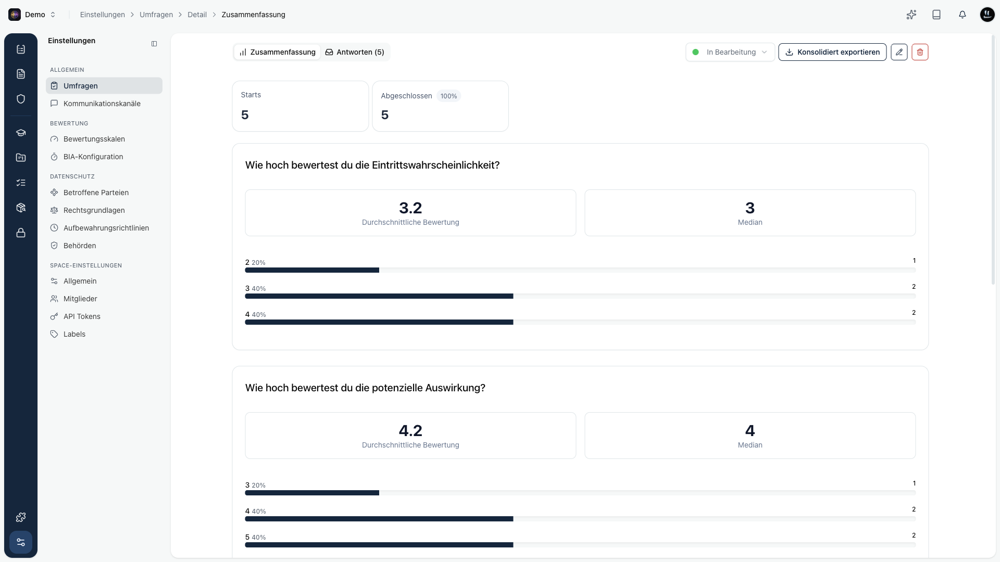
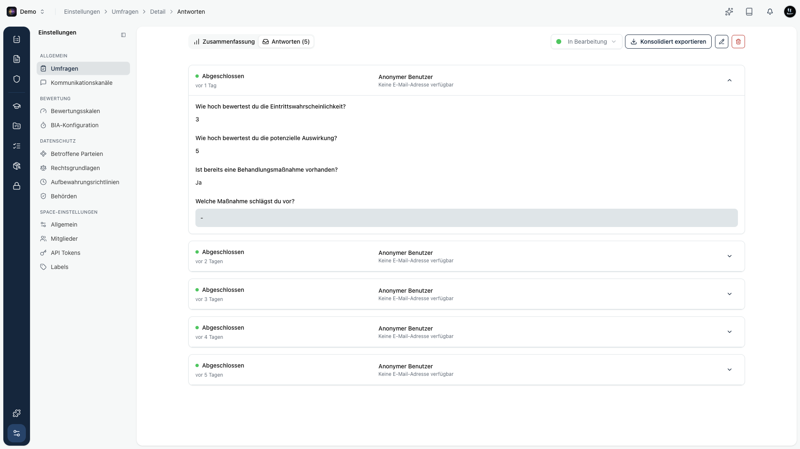

Sobald eine Umfrage Antworten hat, öffnest du sie über die Liste. Oben wechselst du zwischen zwei Ansichten: **Zusammenfassung** und **Antworten**.

## Zusammenfassung

Die Zusammenfassung wertet alle Antworten aggregiert aus. Oben siehst du, wie viele Personen gestartet und abgeschlossen haben. Darunter folgt pro Frage eine passende Auswertung, zum Beispiel Durchschnitt und Verteilung bei Bewertungen oder der NPS-Wert.

## Einzelne Antworten

In der Antworten-Ansicht siehst du jede Antwort einzeln. Du klappst einen Eintrag auf und liest die Angaben Frage für Frage.

## Exportieren

Über **Konsolidiert exportieren** lädst du alle Antworten gebündelt herunter, wahlweise als CSV, Excel oder PDF. So nimmst du die Ergebnisse in Berichte oder Nachweise auf.

## Status ändern

Oben rechts steuerst du den Status der Umfrage. Setze sie auf **Abgeschlossen**, wenn keine weiteren Antworten mehr erwartet werden.

<Callout title="Lieferantenbewertungen">
Bei einer Lieferanten-Risikobewertung zeigt die Antworten-Ansicht die verschickten **Bewertungen** je Lieferant, inklusive Genehmigen und Ablehnen. Details dazu findest du unter [Lieferanten-Bewertungen](/platform/organization/vendors/bewertungen).
</Callout>
