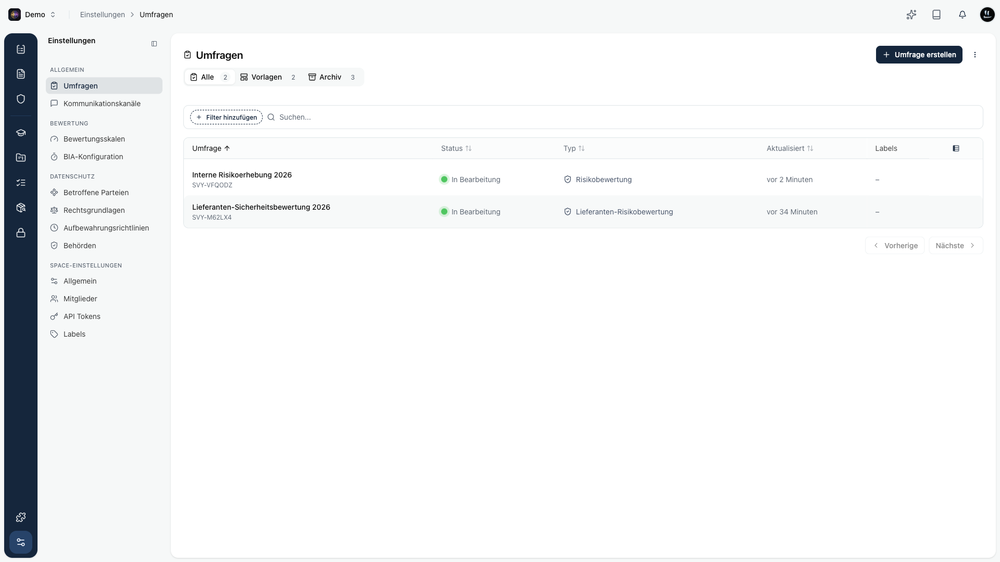

Mit Umfragen sammelst du strukturiert Informationen von internen und externen Personen. Du baust einen Fragebogen, verteilst ihn und wertest die Antworten zentral aus. In Kopexa nutzt du sie für Sicherheitsbewertungen von Lieferanten und für interne Risikobewertungen.

Du findest Umfragen unter **Einstellungen → Umfragen**.

## Die drei Tabs

| Tab | Inhalt |
|-----|--------|
| **Alle** | Deine aktiven Umfragen. |
| **Vorlagen** | Wiederverwendbare [Vorlagen](/platform/surveys/vorlagen) als Ausgangspunkt. |
| **Archiv** | [Archivierte](/platform/surveys/archiv) Umfragen, die aus dem Alltag genommen wurden. |

Jede Zeile zeigt Titel, Status, Typ und wann die Umfrage zuletzt geändert wurde. Über die Suche und Filter findest du eine bestimmte Umfrage schnell wieder.

## Umfragetypen

Beim Anlegen wählst du einen Typ. Es gibt zwei:

| Typ | Wofür |
|-----|-------|
| **Lieferanten-Risikobewertung** | Sicherheit und Risiko von Drittanbietern und Partnern bewerten. Wird als Bewertung an einen Lieferanten verschickt. |
| **Risikobewertung** | Risiken in der eigenen Organisation identifizieren und analysieren. |

## Status einer Umfrage

- **Entwurf** - noch in Arbeit, wird nicht verteilt.
- **In Bearbeitung** - ausgerollt, nimmt Antworten entgegen.
- **Abgeschlossen** - beendet, keine weiteren Antworten erwartet.

## So geht es weiter

<Cards>
  <Card title="Erstellen und bearbeiten" href="/platform/surveys/erstellen" />
  <Card title="Auswerten" href="/platform/surveys/auswerten" />
  <Card title="Vorlagen" href="/platform/surveys/vorlagen" />
  <Card title="Archiv" href="/platform/surveys/archiv" />
</Cards>

<Callout title="Lieferantenbewertungen">
Eine Umfrage vom Typ Lieferanten-Risikobewertung wird als **Bewertung** an einen Lieferanten verschickt und dort überprüft. Wie das im Lieferanten-Modul abläuft, liest du unter [Lieferanten-Bewertungen](/platform/organization/vendors/bewertungen).
</Callout>
