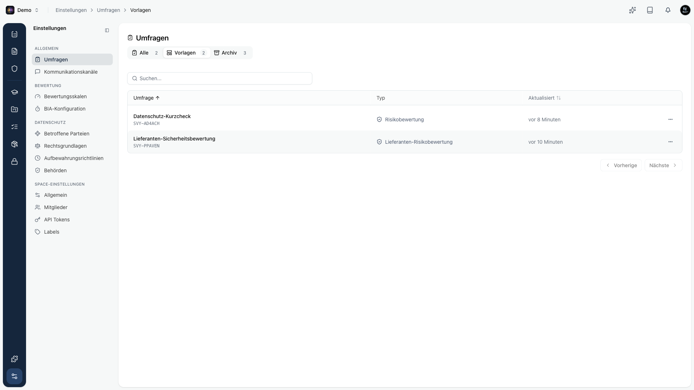

Eine Vorlage ist ein wiederverwendbarer Fragebogen. Statt jedes Jahr eine Lieferantenbewertung neu aufzubauen, pflegst du sie einmal als Vorlage und kopierst sie bei Bedarf.

Vorlagen findest du unter **Einstellungen → Umfragen** im Tab **Vorlagen**.

## Vorlage anlegen

Zwei Wege:

- Beim [Erstellen](/platform/surveys/erstellen) im Schritt Details den Schalter **Als Vorlage anlegen** aktivieren.
- Eine bestehende Umfrage als Grundlage nehmen und als Vorlage speichern.

## Vorlage verwenden

Klicke auf **Umfrage erstellen** und wähle **Aus Vorlage**. Kopexa kopiert Fragen und Aufbau der Vorlage in eine neue Umfrage. Titel und Beschreibung passt du danach an. Die Vorlage selbst bleibt unverändert.

<Callout title="Tipp">
Halte für jeden wiederkehrenden Anlass eine gepflegte Vorlage bereit. Das spart Zeit und sorgt dafür, dass alle Bewertungen dieselben Fragen stellen und damit vergleichbar bleiben.
</Callout>
