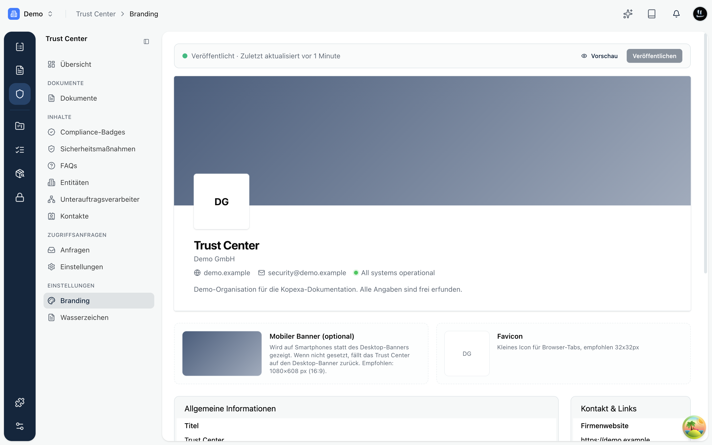

Unter **Branding** legst du fest, wie dein Trust Center für Besucher aussieht. Ziel ist ein professioneller, wiedererkennbarer Auftritt, der zu deiner Marke passt.

Oben siehst du jederzeit eine **Live-Vorschau**: Änderungen werden sofort angezeigt, bevor du sie veröffentlichst.

## Bilder

- **Banner (Desktop)**: das große Hero-Bild oben auf der Seite.
- **Mobiler Banner** (optional): ein separates Bild für Smartphones. Ohne eigenes Bild wird der Desktop-Banner verwendet. Empfohlen: 1080 × 608 px (16:9).
- **Logo**: dein Firmenlogo, quadratisch. Es erscheint prominent über dem Titel.
- **Favicon**: das kleine Symbol im Browser-Tab. Empfohlen: 32 × 32 px.

## Allgemeine Informationen

- **Titel**: die Überschrift deiner Seite, zum Beispiel „Trust Center".
- **Firmenname** und **Beschreibung**: ein kurzer Satz, der erklärt, wofür deine Organisation steht.
- **Farben und Design**: im einfachen Modus wählst du eine Grundfarbe; im erweiterten Modus stellst du Hintergrund-, Vordergrund- und Akzentfarben sowie die Schrift einzeln ein.

## Kontakt & Links

- **Firmenwebsite**: Link zu deiner Hauptseite.
- **Sicherheitskontakt**: die E-Mail-Adresse für Sicherheitsanfragen. Sie wird Besuchern angezeigt.
- **Statusseite**: Link zu deiner Status- oder Verfügbarkeitsseite, falls vorhanden.

<Callout title="Erst prüfen, dann live schalten">
Alle Änderungen landen zunächst in der Vorschau. Über **Veröffentlichen** oben rechts machst du sie für Besucher sichtbar.
</Callout>
