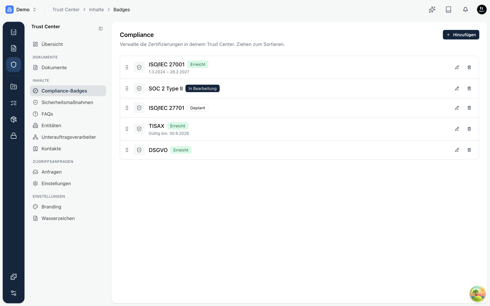
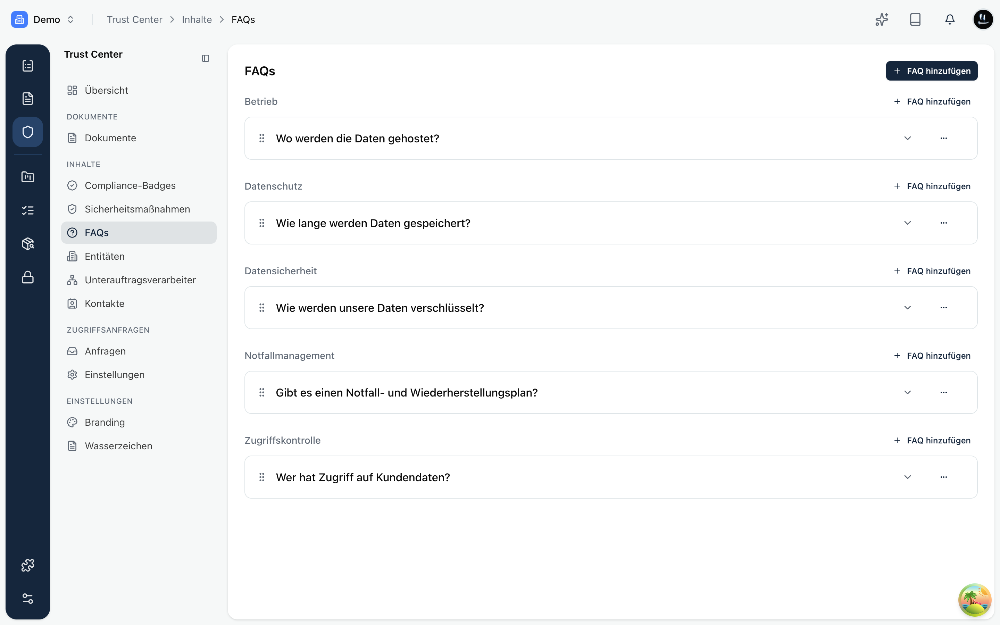
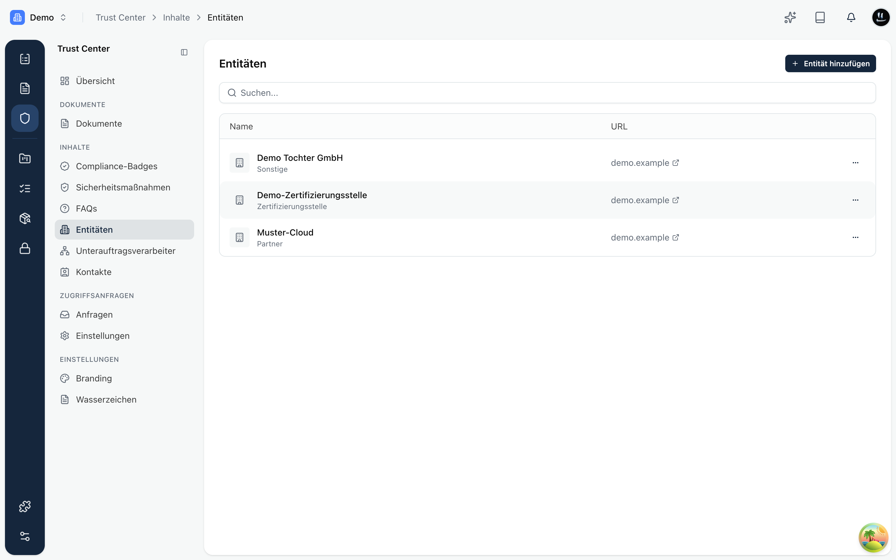
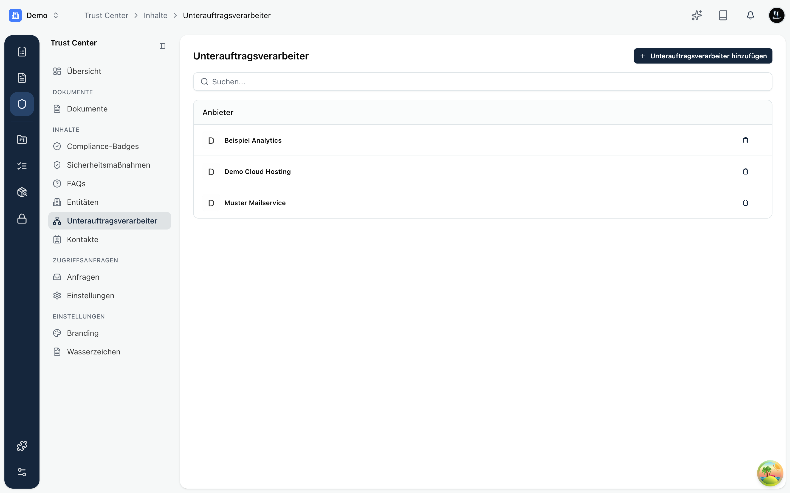
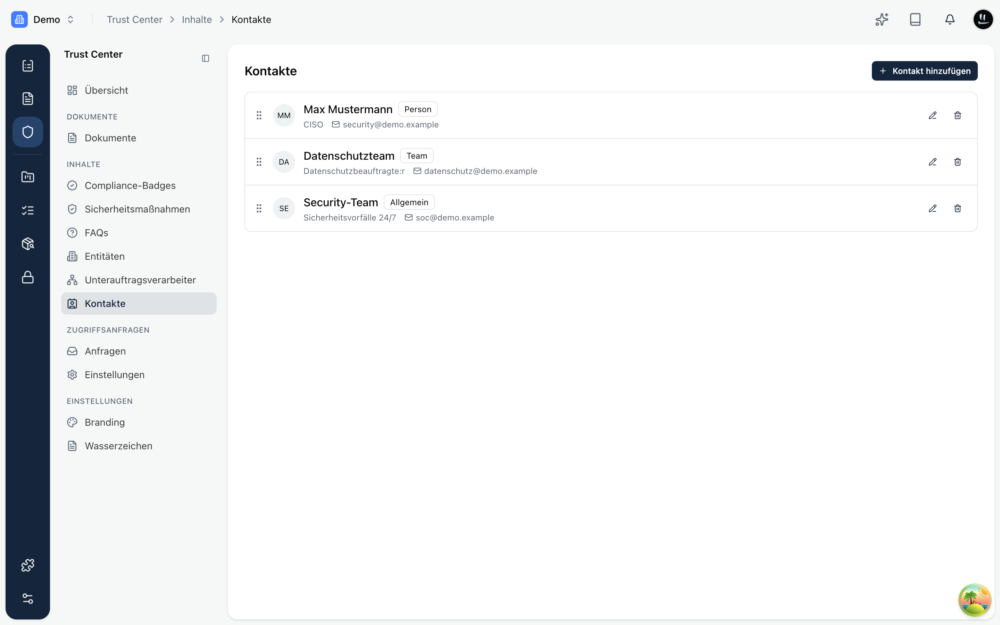

Unter **Inhalte** pflegst du, was auf deinem öffentlichen Trust Center zu sehen ist. Jeder Bereich ist optional: Du entscheidest, wie viel Transparenz du gibst.

## Compliance-Badges

Badges zeigen deinen Zertifizierungs- und Compliance-Status auf einen Blick, zum Beispiel ISO/IEC 27001, SOC 2, TISAX oder DSGVO. Für jeden Nachweis legst du **Name**, **Status** (Erreicht, In Bearbeitung, Geplant) und optional den **Gültigkeitszeitraum** fest.

Per Ziehen ordnest du die Reihenfolge, in der die Badges öffentlich erscheinen.

## Sicherheitsmaßnahmen

Hier verknüpfst du konkrete **Maßnahmen** aus deinen Programmen mit dem Trust Center. So belegst du nicht nur „wir sind zertifiziert", sondern auch, welche Kontrollen du tatsächlich umgesetzt hast. Öffentlich sichtbar wird eine Maßnahme erst, wenn sie im Programm als veröffentlicht markiert ist.

## FAQs

Beantworte die häufigsten Sicherheitsfragen einmal zentral, statt sie im Vertrieb immer wieder einzeln zu beantworten. Jede Frage hat eine **Antwort**, eine optionale **Gruppe** (zum Beispiel „Datensicherheit" oder „Zugriffskontrolle") und optional einen **Verweislink**.

## Entitäten

Entitäten sind zugehörige Organisationen, die du auf deiner Seite ausweist: Tochtergesellschaften, Partner oder deine **Zertifizierungsstelle**. Für jede Entität gibst du Name, Typ und Link an.

## Unterauftragsverarbeiter

Zeige transparent, welche **Drittanbieter** Kundendaten in deinem Auftrag verarbeiten (Hosting, Analyse, E-Mail-Versand). Du verknüpfst dazu Anbieter aus deiner Lieferantenverwaltung.

## Kontakte

Hinterlege Ansprechpartner für Sicherheits- und Datenschutzanfragen, zum Beispiel den Sicherheitskontakt, das Datenschutzteam oder ein Security-Team. Besucher sehen so sofort, an wen sie sich wenden können.

