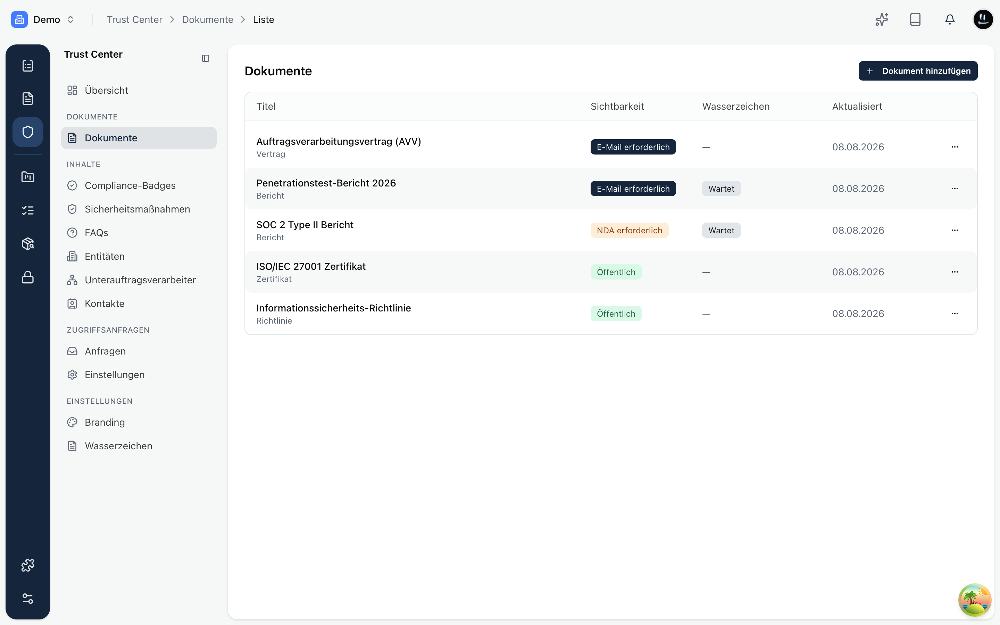
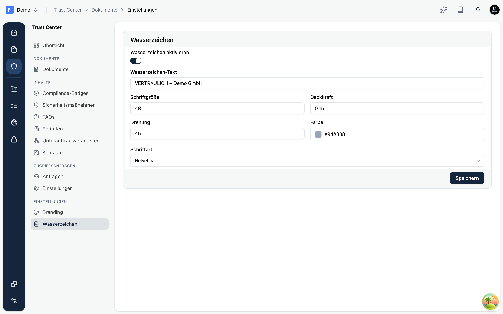

Im Bereich **Dokumente** teilst du deine eigentlichen Nachweise: Richtlinien, Zertifikate, Prüfberichte, Penetrationstests oder Auftragsverarbeitungsverträge. Für jedes Dokument legst du Titel, Kategorie, **Sichtbarkeit** und optional ein Wasserzeichen fest.

## Sichtbarkeitsstufen

Die Sichtbarkeit entscheidet, wie viel ein Besucher tun muss, bevor er ein Dokument öffnen kann:

- **Öffentlich**: jeder kann das Dokument direkt herunterladen.
- **E-Mail erforderlich**: der Besucher muss zuerst seine E-Mail-Adresse bestätigen.
- **NDA erforderlich**: der Besucher muss seine E-Mail bestätigen **und** deine Vertraulichkeitsvereinbarung annehmen. Erst nach deiner Freigabe erhält er Zugriff (siehe [Zugriffsanfragen](./requests.mdx)).
- **Entwurf**: nur intern sichtbar, nicht auf dem öffentlichen Trust Center.

So kannst du unkritische Unterlagen (etwa dein Zertifikat) offen zeigen und sensible Berichte (etwa einen SOC-2-Bericht) hinter eine E-Mail- oder NDA-Schranke stellen.

## Wasserzeichen

Für sensible Dokumente aktivierst du ein **Wasserzeichen**. Kopexa legt dann beim Download einen dauerhaften Hinweis über die PDF-Seiten, was unerlaubtes Weitergeben erschwert. In der Liste siehst du pro Dokument den Status (zum Beispiel „Wartet", wenn das Wasserzeichen noch verarbeitet wird).

Unter **Einstellungen › Wasserzeichen** legst du das Aussehen zentral fest: Text, optionales Logo sowie Schrift, Größe, Transparenz, Drehung und Farbe. Diese Vorlage gilt für alle Dokumente, bei denen du das Wasserzeichen aktivierst.
