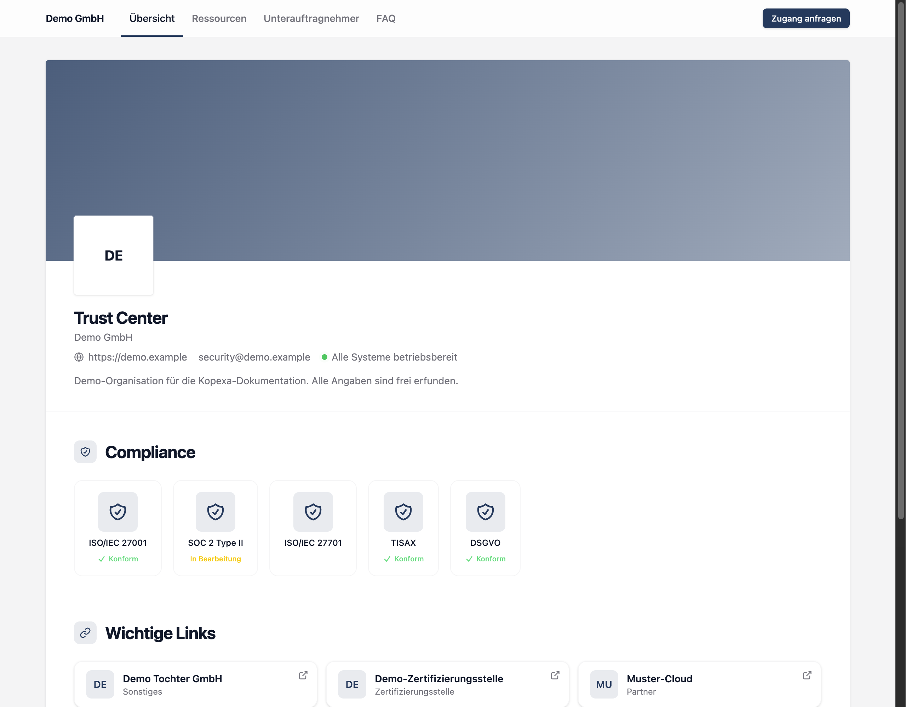
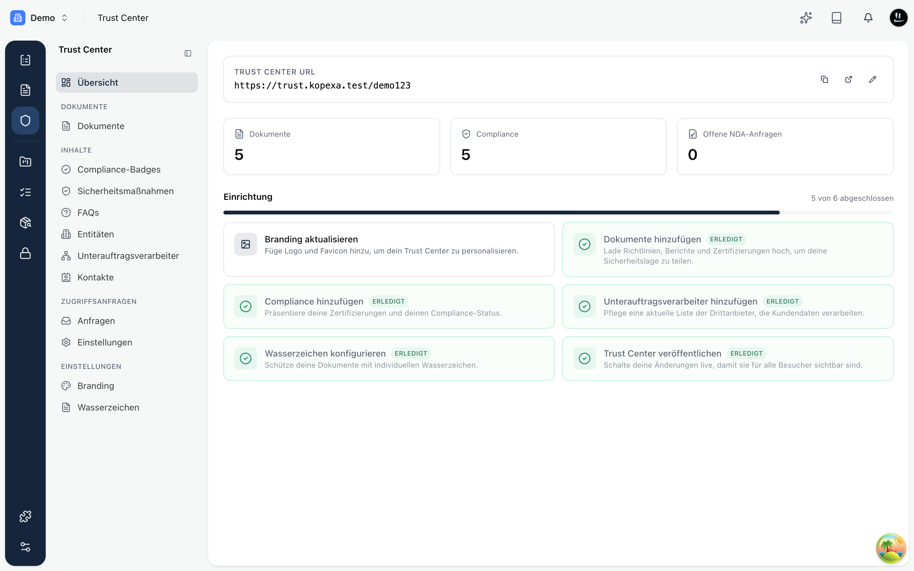

Das **Trust Center** ist die öffentliche Vertrauensseite deiner Organisation. Statt bei jeder Sicherheitsfrage im Vertrieb einzeln Zertifikate, Berichte und Fragebögen herauszusuchen, verweist du auf **eine gepflegte Seite**: Kunden und Interessenten sehen dort deinen Zertifizierungsstatus, laden freigegebene Dokumente herunter und finden Antworten auf die häufigsten Sicherheitsfragen.

<Callout title="Kurz gesagt">
Ein Ort, eine Adresse, immer aktuell. Das Trust Center nimmt deinem Team die wiederkehrende Arbeit ab, Sicherheitsnachweise manuell zu versenden, und gibt deinen Kunden Transparenz.
</Callout>

## Was Besucher sehen

Dein Trust Center ist unter einer eigenen, gebrandeten Adresse erreichbar, zum Beispiel `https://trust.kopexa.test/dein-name`. Besucher sehen dort dein Logo und deine Farben, deinen Zertifizierungsstatus, wichtige Dokumente sowie Ansprechpartner und häufige Fragen.

Welche Dokumente ein Besucher tatsächlich öffnen kann, steuerst du pro Dokument über **Sichtbarkeitsstufen**: öffentlich, erst nach E-Mail-Bestätigung oder erst nach Annahme deiner Vertraulichkeitsvereinbarung. Mehr dazu unter [Dokumente](./documents.mdx).

## Der Aufbau

Im Bereich **Trust Center** eines Space richtest du alles ein. Die Konfiguration ist in Abschnitte gegliedert:

- **Branding**: Logo, Farben, Firmenname und Sicherheitskontakt. Siehe [Branding](./branding.mdx).
- **Inhalte**: Compliance-Badges, Sicherheitsmaßnahmen, FAQs, Entitäten, Unterauftragsverarbeiter und Kontakte. Siehe [Inhalte](./content.mdx).
- **Dokumente**: Dateien hochladen, Sichtbarkeit festlegen und mit Wasserzeichen schützen. Siehe [Dokumente](./documents.mdx).
- **Zugriffsanfragen**: Anfragen von Besuchern prüfen und NDA-Freigaben erteilen. Siehe [Zugriffsanfragen](./requests.mdx).

Die **Übersicht** zeigt dir auf einen Blick, wie viele Dokumente und Nachweise du teilst und wie viele Zugriffsanfragen offen sind. Die Einrichtungs-Checkliste führt dich durch die ersten Schritte.

## Vorschau und Veröffentlichen

Deine Änderungen sind **nicht sofort öffentlich**. Du bearbeitest das Trust Center in einer **Vorschau**, prüfst das Ergebnis und schaltest es dann mit **Veröffentlichen** live. So kannst du in Ruhe Inhalte vorbereiten, ohne dass halbfertige Stände nach außen sichtbar werden.

## Die öffentliche Adresse

Der letzte Teil der Adresse (der **Slug**, zum Beispiel `dein-name`) identifiziert dein Trust Center eindeutig. Du kannst ihn ändern, solltest das aber mit Bedacht tun: Bereits geteilte Links funktionieren danach nicht mehr.
