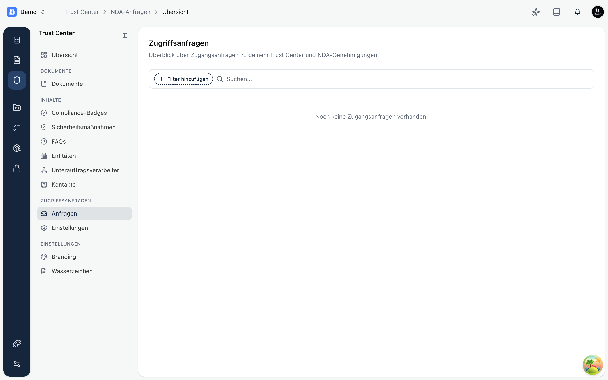

Sobald ein Besucher ein Dokument mit Schranke öffnen möchte, entsteht eine **Zugriffsanfrage**. Im Bereich **Zugriffsanfragen** siehst du alle Anfragen an einer Stelle und entscheidest, wer Zugang bekommt.

## Was in der Übersicht steht

Für jede Anfrage siehst du:

- **Besucher**: Name (falls angegeben), E-Mail-Adresse und Firma.
- **E-Mail bestätigt**: ob der Besucher den Bestätigungslink angeklickt hat.
- **NDA-Status**: ob die Vertraulichkeitsvereinbarung angenommen, abgelehnt oder noch offen ist.
- **Angefragt am**: wann die Anfrage einging.

Du kannst nach Datum sortieren und nach E-Mail-Bestätigung oder NDA-Status filtern.

## Die zwei Zugangswege

- **E-Mail-Verifizierung**: Bei Dokumenten mit der Stufe „E-Mail erforderlich" genügt es, dass der Besucher seine Adresse bestätigt. Danach kann er diese Dokumente selbst herunterladen, ohne dass du etwas tun musst.
- **NDA-Freigabe**: Bei Dokumenten mit der Stufe „NDA erforderlich" nimmt der Besucher zusätzlich deine Vertraulichkeitsvereinbarung an. Die Anfrage landet dann bei dir: Du **gibst frei** oder **lehnst ab**. Erst nach der Freigabe erhält der Besucher Zugriff, heruntergeladene Dokumente tragen bei Bedarf ein Wasserzeichen.

<Callout title="Zusammenhang">
Welche Schranke greift, legst du pro Dokument über die [Sichtbarkeitsstufe](./documents.mdx) fest. Die Vertraulichkeitsvereinbarung selbst pflegst du im Trust Center; ob eine Freigabe nötig ist, steuerst du über die entsprechende Einstellung.
</Callout>
